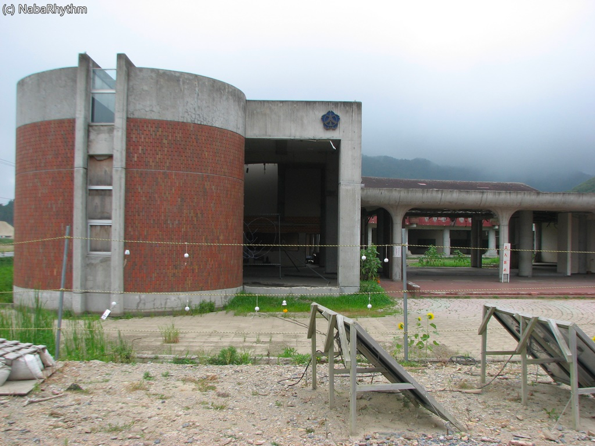
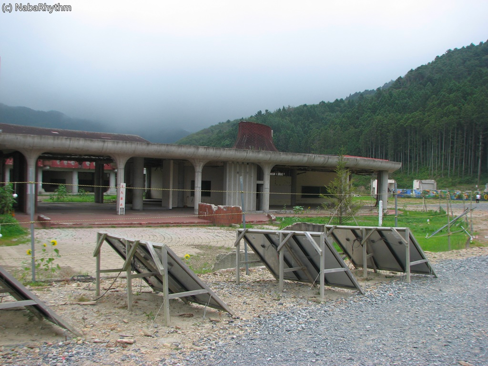
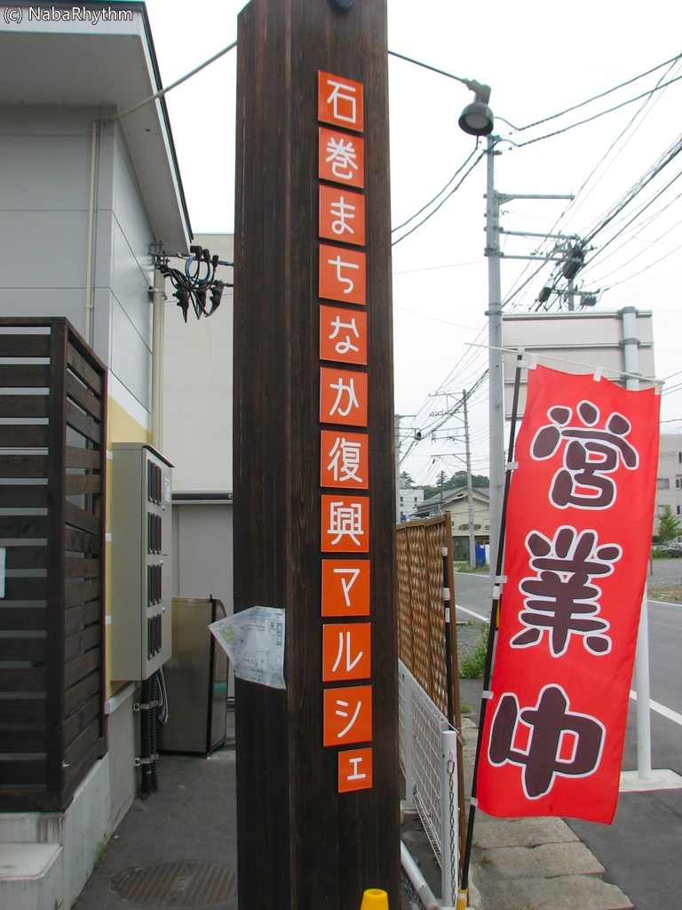
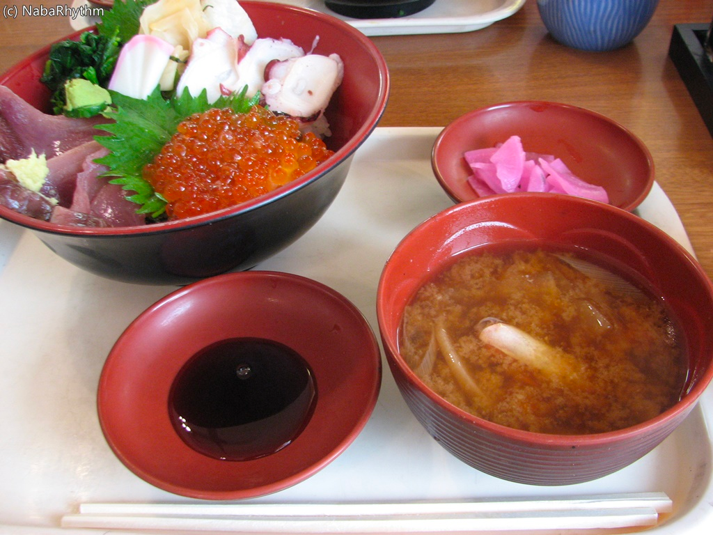
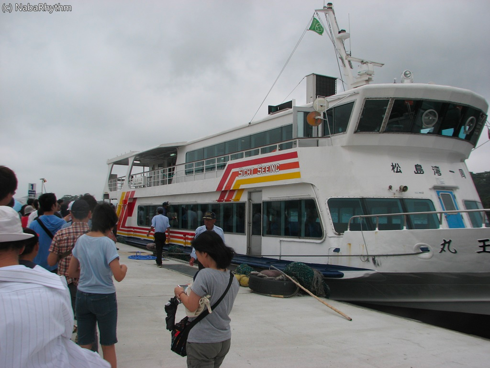

先週の金曜日と土曜日にかけて、仙台の七夕祭りを見に行きました。

また、折角東北に行くので爪痕も１度は自分の目で見ておこうと思い、仙台から数十キロ先の石巻へ行きました。

<!--more-->

 

感じたことを簡潔に書くことにします。

 

まず、石巻市立大川小学校へ行きました。

<iframe src="https://www.google.com/maps/embed?pb=!1m10!1m8!1m3!1d6240.922712768852!2d141.42799!3d38.546183!3m2!1i1024!2i768!4f13.1!5e0!3m2!1sja!2sus!4v1444572681345" width="600" height="450" frameborder="0" style="border:0" allowfullscreen></iframe>

大川小学校は、皆さんご存知のように津波で生徒の多くが亡くなったことで、慰霊碑が置かれています。

簡易的な駐車場もありますので、実際に車で現場まで行くことができます。

3年以上経ちましたが、時間が止まったように静かでした。

この場所に大津波が来て、多くの命がこの場で失われてしまったと思うと、とても息苦しく感じました。

コンクリートの壁がそのまま剥ぎ取られていて、津波の恐ろしさを感じると共に、

それでも残る子どもたちによって書かれた壁画が残っていることに、悲壮感を感じました。

倒壊の恐れがあるので近付くことはできませんが、

このまま風化させてはいけないですね。

決して同じ過ちは繰り返してはいけません。

 

また、その後に何気なく通った道路が、一見原っぱの中の道路を進んでいたように思えましたが、
カーナビが震災前のカーナビで、そのカーナビには、そこにコンビニがあったり、商店があったりと、当時の街を表示していました。

震災復興の旗を付けたダンプが行き交い、ぱっと見は復興が進んでいそうですが、まったく手付かずの所は多かったです。

後に親から聞きましたが、ダンプが走っているだけでも進んでいるそう。1年前に訪れた際にはまだダンプすら走っていなかったようです。

 

たった一瞬の津波のせいで、人の命を多く奪い、復興することの出来ない爪痕が残った。

自然災害ですが、どうにもこう、やるせない気持ちになりますね。仮設住宅では未だに多くの人が住んでいます。

 

しかし、復興に向けて頑張っている人は多くいます。

震災を乗り越え、新たな未来に向かう人を少しでも応援したいと思い、石巻市にある、「石巻まちなか復興マルシェ」へ行きました。

<iframe src="https://www.google.com/maps/embed?pb=!1m10!1m8!1m3!1d6250.953201595708!2d141.309672!3d38.430459!3m2!1i1024!2i768!4f13.1!5e0!3m2!1sja!2sus!4v1444573035647" width="600" height="450" frameborder="0" style="border:0" allowfullscreen></iframe>

復興商店街と位置づけられているこの商店街では、様々なお店が軒を連ねています。

お昼ということもあり、海鮮丼を頂きました（お店の名前はメモってませんｺﾞﾒﾝﾅｻｲ）。

三色丼で1,700円でしたが、とても美味しかったです。

正直、平日ということもあり商店街自体には人はあまりいませんでしたが、お店に入ってみるとかなり人がいて驚きました。

お店ではラジオが流れ、人の笑い声が聞こえ、活気に溢れていました。

 

震災を忘れることは出来ませんし、完全に元通りにすることはできません。

しかし、必ず乗り越え復興することはできる、ということを忘れてはいけませんね。

日本全体が、一つの家族として、共に乗り越えて行きたいですね。

さて、あとは観光として松島のフェリーに乗ったり、仙台の七夕祭りに行ったりしましたよ。

え？　写真無いのかって？

ﾁｶﾚﾀ（）

