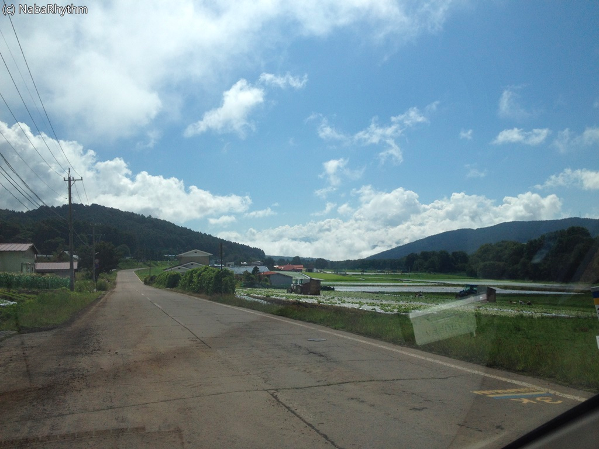
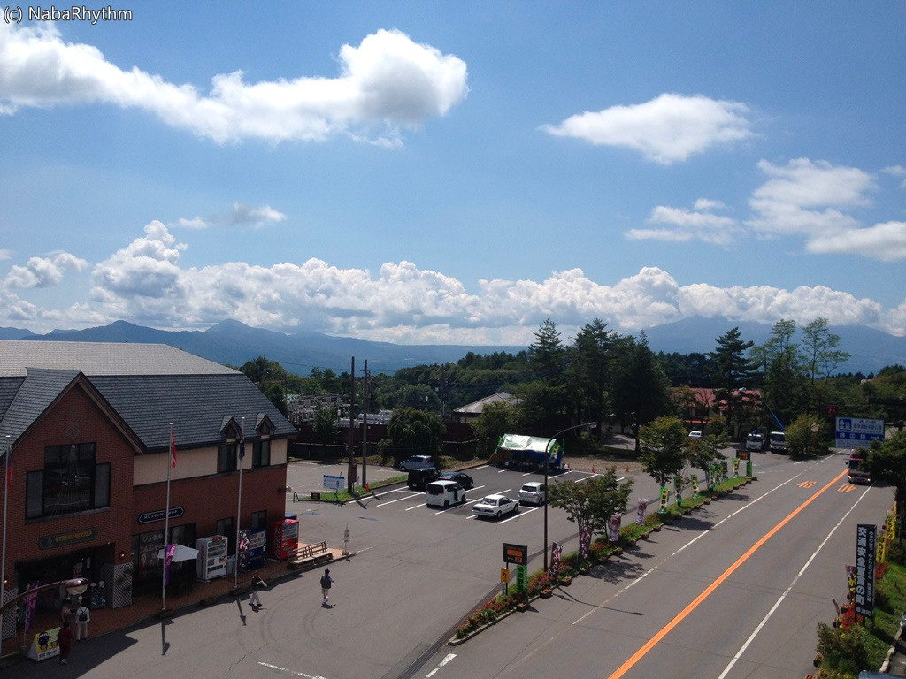
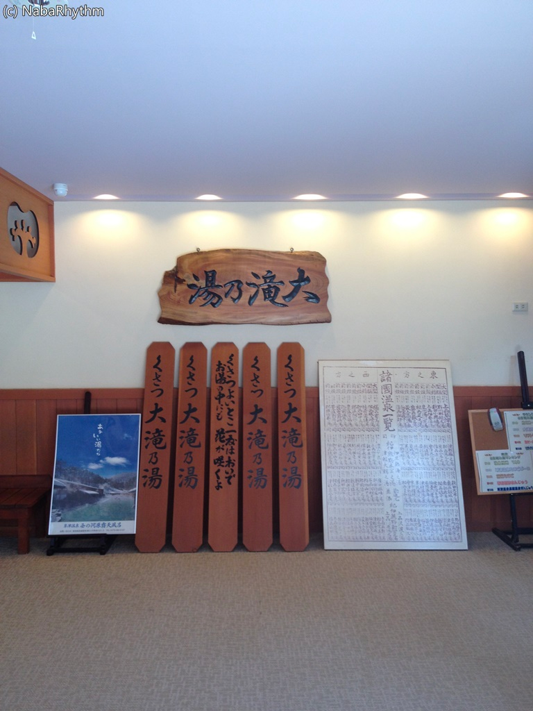
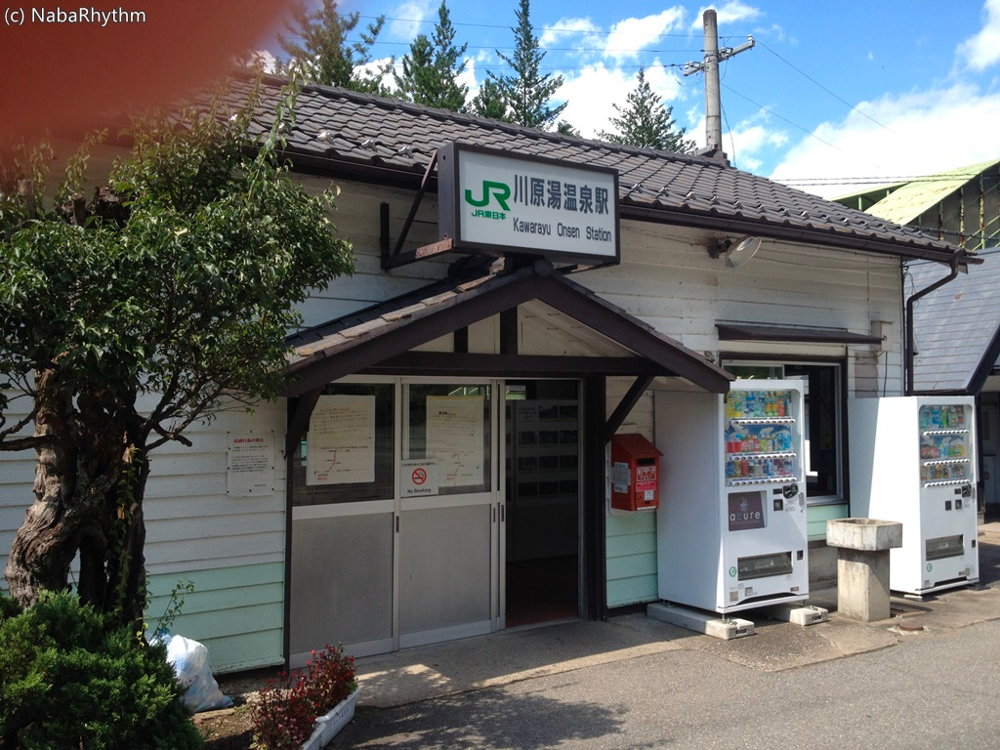
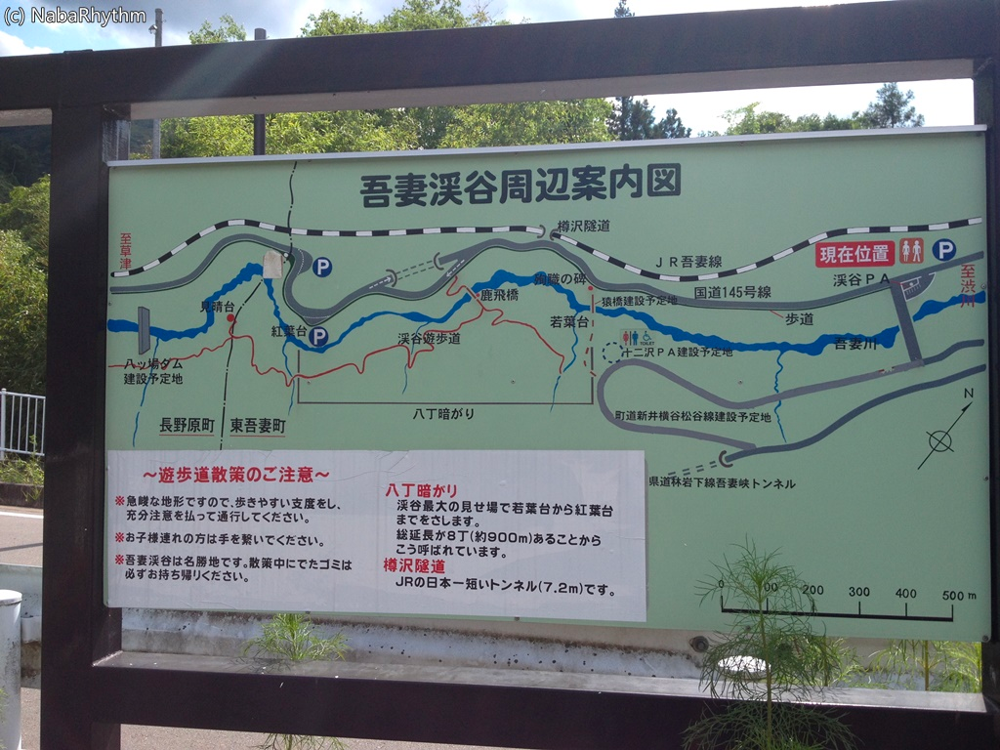

実家に帰るついでに一般道で菅平高原とか草津温泉とか寄ってきました。

<!--more-->

 

幸い天候に恵まれ、とっても気持ちのよいドライブが出来ました。

キャベツ畑が広がる菅平高原。

収穫中の畑が多く、農耕車も行き交っていました。

 

 

<iframe src="https://www.google.com/maps/embed?pb=!1m10!1m8!1m3!1d6404.885164500255!2d138.591912!3d36.615732!3m2!1i1024!2i768!4f13.1!5e0!3m2!1sja!2sus!4v1444573283963" width="600" height="450" frameborder="0" style="border:0" allowfullscreen></iframe>

これは道の駅 草津運動茶屋公園。

ここまでくれば目の前は草津温泉街。

 

 

<iframe src="https://www.google.com/maps/embed?pb=!1m10!1m8!1m3!1d6404.283372404697!2d138.601855!3d36.62297600000001!3m2!1i1024!2i768!4f13.1!5e0!3m2!1sja!2sus!4v1444573299880" width="600" height="450" frameborder="0" style="border:0" allowfullscreen></iframe>

温泉に入ったのは、大滝乃湯というところです。大人800円。

老舗っぽい。

大浴場、２つの露天風呂に合わせ湯というところがありました。

合わせ湯熱すぎて入れませんでした（真顔

 

その後、国道145号線を通り渋川方面へ。

その間ずっとJR吾妻線と並走。特急走ってました！

 

<iframe src="https://www.google.com/maps/embed?pb=!1m10!1m8!1m3!1d6410.041219830001!2d138.707756!3d36.553616000000005!3m2!1i1024!2i768!4f13.1!5e0!3m2!1sja!2sus!4v1444573335126" width="600" height="450" frameborder="0" style="border:0" allowfullscreen></iframe>

途中何気なく寄った川原湯温泉駅。

偶然記念きっぷを今日から発売していたようでしたが、限定700枚のポスターにデカデカと「売り切れ」の文字。

朝はすごい人がいたのかここ…。

ところでこの駅、かの八ッ場ダムが完成すれば湖に沈むそうです。

残念ですが、駅の移設も進んでいるようで、よかった（？）です。

 

観光案内。駅からちょっと来たところです。

 

渋川から前橋に行った後は50号なので見せ場はありませんが…。

とっても天気の良い日に山道ドライブが出来て幸せでしたまる。

 