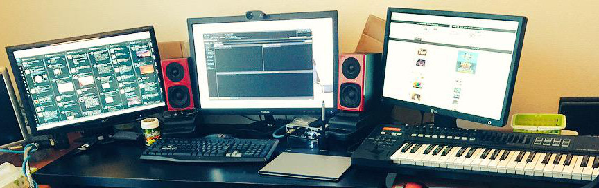

もうすぐ８月、就職して４ヶ月が経とうとしています。 
この４ヶ月のことに触れつつ、就職してどう生活・気持ちが変わったかを書いていきたいと思います。

<!--more-->

## １．出来事

まずはこの４ヶ月での出来事を書きます。

### ４月

* 就職した



* 東京に引っ越した



### ５月

* 新卒研修そっちのけで会社でiOSアプリ開発してた



* プロジェクト先が東京都立川市になった



* プロ生勉強会に初参加した[/2015/0517-pronama](/2015/0517-pronama)

### ６月
* 片道通勤２時間は辛かった（下の理由で睡眠時間が取れなかった）ので国分寺市に引っ越した



* プロジェクト先で闇の案件を任される



### ７月
* プロジェクト先で新案件に異動になる



* １０月に茨城に行くことを宣告される　←イマココ

## ２．感じたこと
就職して変わったこと、気付いたことを書いていきます。少しでもこれから就職する人？のためになれば。

### 意外と毎日ちゃんと起きることができる
このことはよく言われていますが、大学生の時にぐーたらな生活を送っていても、（規則正しい生活をしていれば）意外とちゃんと毎日起きられるものです。 
やっぱり仕事には行かなくちゃいけない身体ってことが分かっているんですね。

### 引っ越しは面倒臭い
この半年で引っ越しを３回しました（大学→実家，実家→社宅１，社宅１→社宅２）。

大学生のときは、実は面倒くさくて転居届を出さずにずっと住民票は地元でした。 
しかし、社会人になってさすがに転出・転入手続きを行いましたが、窓口が平日の１７時までやっていなかったり、免許証の住所変更も平日しか行っていなかったりと、会社に入ってしまうと本当に不便を感じました。 
月に１回ぐらい土曜日の午前中のみ開いている庁舎があったりする（国分寺市がこれだった）ので、なんとか半休を取らずに済みましたが、ちゃんと計画を立てておかないと転入届が出せずに住所不定になります、マジで。

### 会社に家が近いのはかなり便利
片道電車２時間通勤から、徒歩２５分の距離に変わって思ったのは、会社が近いと気持ちがかなり楽になるということです。 
今まで、残業して１９時に仕事が終わっても、家に変えるのは２１時過ぎでしたが、今では１９時半には家に帰れる。これは、定時（１７時１５分）に会社が終わって前の家に着くのと同じぐらいの時間です。 
このことで、少し仕事に対して余裕が生まれました。残業をする意気込みではないですが、多少残業してもお金は出るしあまり遅くならないうちに家に帰れるし、あまり文句はありません。

### 勉強に対する意気込みが変わった
大学の頃は集中して趣味に勉強することはあまりなかった（基本情報処理技術者試験も一夜漬けのようなもので受かった）し、その背景には不規則な生活があったので、グダグダしたままそのまま卒業してました。

卒業してから、毎日同じような時間に時間ができるようになると、比較的計画的に勉強計画を立てることが出来ました。その結果勉強に対する意気込みが入るようになりました。

## ３．一番言いたいこと

一番言いたいのは、<strong>人生を楽しみながら、やりたいことをやろう</strong>、ということです。

要は、ですが。大学生のうちには、この先の未来なんて正直分からないのです。 
でも、就職してしまえば、リストラや会社が倒産しない限りは、あと４０年間その会社に従事するわけです。 
もしその生活を望むのであれば構いませんが（最初からいい会社に入れた、etc）、私は勿体無いと思います。 

折角の一度きりの人生なんだから、精一杯努力をして、<strong>成果を残して</strong>死にたいわけです。 
成果を残すためには、技術力がないと行けませんから、毎日の努力をするわけです。 
でも、楽しくないと苦行なだけですから、楽しみながら学びたいですよね。 

## ４．おわりに
自分の知らない知識って、とってもワクワクしませんか？ 
目の前にいる人は、自分が知らない知識、理解していない技術を持っている。 
それだけでもワクワクします。

そういう意味でも、IT勉強会こそ素晴らしい物は無いと思います。 
大学生の時に<a href="https://pronama.jp/">プログラミング生放送</a>と出会いました。 
キャラクターが可愛いというものありましたが、その活動力の素晴らしさに惹かれました。 
マスコットキャラクターを作るだけではなく、頻繁な全国での勉強会の実施、オリジナルグッズの販売、イベントへの協賛など、本当に現代に合った素晴らしい活動をしています。

これからも応援していきたいと思います。

次回８月にまた東京でプロ生勉強会があるそうなので、出来たらLTしたいと思います。 
話すネタを考えないといけないな〜。

長くなりましたが、今回はこのへんで。
