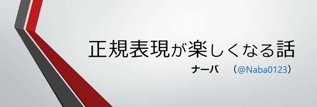

こんにちは、ナーバです。

先日行われた、<a href="http://pronama.azurewebsites.net/2015/07/28/pronama-35-at-dmm-com/" target="_blank">第 35 回プログラミング生放送勉強会@DMM.com ラボ</a>に参加をし、LT をしてきました。

あと終電逃しました。

今回の勉強会の様子や、LT から学んだこと、反省点などを書きます。

<!--more-->

## 勉強会の様子
前回あった5月の勉強会の時よりも、人が少なかった気がします。
今回の勉強会はビアバッシュのために参加費がかかったので、そこで人が減ってしまったかもしれません。

その参加費の中には飲み物・お菓子代も入っていたようで、運営の方が用意して下さりました。ありがとうございます！



また、電源タップを持っていくのを忘れてしまい、MacBook Air の電池がギリギリでした（なんとか足りた）。

どこの会場もそうだと思いますが、電源を使うのであれば、電源タップを持参しましょう。

## LT



<del>「万が一先ほどのスライドを詳しく見たい方」という不自然な日本語が拡散されて辛い。</del>

## 資料について

アスペクト比を 4:3 にしようか 16:9 にしようか迷ったところ、フォロワーから「SlideShare に上げるのであれば 4:3」と言われてましたが、DMM.com ラボの会場のディスプレイに合わせて 16:9 で作りました。

今意味が分かりました（真顔）。

しかし、余白が出るのはブログに貼り付けた時だけで、公式ページは既に 16:9 に対応しているみたいですね。

きっと今後対応してくれるでしょう。

## 発表内容について

今回、「正規表現に馴染みのない（または苦手な）人が、正規表現に触れる敷居を下げられればいい」と思い、基本的な正規表現の構文、その使い方の例を図を使って紹介しました。

内容としては、後に様々な人から「分かりやすかった」などを言っていただき嬉しいです。

しかし、（これがいいのか悪いのか分かりませんが）ウケは良くなかった気がします。

別にネタ枠を狙ったつもりではなく、単純な技術の紹介をしたつもりでしたが、イマイチつかみが悪かったですね。。

私なりに原因を考えましたが、恐らく<strong>成果物がなかったことが原因</strong>ではないかと考えます。

何かを作ってその経緯を話し、その中で使われている技術を紹介する、というのが一番わかり易い発表の流れと感じました。 
プロ生ちゃん bot を作った、ガジェットを作った、アプリを作った、電子工作をした…など。

次回は何かを作って発表してみます。

### 発表の仕方について

私の前に 3 名 LT を発表していましたが、その流れがとても良く<del>（主に友利奈緒）</del>、真面目に発表するつもりでしたが、すっかり場の雰囲気に飲まれてしまいました。

ここで長々と発表しても皆さんを飽きさせるだけと思い、予定よりもかなり飛ばして発表してしまいました。

しかし終わってから考えてみれば、早口で話してもそれこそ付いてきてくれないでしょうし、早口で話して内容を飛ばすよりも、やはり人にわかりやすく論理的に発表したほうがいいですね。

先ほどの内容の話と加え、話し方、話の持っていき方、抑揚の付け方など、いろいろ勉強することはありますが、プレゼンの発表の上手い方を参考にこれからも精進していきたいと思います。

## 終電を逃す

ビアバッシュに参加して様々な方とお話をし、2 次会で唐揚げを 9 人前（<a title="からあげにレモンをかける・かけない戦争を解決した驚くべき方法" href="http://jz5.jp/2015/05/17/karaage-lemon/" target="_blank">前例あり</a>）注文をし、3 次会でプロ生ちゃん PR についてブレストをし、

終電に乗り遅れました。



恵比寿駅にて新宿方面の山手線の終電しか残っていない状態で、新宿駅で中央線に乗り換えても、終電が三鷹行き（自分は 10km 先の国立）で、非常に焦りました。

三鷹からタクシーに乗ってもいいのですが、地味にお金がかかりそう…。

ということで、急遽新宿でネカフェを探すことにしました。



### 新宿歌舞伎町

同じプロ生の方からオススメのネカフェを教えていただき、向かいます。

が、そこは新宿歌舞伎町の奥。

時間は午前 1 時。

あちこちで警察と兄ちゃんが衝突する。

消防車と救急車が行き交う。

歩けば 10m おきに中国？台湾？系の女性に「ﾏｯｻｰｼﾞ ｲｶｶﾞﾃﾞｽｶ」と声をかけられる事案。

なるほど、ここが龍が如くか…って感心している暇はなく、命の危険を感じる前にネカフェに向かいます。



そして迷いながらも到着。





折角 PSO2 公認ネットカフェなので起動していましたが、マウスは 3 ボタン、キーボードも反応が悪く、プレイに耐え難いものだったので放置勢してネカフェポイントを貯めてました。

## まとめ



もっと技術を学んで、プログラミング出来るようになって、自分の好きなことをやりたい！って思いました。

前まではバックエンド側とフロントエンド側の両方興味がありましたが、最近はバックエンド側に偏っています。

フロントエンド側は、直接人の目に直接触れる部分を作れるというのが楽しいですが、バックエンド側の仕事がなければフロントエンドも成り立たず、いざ何かを作ろうとした時に、バックエンド系のスキルを持っているのはかなり強みになると思います。

以前からホームページ作成などで HTML/CSS/JavaScript などは触れていますが、サーバについては簡単な PHP と MySQL や自宅サーバ程度の知識しかないので、今のうちにガッツリ学んでおきたいですね。

 

またこれからも IT 勉強会に顔を出していきたいと思いますので、よろしくお願いします！
