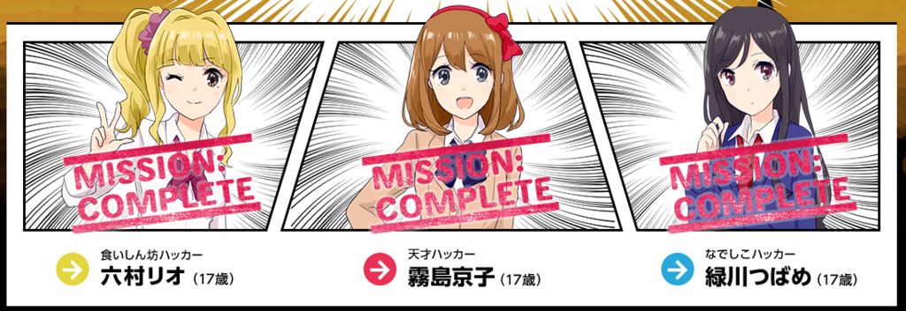

こんにちは、ナーバです。

Paizaのオンラインハッカソンの参加は2回目です。 

[女子高生プログラマーの大バトル](https://paiza.jp/poh/joshibato)

前回はJavaでの参加でしたが、今回は新しく習得中のPHPでの参加をしました。

コードを記載して簡単な解説を行います。

<!--more-->

## １．六村リオ

### 「ちょうどいい濃度のコーヒーを淹れ、古代コボール王Ⅳ世を撃破せよ！」

お湯を足したりコーヒー粉を足したり、味見をしたりするので、最終的なコーヒーの濃度を求めよという問題です。 
濃度の問題は昔から苦手なので、ありがたく書いてある公式をそのまま書きました。



いくつか気をつけなければならない点があります。

一つは、味見をしたり、最終的な濃度を求める際に変数で割り算を行いますが、 コーヒーとお湯が0の時に割り算を行うと例外が起きるので注意すること。 

もう一つは、味見をする際の書き換わった変数をそのまま使用することに伴う副作用です。 先にお湯の量を計算しますが、その際にグローバル変数に保存してしまうと、その次のコーヒー粉の計算の時に既に味見後のお湯の量で計算をするので、計算が合わなくなってしまいます。

これが発覚するテストケースがサンプルテストケースには存在していないので、この問題が発覚するまでに時間がかかってしまいました（自分はここで時間がかかった）。      

## ２．霧島京子

### 「古代コボールすごろくで古代コボール王Ⅳ世を撃破せよ！」

すごろくのマスに数字が書いてあり、その数字分またマスを移動すれば良いです。 以前行ったところにもう一度行く、即ち無限ループなので、 既視感フラグの配列を一つ用意してあげればいいと思います。



## ３．緑川つばめ

### 「遺跡発掘ゲームで古代コボール王Ⅳ世を撃破せよ！」
この問題だけ難易度がかなり低めだった気がします。PHPのおかげかもしれませんが。



計算結果の変数を一つ用意し、「入力数＋入力数を10で割って小数点以下を切り捨てる＋入力数を10で割った余り」を計算すればそれだけで終わりです。

## まとめ

つばめちゃんの問題が物足りない以外は、比較的普通の難易度の問題でした。

前回の時はまだプログラミングコンテスト初心者で（今もですが）、効率の悪いアルゴリズムを書いていましたが、以前よりはスッキリとしたプログラムを書けるようになったと思います。

初めてPHPをまともに勉強して使ってみましたが、型をあまり気にしなくていいのは楽ですね。 
しかしその分、バグの温床になる可能性があるので、比較などをする際には型に注意したいと思いました。

今回も、楽しい問題をありがとうございました。ところで、つばめちゃんが一番可愛いですね。
