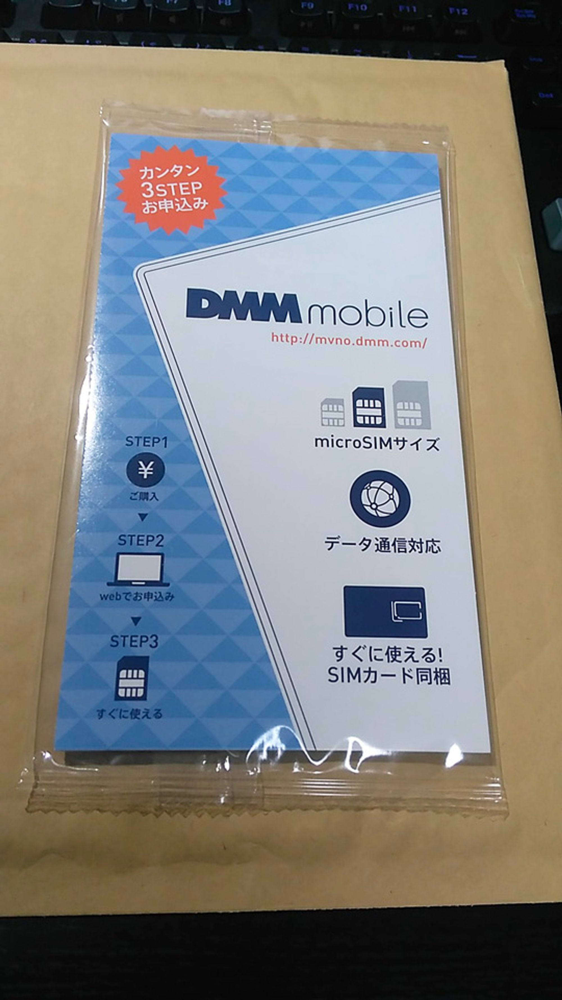
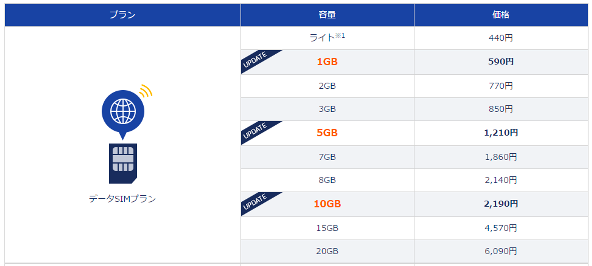
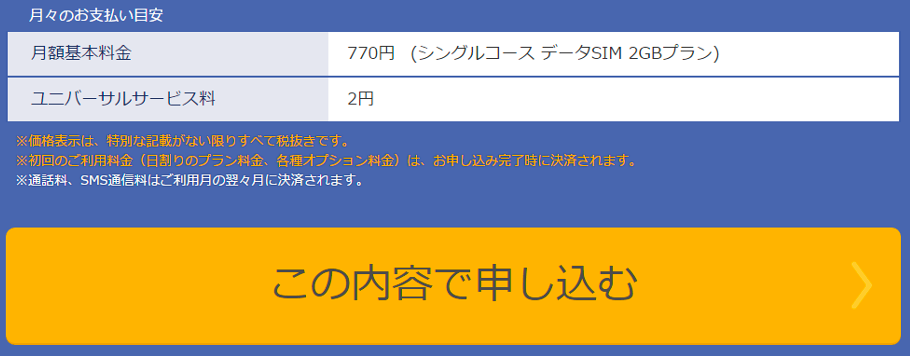
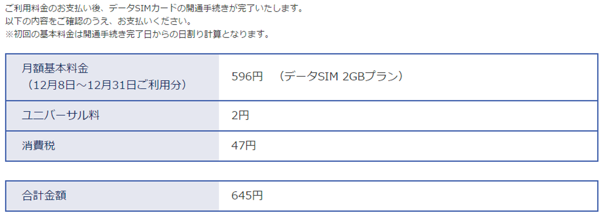
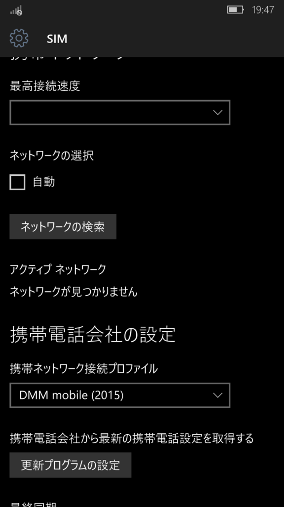
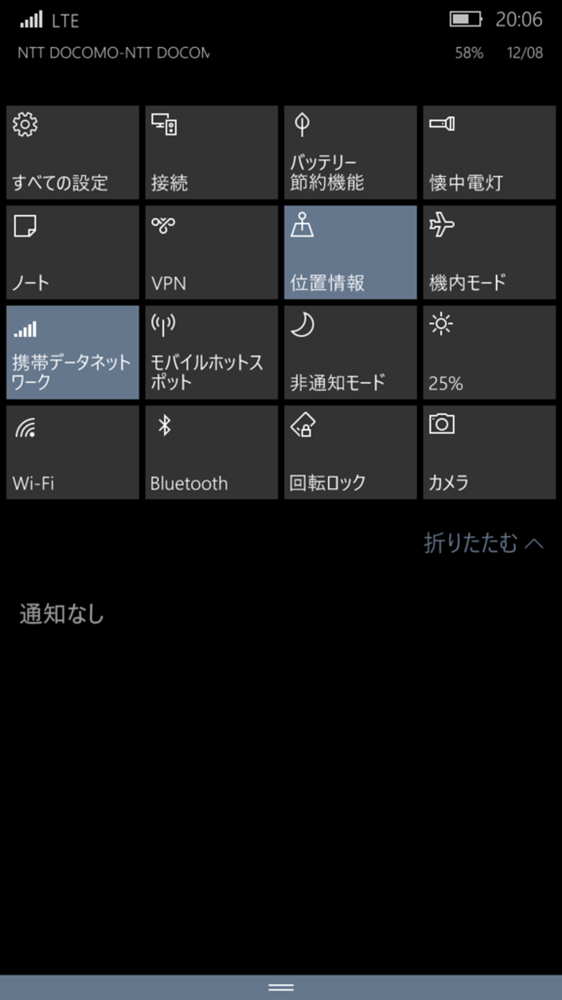
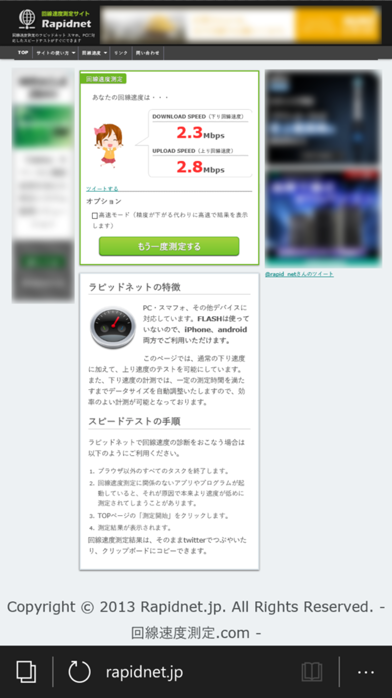

先日MADOSMAを購入して、まだSIM契約をしていなかったので、安いらしいDMM mobileを契約しました。

（内部からのステマとかではないです。アフィカス等ではないので）

契約したのは、データプランの2GBです。そこまで外で使う予定もないのでとりあえず2GBにしておきます。

今まで大御所しか契約したことがなかったので、今ってどこもこんなに安いんですかね。

### **契約**

契約はすぐに終わりました。書いてある通りにすれば終わりなので割愛します。

月額は770円と書いてありますが、実際に払うのは、770円(+税) + 2円 = 833円(税8%) です。

SIMはamazonで買って(540円)、実質それが初期費用となりました。

開通初月は日割りしてくれました。

### **MADOSMA上でセットアップ**

申し込みが終了すると、即開通しているので、SIMをMADOSMAに挿入します。

プロファイルは「DMM mobile (2015)」

しばらく繋がらなくて焦ってましたが、何度か再起動してるうちに繋がりました。DMMはdocomoの回線を使っています。

### **回線速度**

私が住んでいるのは石川県金沢市で、自宅の部屋の窓際で計測しました。

測定は Rapidnet.jp で行いました。

rapidnet.jp

上り：**2.3Mbps** (約 290 KB/s)下り：**2.8Mbps** (約 350 KB/s)

まぁ、このぐらいですね。

調べ物とかTwitterをするぐらいなので、速度は我慢しておきます。

ひとまず、ようやくこれでMADOSMAを外に持ち出せそうです！よかった！