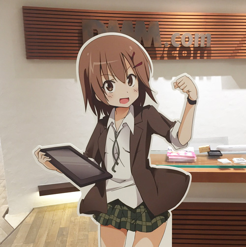

ブログでは記事を書いていませんでしたが、 
私は新卒ながら先月転職をしました。

この話の詳しい内容は、10/31に行われた [プロ生第36回](http://pronama.azurewebsites.net/2015/10/12/pronama-36-at-dmm-com/) のLTで話しています。

<!--more-->

## LT

<iframe src="//www.slideshare.net/slideshow/embed_code/key/NFzhFOWX0995Oy" width="640" height="430" frameborder="0" marginwidth="0" marginheight="0" scrolling="no" style="border:1px solid #CCC; border-width:1px; margin-bottom:5px; max-width: 100%;" allowfullscreen> </iframe>

## 決意



私は組込み系の派遣会社に就職しました。

2015年度新卒の私の代までは、まだ就職解禁が2年前の12月（2013年12月）で、私が入社した会社は、大手に学生を取られる前に確保しておきたいために、内々定を2月～3月に出していました。 
二次試験での筆記試験は満点、最終面接もあっさりで、内々定を貰いました。

当時、まだ本当にやりたいことが定まっていなかった自分でしたが、内々定を貰って、組込みで世の中の役に立ちたいと思うようになりました。

 

実際、入社をしてから暫くはその気持ちが揺らぐことはありませんでした。 
音楽と技術で面白いものを作りたい、という技術者の夢を持ち続けていたので ― 今も思っていますが ― たとえ新規事業が白紙になっても派遣先で終電帰りを続けても、会社を辞めるつもりはありませんでした。

 

そんな時私は、プライベートでIT勉強会に参加しました。

そこで目にしたのは、自分の好きな仕事・技術を楽しそうに話している登壇者や、自分の理解が追いつかない分野を知っている技術者の方々。

あぁ、こうなりたい。自分もこの人達と話したい、話についていけるようになりたい。

そう思いました。



※サーバーエンジニアではありません

今までひたすら綺麗事を並べて妥協していただけで、本当は組込み系は私には合わなかったのかもしれません。

気付けば転職をしていました。入社から7ヶ月のことでした。

## 今



転職を決意したのが8月下旬、試験を受けたのが9月中旬、内定を貰ったのが10月頭。

そして10月末に退職し、11月中旬から DMM.comラボ でオンラインゲームエンジニアとして働いています。

給与は前の会社とほとんど変わりませんが、満足度は前職の4月よりも何倍も違います。

入社前に、今の会社の人事の方から「期待し過ぎると後悔するよ」と言われました（入社前の人に言うのか…？）が、1ヶ月経った今でも毎日「楽しい」と思えています。

我ながらすごい！

## ということで

同年代、いや自分よりも若くて技術力のある方は星の数ほどいる中で、私はこれから皆さんに追いつけるように、無い頭をフル回転させて頑張ります。

これからも、応援をして頂ければ幸いです。どうぞよろしくお願いします。


