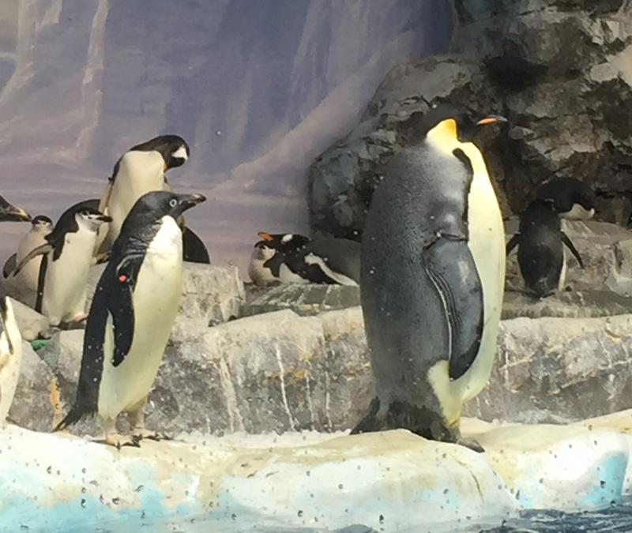
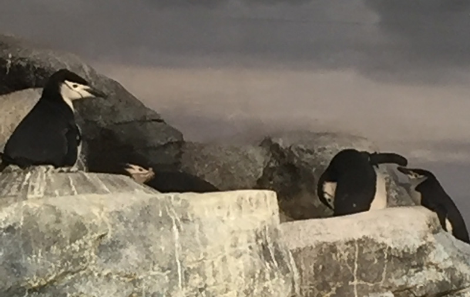
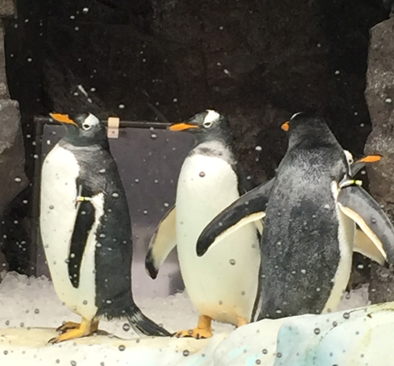

この記事は [プロ生ちゃん Advent Calendar 2015](http://www.adventar.org/calendars/969) の20日目の記事です。

12月12日（土）に名古屋の東桜会館で行われた、プログラミング生放送勉強会第38回＠名古屋に参加をしてきました。

<!--more-->

http://pronama.azurewebsites.net/2015/11/27/pronama-38-at-nagoya/

なんとAtndの申込みに対する出席率9割強…といいますか、1名以外全員参加だったそうです。すごい。



## LT

<iframe src="//www.slideshare.net/slideshow/embed_code/key/wCeKVOkjKP9ZRY" width="595" height="485" frameborder="0" marginwidth="0" marginheight="0" scrolling="no" style="border:1px solid #CCC; border-width:1px; margin-bottom:5px; max-width: 100%;" allowfullscreen> </iframe>

8月の正規表現についてのLT、 
10月の転職についてのLT、 
そして今回は、自宅サーバーについてのLTを行いました。

学生の頃に独学で始めた自宅サーバーですが、そこそこ慣れてきた(適当)と思うので今回発表をした次第です。

 

自宅サーバーをやってみたいけど何か難しそう、という人向けに、 
自宅サーバーのメリットや、自宅サーバー3分クッキング的なものを話しました。

勉強会が終わった後に、 
「自宅サーバーってやってみたかったんですけど、難しそうだったんですよね。後でスライド見なおしてみます！」などを声をかけて頂いて、 
一人でも自分の発表が伝わったようでとても嬉しいです。

次回にも活かしていきたいです。

## 名古屋港水族館にペンギンを見に行った

金沢から一緒に名古屋まで遠征した人＋αで[名古屋港水族館](http://www.nagoyaaqua.jp/)に行きました。

名古屋港水族館には、日本では和歌山のアドベンチャーワールドとここにしかいない、**エンペラーペンギン**（コウテイペンギン）がいます。

コウテイペンギンは、全18種類しかいないペンギンの中でも最も大きなペンギンです。 
よくキングペンギン（オウサマペンギン）と間違えられやすいですが、首のあたりの毛の色が違うので、これを機に覚えておきましょう。役立ちます。

[キングペンギンとエンペラーペンギンを見分けられるようになろう！](http://matome.naver.jp/odai/2141683346896764401)

 

また、3箇所でしか見られない**アデリーペンギン**もいます。

アデリーペンギンは、Suicaのペンギンの元となったペンギンと言えばピンとくる方が多いと思います。 
ポチな目がとってもキュートで可愛いです。

 

他には、アゴの髭の模様が特徴のヒゲペンギン（アゴヒゲペンギン）と、比較的いろんな水族館にいるジェンツーペンギンがいます。

ペンギン好きにはたまらない水族館となってます。是非行ってみてください。

 

### プロ生ちゃん Advent Calender

18日目と19日目はムラムラしているむらむらさんでした。

[先日のプロ生勉強会LTでスライド爆発させた件の話](http://pmw1415.hateblo.jp/entry/2015/12/18/063507)

[プロ生ちゃん素材から線画を抽出した話](http://pmw1415.hateblo.jp/entry/2015/12/19/135359)

あの「転職したい爆発ネタ」にあそこまでの情熱をかけているとは思いませんでした。

私も次回のLTではもっとネタを仕込みます。今回は時間がなかったんです（言い訳）
