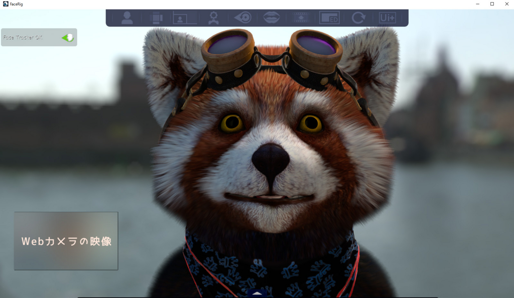
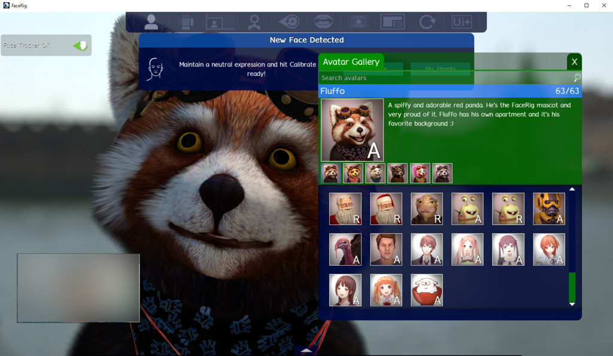
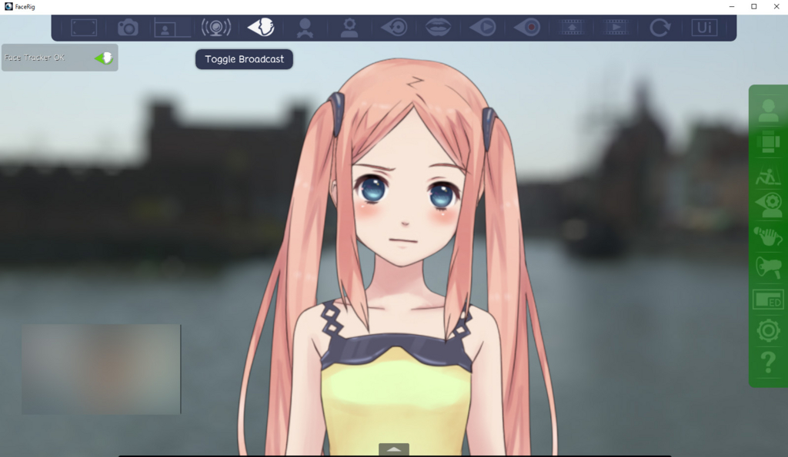

最近話題となっているFaceRig Live2D Module。 
Webカメラから顔を認識して画面内の3Dキャラクターが同じ表情をしてくれるFaceRigというソフトのDLCですが、調べてみたら思ったよりも安かったので、本体のFaceRigと共につい買ってしまいました。

<!--more-->

Steam上で配信されています。

* http://store.steampowered.com/app/274920/
* http://store.steampowered.com/app/420680/

## インストール

SteamからFaceRigをインストールすれば完了です。 
Skypeで使いたい場合は、仮想Webカメラドライバが必要なので、キャンセルを押さずにちゃんとインストールしましょう。

## キャラクター選択

起動するとこんな画面が出ます。 
デフォルトのたぬきの毛のふわふわ感に驚きます。

左上の人の形のアイコンをクリックすると、キャラクター選択画面になります。 
FaceRig Live2D Moduleを購入しているのならば、一番下に追加キャラクターが表示されているので、お好みのキャラクターを選択しましょう。



## 上手く顔を認識させるコツ

### カメラに顔全体がちょうど入るようにする
上の動画では目の動きが少し不自然ですが、これはカメラに遠かったせいでもあります。 
カメラから遠ざかればそれだけ目の認識範囲が狭まって、誤認識をする可能性が出るようです。

なお近すぎても顔の輪郭を認識しなくなるので気をつけましょう。

### 表情豊かに
ここまで完成度の高いソフトであっても、完璧ではありません。 
例えば、まつ毛が長かったり目が細めたりすると、ご認識される可能性が上がります。

上手く認識するためには、感情豊かな表情をすることをオススメします。例え一人でも。

## SkypeのWebカメラとして使う

* 先にFaceRigを起動しておきます。
* 右上のアイコン「Switch to Advanced UI」をクリックします。 

* すると、上と横にアイコンが追加され、上に「Toggle Broadcast」があるのでクリックします。
* 後はSkypeのビデオ設定からFaceRigのインストール時にインストールした仮想Webカメラ「FaceRig Virtual Camera」を選択すれば終わりです。



## その他

他にも、マイクから拾った音声を認識して自動で口を動かさせたり、背景を変更などかなり設定が細かいので、夢が広がりますね。

 

なお、この笑顔のスクリーンショットを撮ったり、実際に動いている様子を撮影している時の、Webカメラに写っている自分の姿を見るのは、とても辛くなるのでやめましょうね。 
慣れてくれば認識画面（左下の自分のWebカメラの映像）を見なくても良くなるので、設定でオフにも出来ます。
