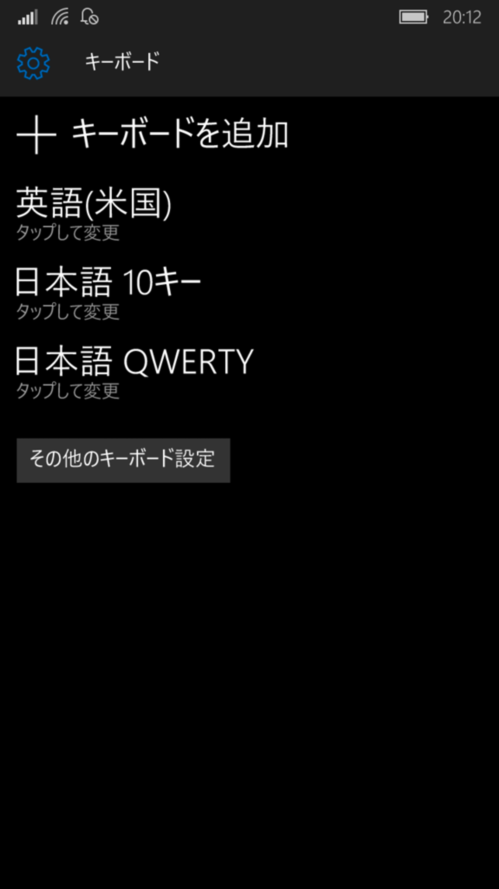
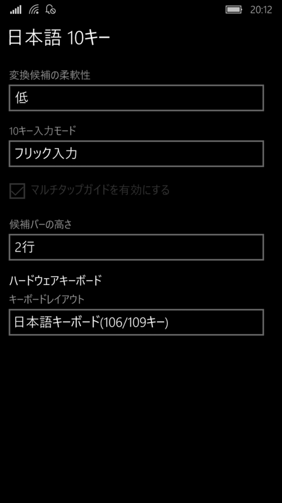

Windows 10 Mobileでは、デフォルトの設定でソフトウェアキーボードは同じキーを短い間隔で繰り返して押すと、そのキーに割り当てられている文字が入れ替わっていきます。

スマホに慣れている方々は、大体フリック入力を使っていると思うので、この動作が煩わしく感じていると思います。

設定で簡単に変えられるので、変えておきます。

設定のキーボードで「日本語 10キー」を選択

「10キー入力モード」を「フリック入力のみ」にする。

以上です。