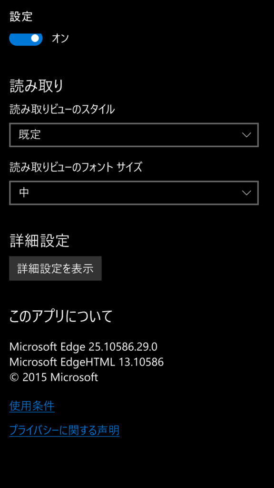
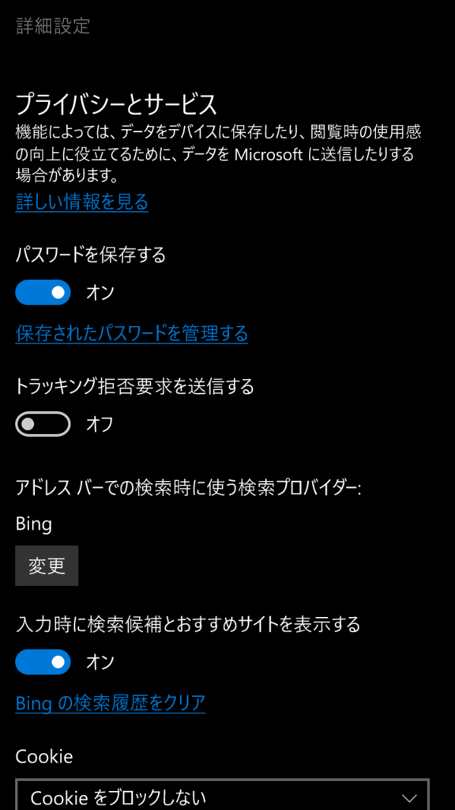
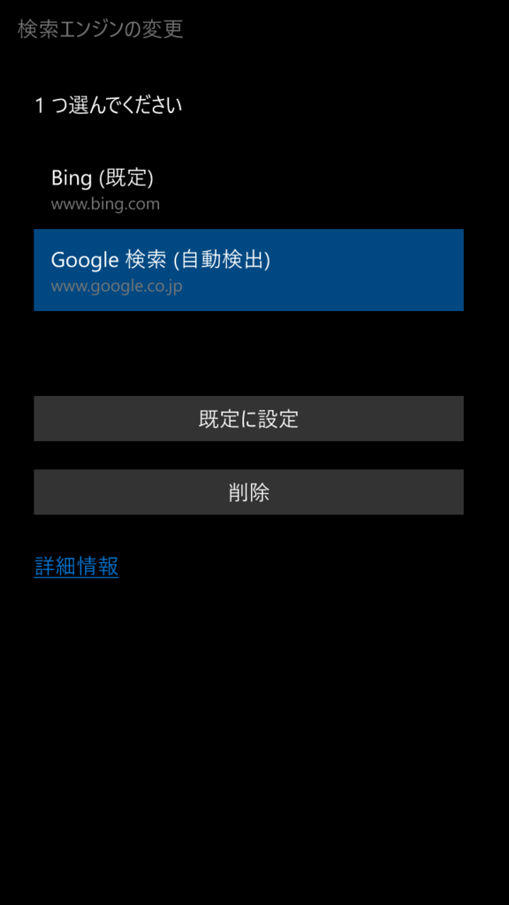
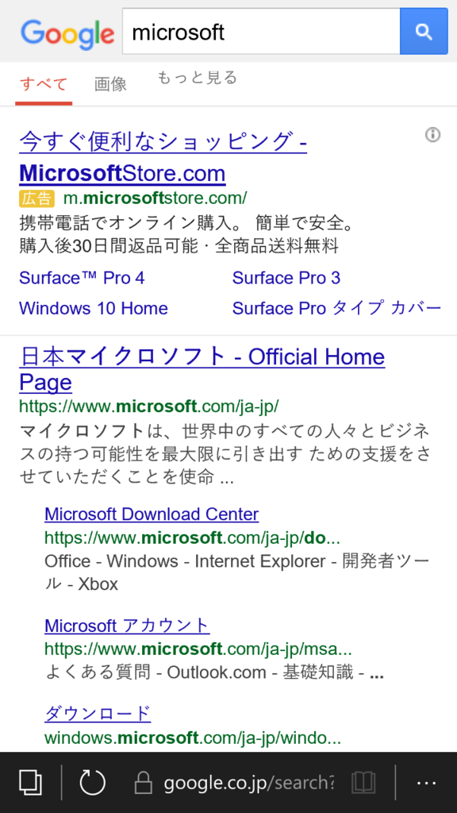

Windows 10 MobileのMicrosoft Edgeのデフォルトの検索エンジンはBingですが、 
Googleに変更できるので、方法を紹介します。

<!--more-->

Edgeで一度Googleのページを開く（その後閉じても構いません）

右下のメニューから「設定」

「詳細設定を表示」

「アドレスバーでの検索時に使う検索プロバイダー」の「変更」

「Google 検索（自動検出）」を選択して「既定に設定」

アドレスバーから検索をすると、Googleで検索されるようになります

