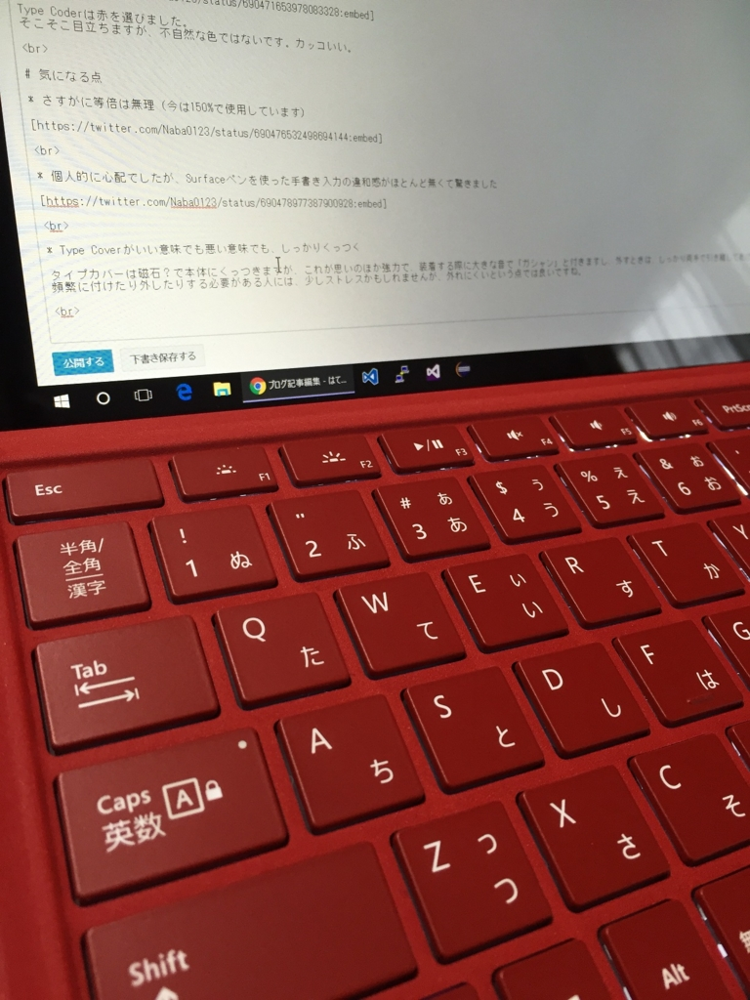

Surface Bookにしようか、Surface Pro 4にしようか散々悩みましたが、私はPro 4を選びました。

Microsoft Storeで予約したかったのですが、すでに予約分は完売しており、公式小売店？のヨドバシカメラで予約をしました。

<!--more-->

で、「まとめて発送」にしたと思ったのですが、先にキーボードだけ届きました。どないしろと。



開封して打鍵感を楽しんだ後、昨日ついに本体が届きました。

石川県なのに、発売日の朝にヤマトさんが届けてくれました！本当にありがとう！ 
（おかげで会社に遅刻しそうになった）



## 開封



Surface Pro ～ Surface Pro 3までの電源コードに問題が見つかったようで、リコール対象となっています。

https://www.microsoft.com/surface/ja-jp/support/warranty-service-and-recovery/powercord



Type Coderは赤を選びました。 
そこそこ目立ちますが、不自然な色ではないです。カッコいい。

## 気になる点

* さすがに等倍は無理（今は150%で使用しています）



* 個人的に心配でしたが、Surfaceペンを使った手書き入力の違和感がほとんど無くて驚きました



* Type Coverがいい意味でも悪い意味でも、しっかりくっつく

タイプカバーは磁石？で本体にくっつきますが、これが思いのほか強力で、装着する際に大きな音で「ガシャン」と付きますし、外すときは、しっかり両手で引き離してあげる必要があります。 
頻繁に付けたり外したりする必要がある人には、少しストレスかもしれませんが、外れにくいという点では良いですね。

* Type Coverを傾けた状態だと、タスクバーにタッチがしづらい

そこまで気にはなりませんが、Type Coverを本体側にくっ付けて、傾けた状態にすると、タスクバーのアイコンが少しタッチしづらいかもしれないです。 
Surfaceペンを使用すればそうでもないと思います。

 

とまぁ、総評は「最高」です。みんなで買いましょう。
