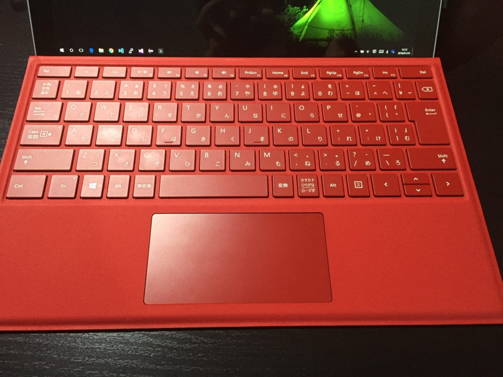
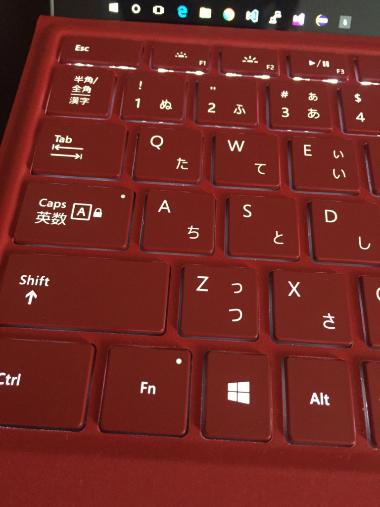
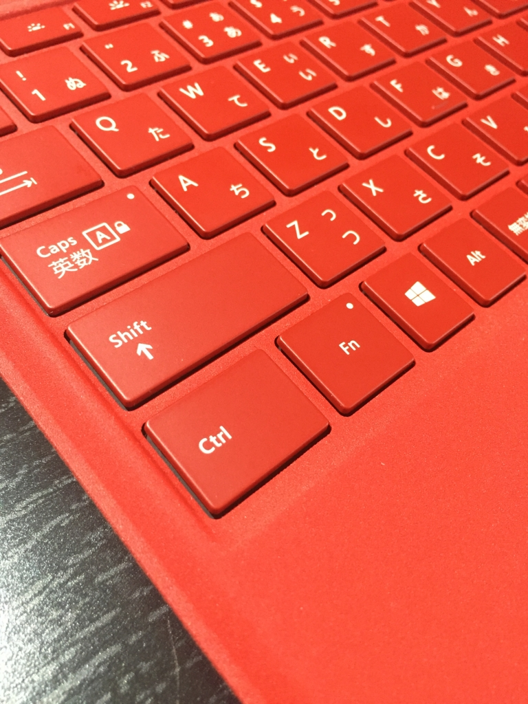
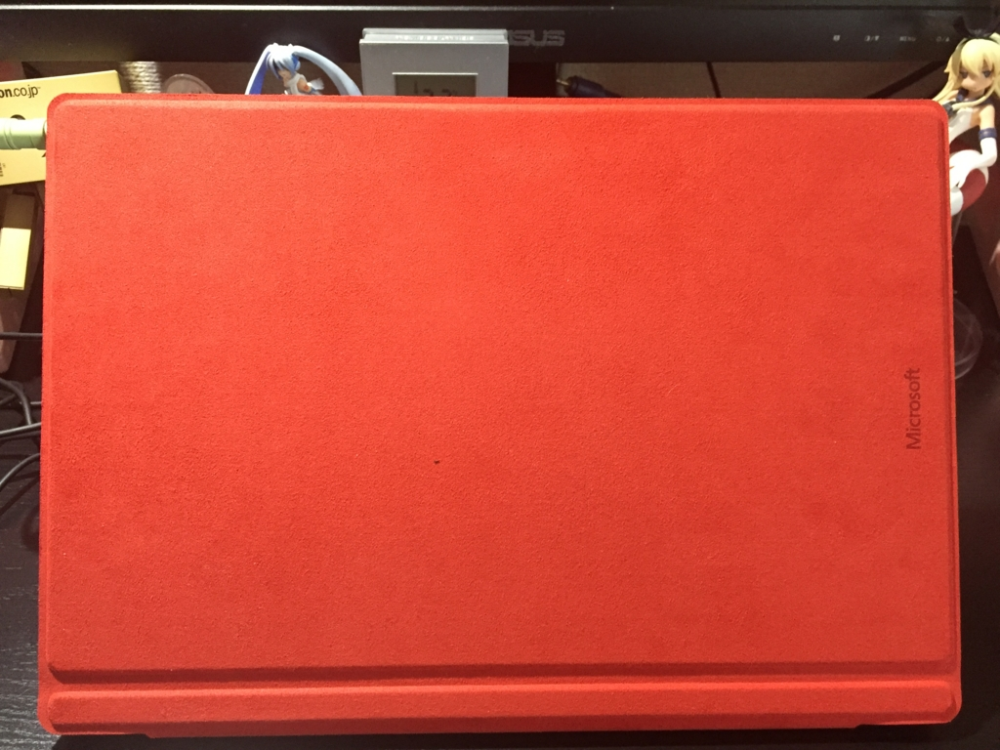

Surface Pro 4のType CoverはRedを選びました。

http://www.microsoftstore.com/store/msjp/ja_JP/pdp/Surface-Pro-4-Type-Cover/productID.326554900

赤カッコいいですよ赤。

<!--more-->

## 配列

日本語配列です。

標準的な日本語配列です。 
右側にCtrlはありません。 
「￥」キーは相変わらず狭いです。

Pro 4のType Coverからキーピッチが広くなりました。 
とても打ちやすいです（Surfaceシリーズ初めてなんですけどね…）。

カーソルキーは、最近のキーボードではよくある上下キーが狭いやつです。 
個人的に好きではないのですが、場所が限られているので仕方がないですね。

## バックライト

LEDバックライト搭載です。暗くてもキーが見やすいです。

Fnキーはオン（F1～F12が使える）の時に右上が光っています。 
オフのときは、音量調節やPrtScnキーなどが使用できます。

なお、Homeボタン等はFn+Leftに割り当てられているので、いちいちFnキーをオフにする必要はないです。

* Home : Fn + Left
* End : Fn + Right
* Page UP : Fn + Up
* Page Down : Fn + Down

## 材質

フェルトを固くしたほうな感じ？でしょうか。 
とっても肌触りがいいです。

外側には、Microsoftのロゴが端っこに書いてあります。

内側よりも、さらにふかふかしてます。良い。

でも、汚れがついたら落ちにくそうです。

窪みには、Surfaceペンを収納することもできます。機能的。

## 打ち心地

以前のType Coverと比べてキーストロークは深くなったようで、キーボードをしっかり打っているという感覚はあります。

しかし、薄型の宿命でキーストロークには限界があるので、ガッツリキーボードを使う作業の時は別のUSBキーボードなどを利用した方がいいのかと思います。 
気にならない人は気にならないと思いますけどね。

軽く打っている分には、キーボードの歪みは感じられないですが、タイプが強い人は少し歪むかもしれません。

 

それでも、この薄さでこれだけのパフォーマンスを発揮できるのは素晴らしいです。 
個人的には、LEDバックライトがついているのが一番気に入っています。

 

Type Coverはいいぞ。
