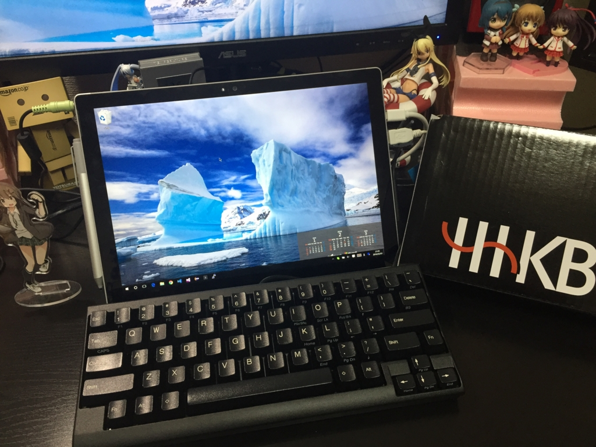
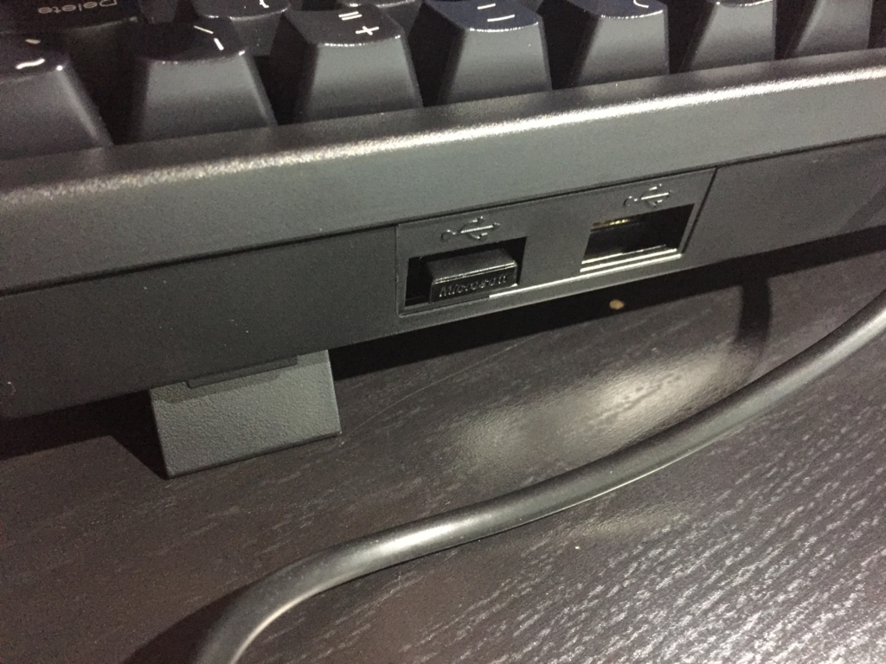
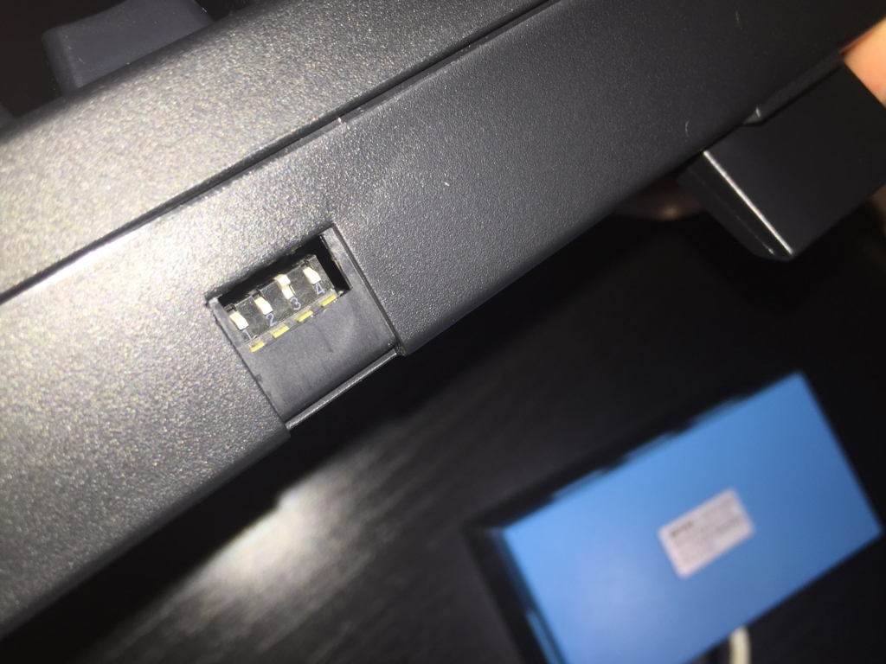
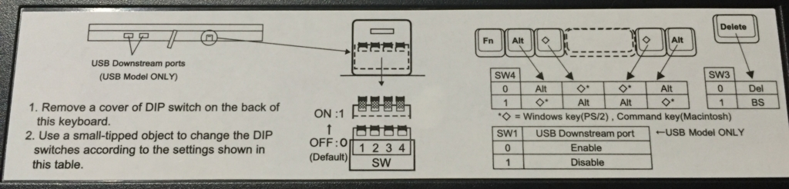
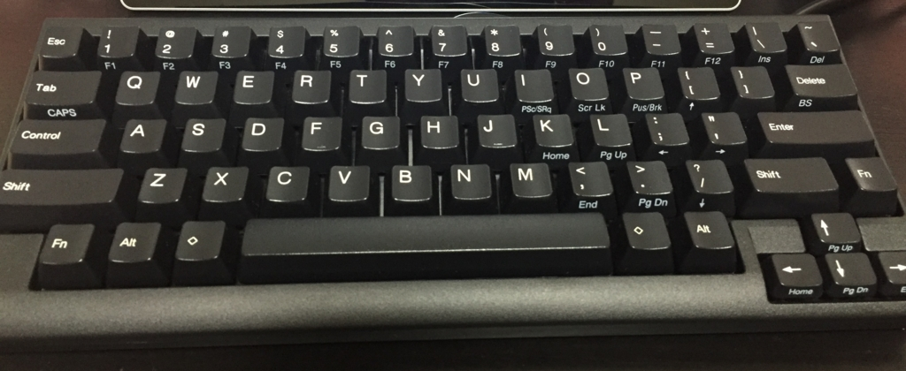

Surface Pro 4のキーボードと言えばType Coverですが、プログラミング用に専用のキーボードが欲しくなったのでHHKBを買いました。

http://www.pfu.fujitsu.com/hhkeyboard/

私が買ったのは、一番安いモデルの **PD-KB200B/U** で、　2016年2月3日現在Amazonで5500円弱です。

http://www.amazon.co.jp/dp/B0000U1DJ2

<!--more-->

 

## インタフェース

USB接続モデルです。ケーブル長は2mで、キーボードがUSBハブの機能も兼ねていて、USBポートが2つ付いています。

Suface Pro 4ではUSBポートが一つしかなく、マウスを考えるとUSBハブが必須なので、このハブは非常に助かっています。

キーボードを直でSurafeceに繋いで、マウスなどはキーボードから繋ぐことが出来るのです。あら便利。

 

でも、コネクタがキーボードの奥まったところに配置されており、うっかり無線アダプタを接続すると、なかなか抜けなくて苦労します。

(引っこ抜くのに数分かかりました)

また、ハードウェアスイッチが付いていて、AltキーとWindowsキー(MacだとCommandキー)を入れ替えたり、DeleteキーとBSキーを切り替えたり出来ます。

キーボードの裏に説明が書かれているので安心です。

## 打鍵感

打つことに特化したキーボードは初めてだったので、素直にキーの打ちやすさに感動してます。 

キーストロークが深いので、しっかり打っているという感じがあり、大満足です（ここはType Coverでは達成出来ないところですね）。

そこそこ角度をつけることも出来、それでもしっかり全部のキーが打ちやすいです。

安いキーボードだと、スペースキーの押す場所によって感触が違うというのもよく有りますが、そこはさすがHHKB、英字配列の長いスペースキーのどこを押しても同じ感触を得ることが出来て、非常に快適です。

 

## 英字配列

人生初めての英字配列です。

何故英字配列かと言われると、Enterキーがホームポジションから近いとか（そもそも自分はホームポジションを守っていないが）いろいろありますが、単に「カッコ良さそうだから」という理由が一番です。

セットアップ等は必要なく、Windows 10に繋げば英字配列のキーボードと認識されて使いはじめることが出来ました。

「半角／全角」キーは、Altを押しながら「｀」キー（Deleteの上）を押せば切り替わります。

「・」は「？／」キー（右Shiftの左）ですね（少し迷った）。

 

「半角／全角」の切り替えにまだ違和感はありますが、使い続けていくうちに慣れていくと思います。



申し訳ないと思っています（思っているとは言ってない）。

HHKBはいいぞ。
