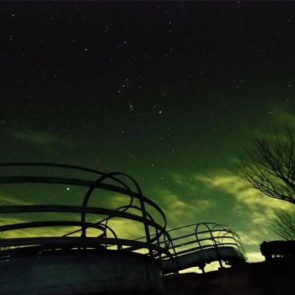

<iframe width="100%" height="300" scrolling="no" frameborder="no" allow="autoplay" src="https://w.soundcloud.com/player/?url=https%3A//api.soundcloud.com/tracks/243405491&color=%23ff5500&auto_play=false&hide_related=false&show_comments=true&show_user=true&show_reposts=false&show_teaser=true&visual=true"></iframe>
<a href="https://soundcloud.com/naba0123" title="Naba" target="_blank" style="color: #cccccc; text-decoration: none;">Naba</a> · <a href="https://soundcloud.com/naba0123/3zm5siwxuyis" title="暗闇" target="_blank" style="color: #cccccc; text-decoration: none;">暗闇</a>

1月24日にアップロードしました。

当初はStaffPadの遊び程度に済まそうとしていたのですが、作り途中でStaffPadの動画を撮って投稿したところ拡散されてしまったので、このビックウェーブに乗るしかないということで、急遽音源化してアップロードしました。

おかげで、作曲活動に本腰を入れることが出来て万々歳です。

<!--more-->



## 解説

タイトルの「暗闇」は後からつけました。

モチーフとしては、悲壮感漂う夜、でしょうか。

夜の暗闇の中、一人ぼっちで道を歩いているイメージです。

感想で「最後に夜が明けるイメージ」と言われ、そういう考え方もあるのか、と感じました。

 

## 技術

* DAWはSONAR X1 Produner
* ピアノ音源はGALAXY VINTAGE D

StaffPadで楽譜を作成した後、自分で弾けるように練習し、電子ピアノからSONARへMIDIでリアルタイム録音しています。

その後、DTMの恩恵を受けて（MIDIの変なところを編集する）、ソフトウェア音源に流し込んで完成です。

 

ひとまず、<del>数年ぶりに曲を作ったので作り方を忘れてなくてよかったです</del>これからも頑張っていきますので、よろしくお願いします。
