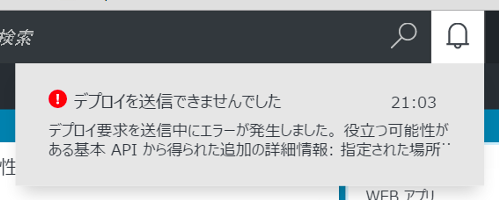
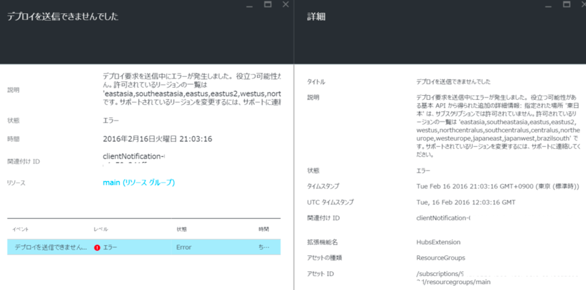
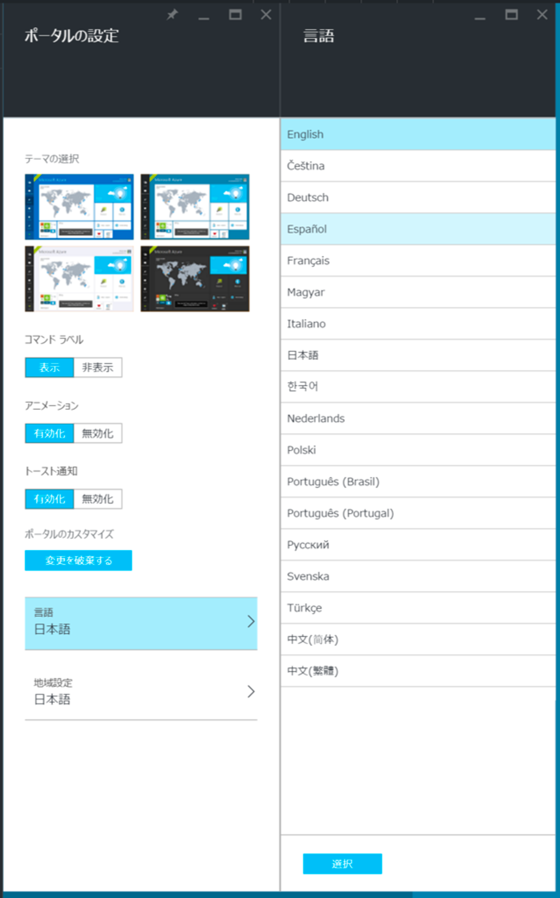
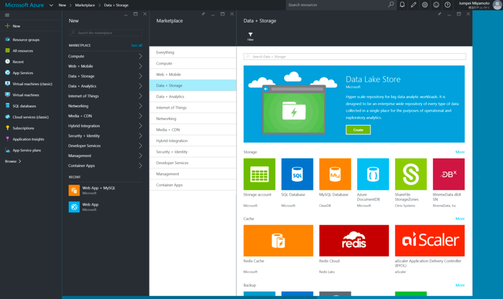
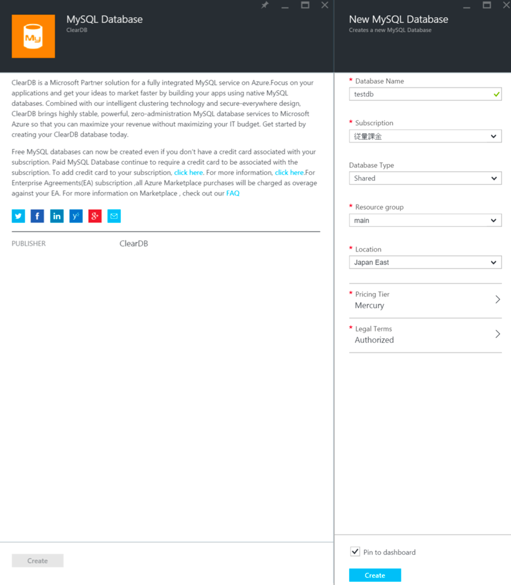
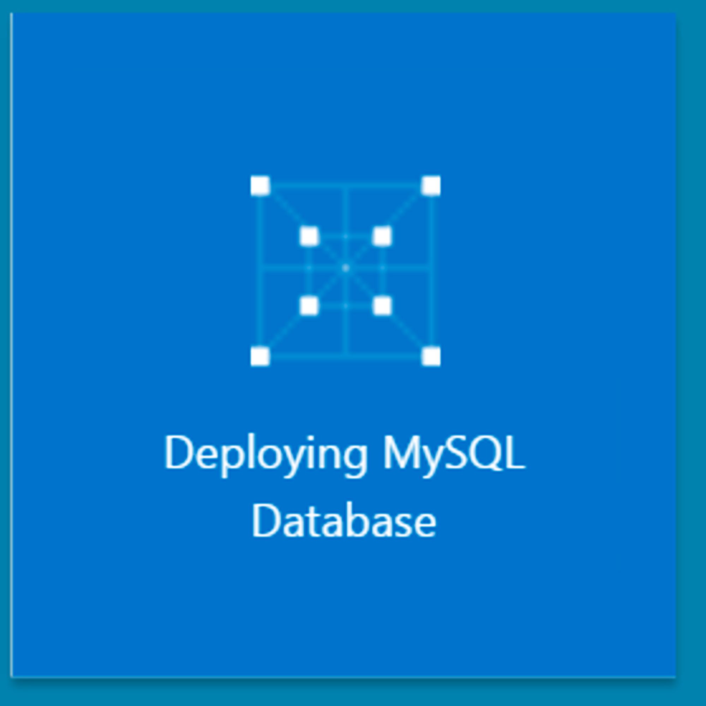
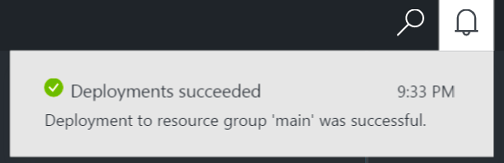

最近、Azureに手を出してみてます。

Web App + Mysqlデータベースを無料で立ち上げることが出来るということで試してみようとしたのですが、MySQLの設定をしてデプロイが始まると、以下のエラーが出ました。

<!--more-->

詳しく見てみると、以下のように書かれていました。

> デプロイ要求を送信中にエラーが発生しました。 役立つ可能性がある基本 API から得られた追加の詳細情報: 指定された場所 '東日本' は、サブスクリプションでは許可されていません。許可されているリージョンの一覧は 'eastasia, southeastasia, eastus, eastus2, westus, northcentralus, southcentralus, centralus, northeurope, westeurope, japaneast, japanwest, brazilsouth' です。サポートされているリージョンを変更するには、サポートに連絡してください。

いやいや、「東日本」は「japaneast」だと思いながら悩んでいましたが、もしかして日本語版のAzureポータルだと自動翻訳されて英語表記の地域にマッチしなかったのでは、と思い、英語に切り替えました。

歯車をクリックし、

言語で英語に切り替えて「選択」を押します。

再読み込みが行われて、英語表記に切り替わって再びポータルに戻ってきましたので、再びMySQLデータベースを作成します。

無事に作成されたようです。

英語表記で困らない方はこのままで良いと思いますが、お金が絡むので心配な方（自分）は、日本語表記に戻しておきましょう。