Windowsストアには、Microsoft純正のリモートデスクトップアプリが存在します。 
このアプリを使って、Windows 10 Proデバイスに接続をしてみます。

<!--more-->

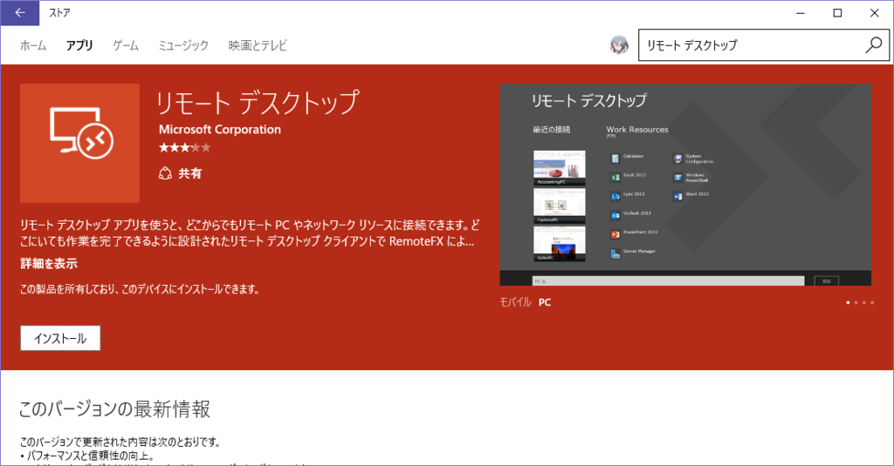

## インストール

Windwos 10 Mobile端末から、ストアにアクセスし、「リモート デスクトップ」と検索すれば出てきます。 
「リモート」と「デスクトップ」の間に半角を入れないとヒットしません（リモートだけでヒットしますけどね）。

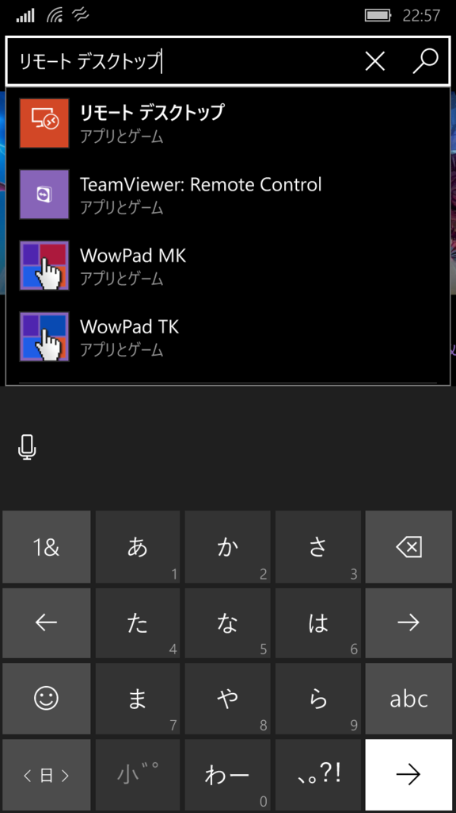

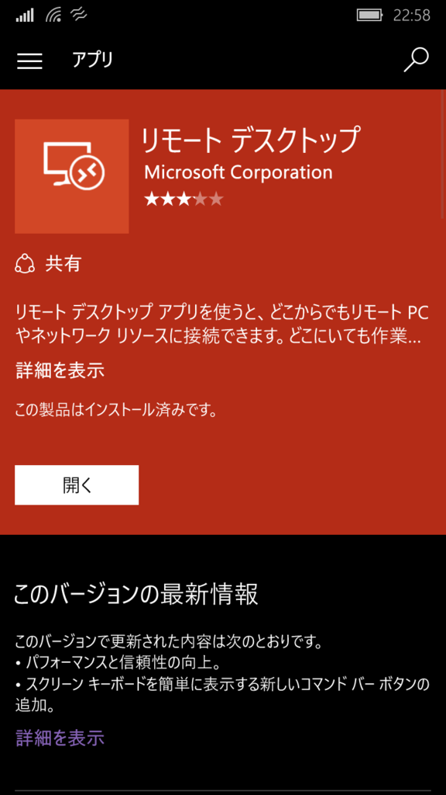

インストールをすれば、完了です。

 

## PC側の設定

今回、接続先にはSurface Pro 4を使用しており、Windows 10 Pro端末です。 
Windows 10 Homeではリモートデスクトップの接続側にはなれませんので、注意してください（以下で説明する設定項目が存在しません）。

「システム」画面から、「リモートの設定」を選択します。

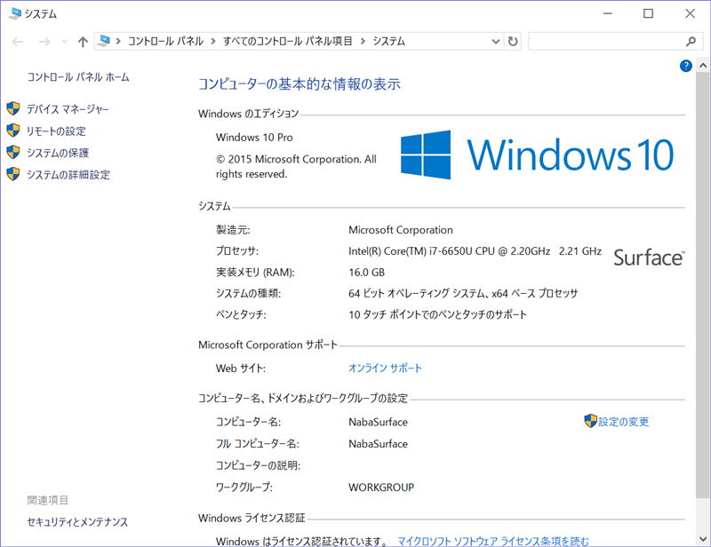

「このコンピュータへのリモート接続を許可する」にチェックを入れます（この項目がHome版には存在しません）。

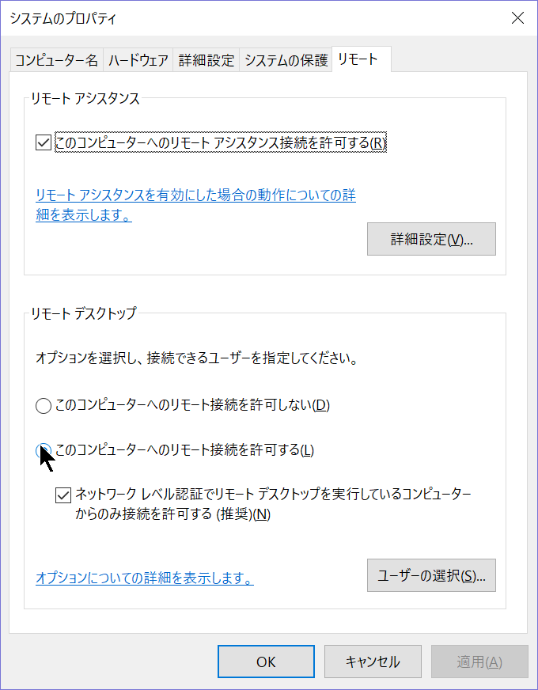

リモートで接続するユーザーが、今ログインしているユーザー以外の場合は、「ユーザーの選択」から追加するとログイン出来るようになると思います（試してないです）。

PC側の設定は以上です。

 

## ポート開放

LAN内からリモートデスクトップをする（どういう状況だ）のであればポート開放をする必要はありませんが、大抵は外出先から接続することがほとんどだと思うので、ポート開放が必要です。

リモートデスクトップはポート番号3389番と決まっているので、ルーターでポート開放を行いましょう。

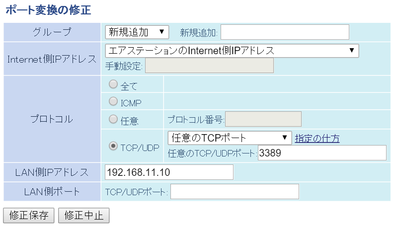

画像は例です。BUFFALOのWHR-G301Nを使用しています。

「LAN側IPアドレス」は、接続したいPC（今回の場合だとSurfaceのローカルIP）を指定します。 
コマンドプロンプトで「ipconfig」と打てば出てきます。

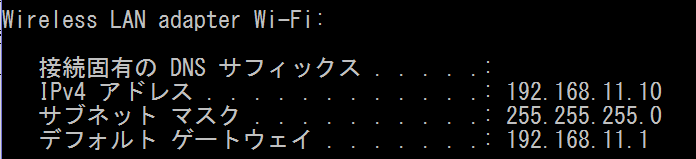

追記）VPNを使用すればもっと安全になると思います。

 

## グローバルIPの確認 or DDNSの設定

ひとまずテストで接続出来れば良いのであれば、今のPC側グローバルIPを確認します。 
「グローバルIP　確認」などと検索すれば出てきます。ルータで見ることも出来ます。

https://www.cman.jp/network/support/go_access.cgi

常用するのであれば、ダイナミックDNSとして、ドメインを取得する手もあります。 
が、今回の話の筋とは外れるので、割愛します。

 

## 接続

それでは、Windows 10 MobileからWindows 10 Proへリモートデスクトップで接続したいと思います。

アプリを起動して、下の「＋」ボタンから設定を追加します。

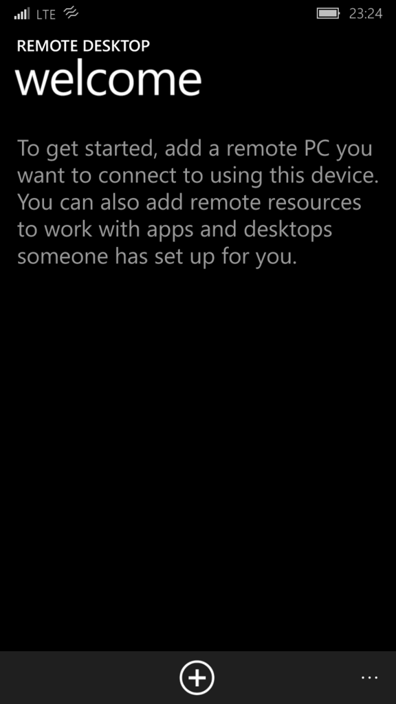

「デスクトップ」を選択します。Azureの仮想PCにもアクセス出来るんですかね？（やったことないです）

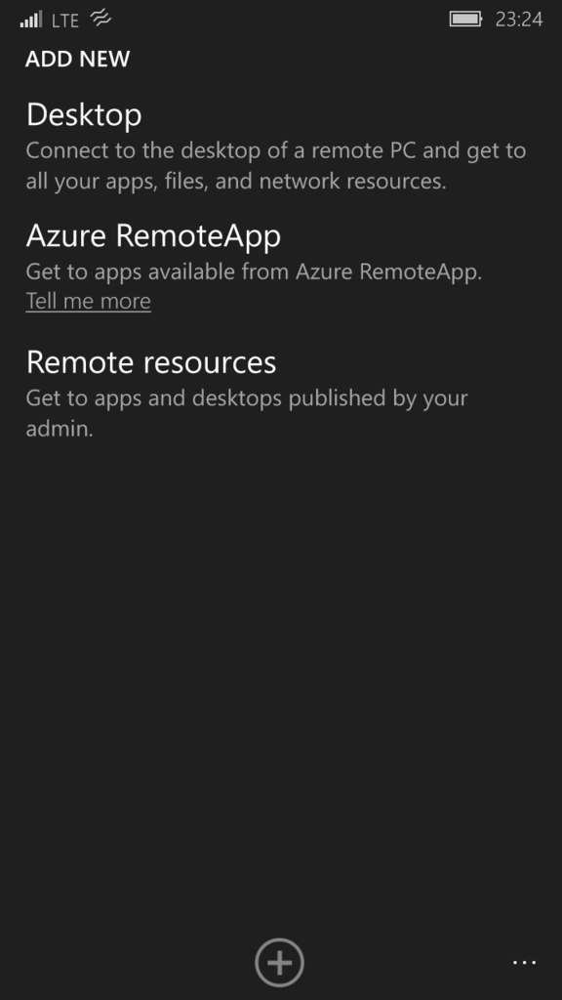

「PC name」には、先程確認したグローバスIP、もしくはDDNSドメインを入力します。 
「Credentials」は資格情報です。他の設定で入力した資格情報を使うこともできます。 
今回は、初めてなので、とりあえず「Enter every time」のままにして下の保存ボタンを押して保存します。

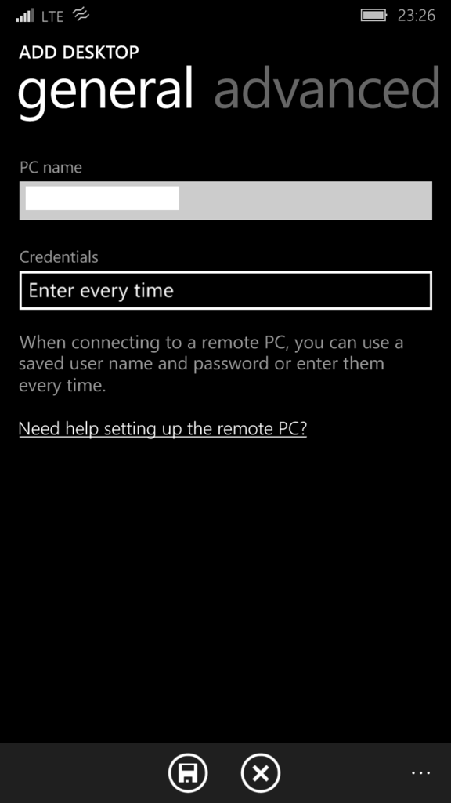

アプリのトップに戻るので、先程作られた設定をタップします。

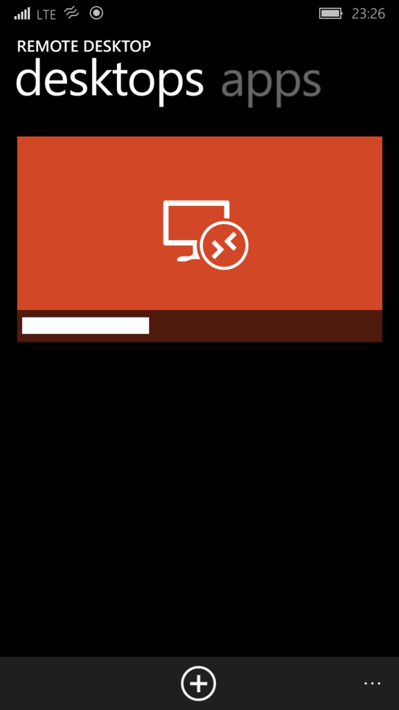

初めての接続の時は、資格情報の入力画面になるので、PCのログイン時に使っているアカウント（大体Microsoftアカウントだと思いますが）を入力します。 
「Save credentials」にチェックを入れておくと、別の接続先でもこの資格情報の設定を利用することが出来ます。

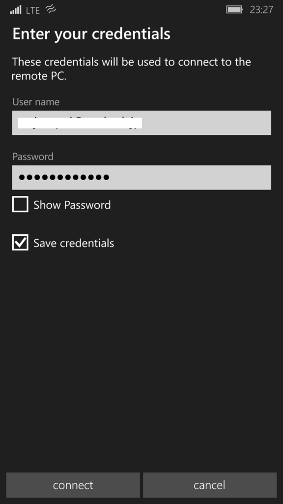

さらに進めると、初回のアクセス先なので信頼できないけど大丈夫？（多分）と聞かれるので、connectを選択します。

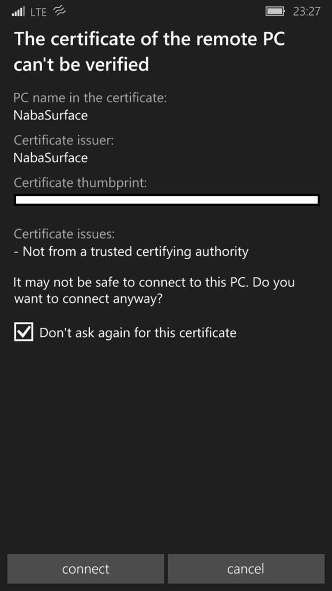

接続完了です。

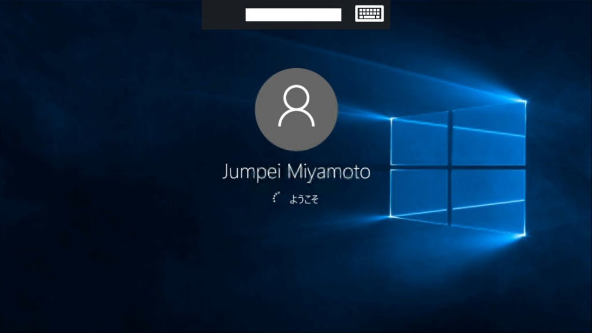

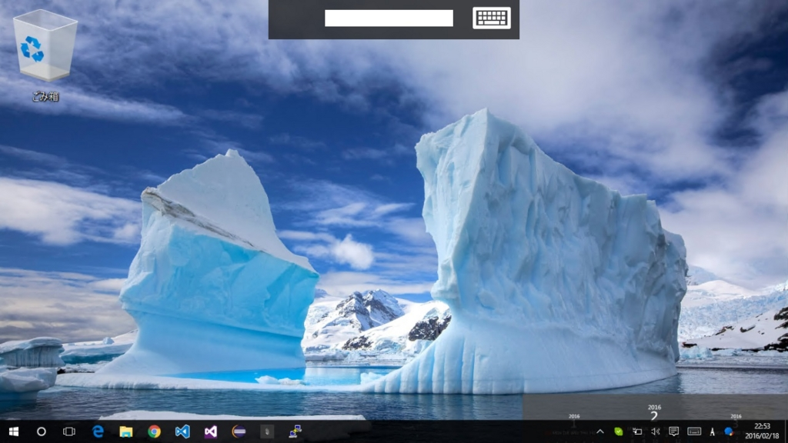

 

使い勝手については、他の方が説明してくださっているので、そちらを参照して下さい。 
追記）こちらの記事は、新しいMicrosoft Remote Desktop Previewの記事のようです。

http://blog.kazuakix.jp/entry/2016/01/16/004959

もちろんですが、リモート接続中は、本体のPCはロックがかかって操作は出来ません。

Surfaceの前に座り、テストするために目の前のSurfaceにリモート接続すると、Surfaceがロックがかかると同時にWindows Helloが反応してロックを解除し、リモートデスクトップが切断されるということもなるかもしれないので、注意してください。

