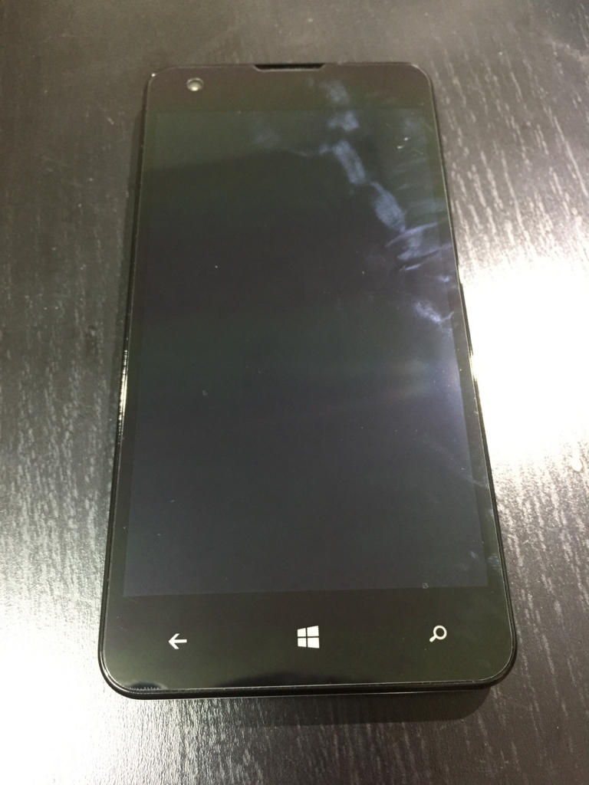
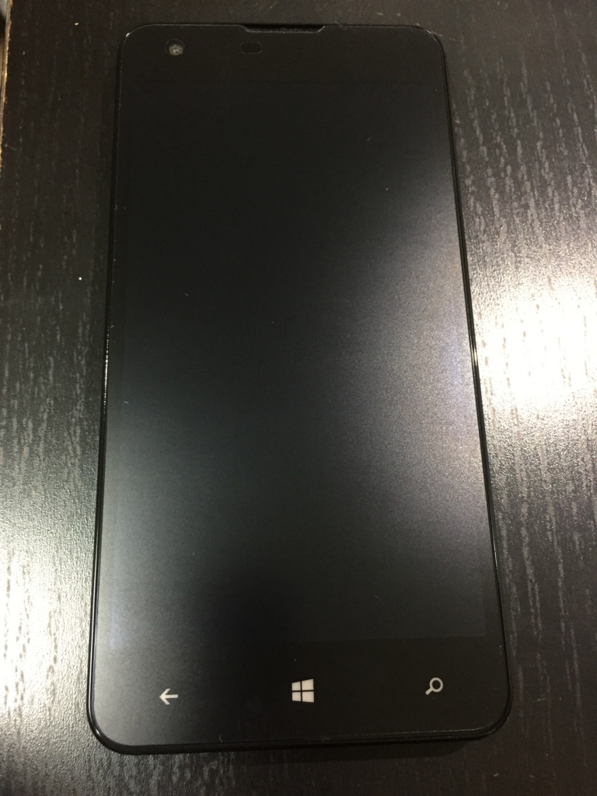

MADOSMA Q501には最初から保護シートが貼ってあります。

が、反射がひどかったり指の滑りが悪かったりと、少し気になってたので、アンチグレアの保護シートに貼り替えました。



<!--more-->

張り替えたのは、OverLay Plus for MADOSMAです。

http://www.amazon.co.jp/dp/B0107J6RVY

最初から貼ってあった保護シートは、拭いても指紋がすぐについてしまっていました。

保護シートを剥がすと、何やら拭いた後が見えてきましたが、綺麗にアルコールで拭きなおして、新しい保護シートに貼り替え。

反射が減って良い感じです。

アンチグレアの、少しざらついた感じが結構好きです。

個人的には、もう少し滑りが良くてもよかったかもしれませんが、概ね満足です。
