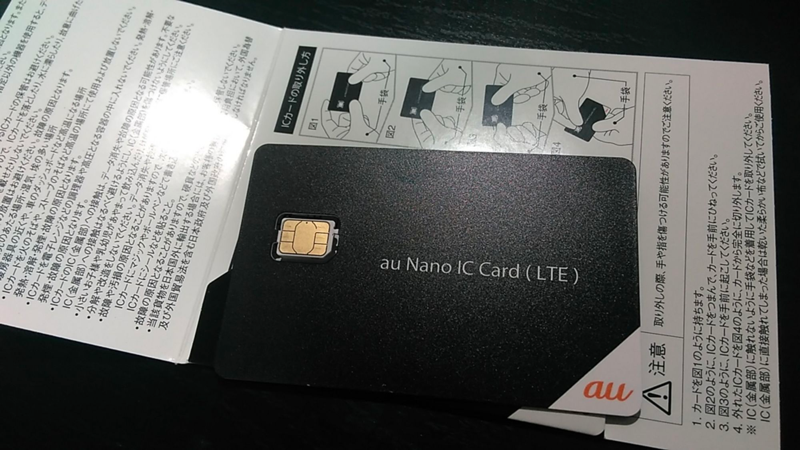
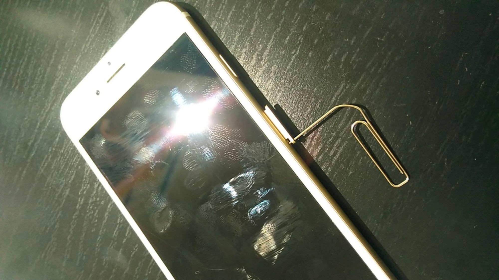
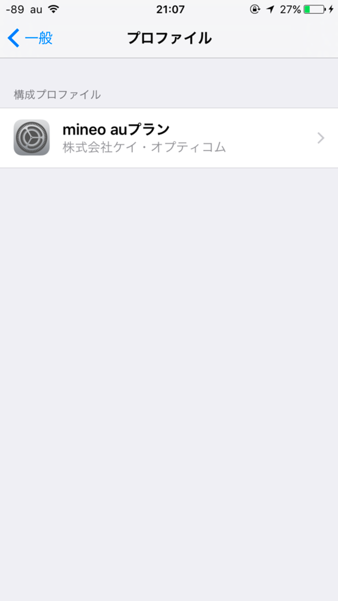
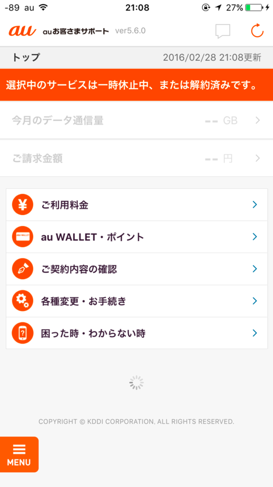
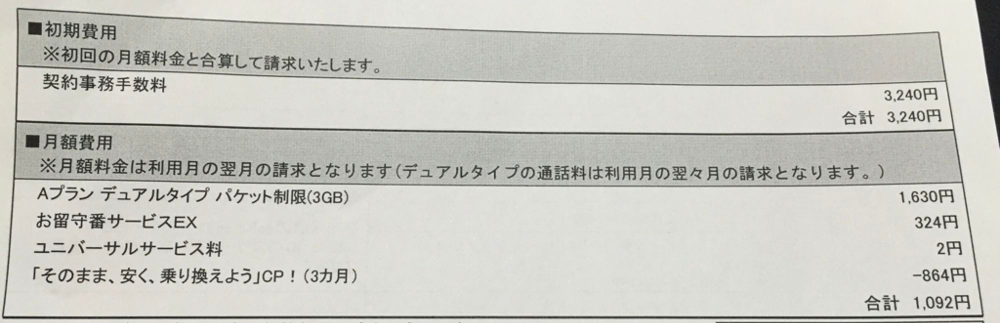

auのiPhone6を使っていましたが、やはり月額料金が気になったので、au系MVNOのmineoに乗り換えました。

<!--more-->

本当はMADOSMAで使用しているDMM mobileに統合したかったのですが、DMM mobileはdocomo系で、auのiPhoneではSIMロックにより使えなかったのと、追加のMNP SIMには対応していなかったのでmineoにしました。

# **MNP転出**

電話で出来るのですが、直接話を聞きたかったのでauの店舗に行きました。が、店舗が混んでいて、「電話をお貸ししますのでご自分で手続きして下さい」と言われ、auショップにいるのにも関わらず電話で手続きをしました。

MNP転出の注意事項などの説明を受け、予約番号を電話口で伝えられ、スムーズに終わりました。一生懸命メモしましたが、数十分後にCメールで予約番号が届きました。

# **mineo申し込み**

mineoのホームページからMNP転入での新規登録を申し込みました。審査？手続き？が完了すると、SIMが届きます。iPhone 6はnano SIMですね。

申し込みをしてから、届くまで約1週間程かかりました。

# **SIMカード入れ替えと開通手続き**

iPhone 6のSIMの取り出し器具は箱に入っているそうですが、無くしてもクリップで代用できます。

指紋ひどい。

開通手続きはネット上から行います。私はPCから行いました。

iPhoneのプロファイルは、KDDIのプロファイルを削除後に、マニュアルに記載されているQRコードからプロファイルをインストールします。

左上の表示はauのままですね。

開通手続きには30分程度かかり、開通したかどうかは「111」にダイヤルすることで確認できます。私の場合は、15分程で試しに電話をしてみたところ、開通されていました。早い。

なので、実際の電話番号の不通時間は15分ほどですね。全く問題ないと思います。

回線速度は恐らく変わっていないと思います。

テザリングは設定項目は残っていますが、接続は出来ませんでした（非対応って公式HPに書いてある）。

auのお客様サポートアプリは使えなくなっていました。確認は、移行前にしたほうが良さそうです。

想像以上に簡単に一連の手続きが完了したのでホッとしています。

mineoのプランは、月額で、3GBプラン1600円＋留守番サービス300円です。何やらキャンペーン適用されていて、初めの3ヶ月間は850円ほど安くなってます。

何も問題なく使えるといいですね。