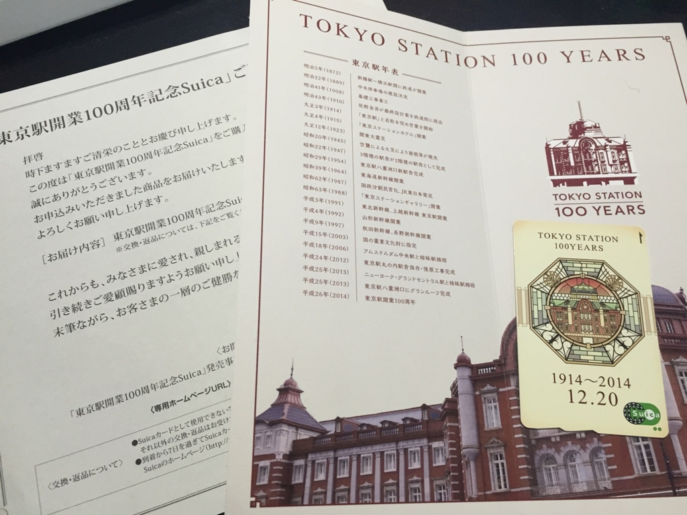
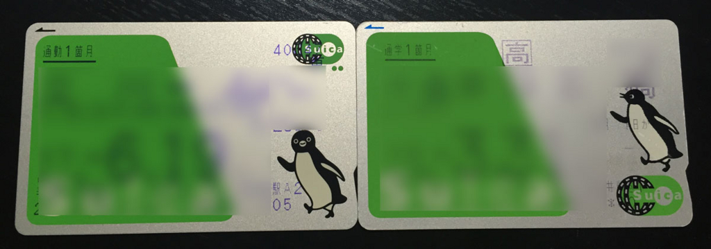

（多分）去年の1月に大変人気となっていた 東京駅100周年Suica が、先月ようやく届きました。

<!--more-->





100周年自体は、2014年なんですね。

つまり、今年は開業102年目…？

 

余談ですが、現在の通常Suicaのペンギンは、正面を向いていますが、その前のデザインではペンギンが横を向いています。

左が現在(2015年5月購入)のSuica、右が2007年4月に購入したSuicaです。

Suicaのロゴの位置も変わっているんですね。

 
