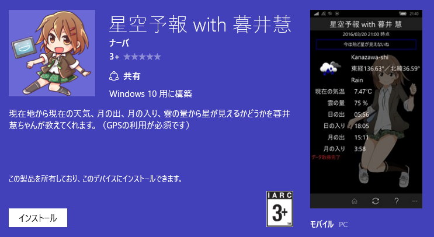
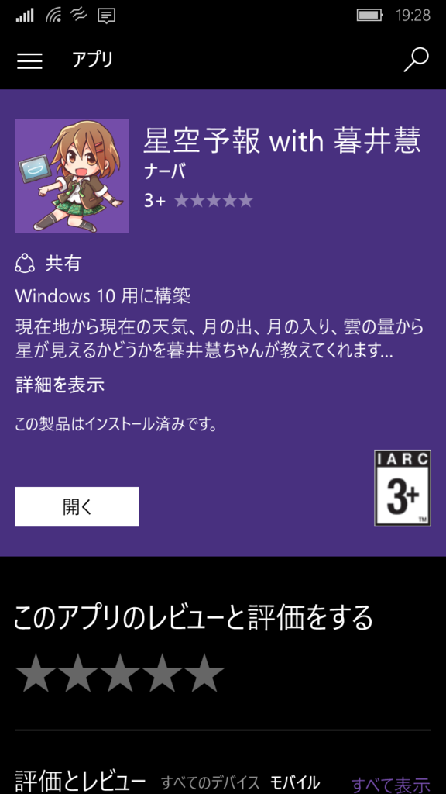

https://www.microsoft.com/ja-jp/store/apps/%E6%98%9F%E7%A9%BA%E4%BA%88%E5%A0%B1-with-%E6%9A%AE%E4%BA%95%E6%85%A7/9nblggh4rjv9

構想1週間、実装1週間でひとまずアプリを公開することが出来ました。

タイトルは、「星空予報 with 暮井慧」です。

<!--more-->

内容は、GPSから現在地の天気を取得し、雲の量から現在星が見えるかどうかをプロ生ちゃんが教えてくれます。

急いで説明文を書いて審査に出したので、説明文からして日本語が怪しいです。次のバージョンアップでどうにかします。

 

プロ生ちゃんについては、以下を参照。

http://pronama.azurewebsites.net/pronama/

 

これからバージョンアップを重ねて使いやすいものに仕上げていくつもりです。

 

## プロ生＠金沢

このアプリの制作についての話は、今週の土曜日に開催される、プログラミング生放送勉強会 第40回＠金沢にて登壇させて頂き、そこで話をさせて頂きます。

といいますか、主催をしています。

是非来てください。（人が少ないと寂しいので！）

https://atnd.org/events/75528

 
