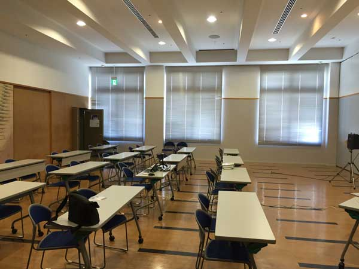
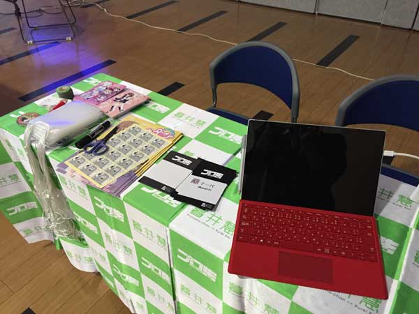
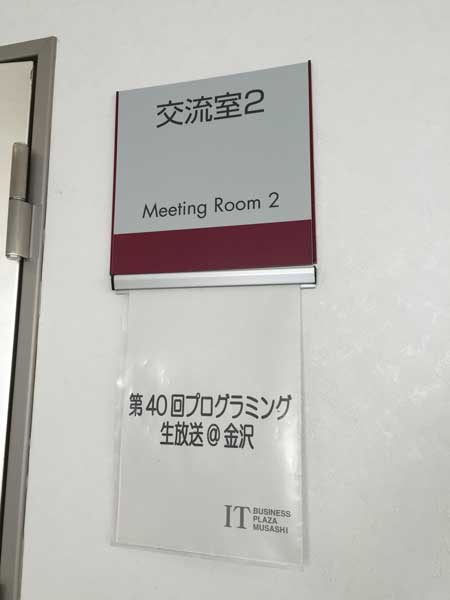
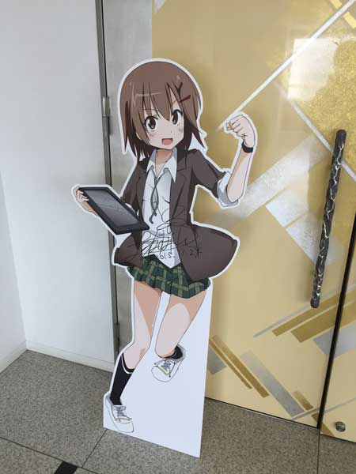
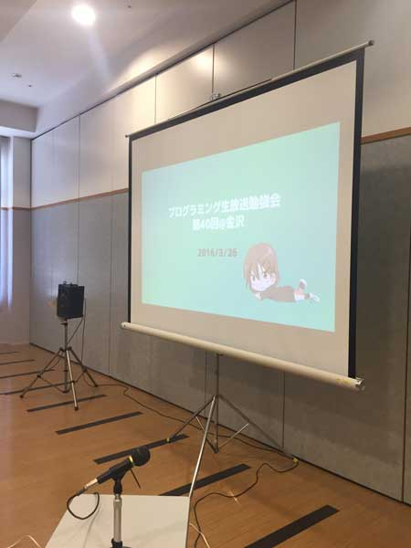

プログラミング生放送勉強会 第40回＠金沢の主催をさせて頂きました。

http://pronama.azurewebsites.net/2016/03/16/pronama-40-at-kanazawa/

１ヶ月半という準備期間で慌ただしい日々が続きましたが、今はひとまず無事に終わってほっとしています。

お忙しい中お越し下さった皆様、登壇をお引受けいただいた高松さん、きりんさん、ショートセッション、ライトニングセッションの方へお礼申し上げます。

<!--more-->

次回、また金沢で開催したいと思います。

その時までには、もう少し運営やセッションについて精進しておきます。

是非、またお越しください。

## 当日のこと

ITビジネスプラザ武蔵の交流室２はとても広いです。 
３０人弱で使用したため、非常に広々と使うことが出来ました。

## セッション

「初心者でも Windows 10 Mobile アプリを作りたい！」というタイトルで50分間のセッションをさせて頂きました。 
初ロングセッション。ライブコーディングは3分クッキングになりました。

<iframe src="//www.slideshare.net/slideshow/embed_code/key/NTAeLJS8mp9UHl" width="595" height="485" frameborder="0" marginwidth="0" marginheight="0" scrolling="no" style="border:1px solid #CCC; border-width:1px; margin-bottom:5px; max-width: 100%;" allowfullscreen> </iframe> 
 <strong> <a href="//www.slideshare.net/naba0123/windows-10-mobile-60052999" title="初心者でも Windows 10 Mobile アプリを作りたい！" target="_blank">初心者でも Windows 10 Mobile アプリを作りたい！</a> </strong> from <strong><a href="https://www.slideshare.net/naba0123" target="_blank">naba0123</a></strong> 

この発表のために作ったアプリが以下。

https://www.microsoft.com/ja-jp/store/apps/%E6%98%9F%E7%A9%BA%E4%BA%88%E5%A0%B1-with-%E6%9A%AE%E4%BA%95%E6%85%A7/9nblggh4rjv9

最初はハッキリ話そうとしていましたが、後半から忘れてて早口になっていました。 
怖くてニコ生のタイムシフトが見れない(´・ω・｀)

 

また、今回の発表にあたって、[Microsoft MVP for Windows Developmentの かずき さん](https://twitter.com/okazuki)にスライドのチェックをして頂きました。 
本当に有難うございました。



 

勉強会以外の内容については、後日また書きます。

 
