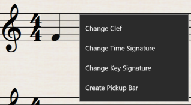
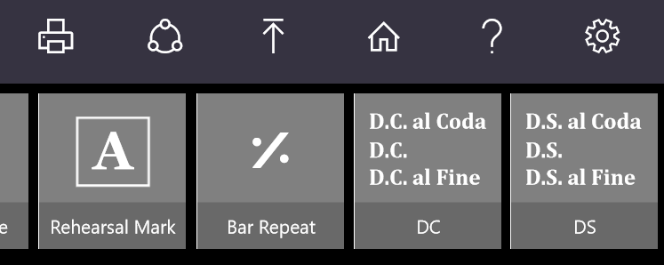
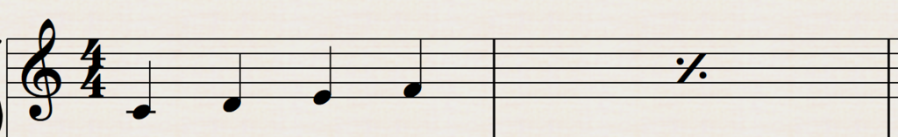
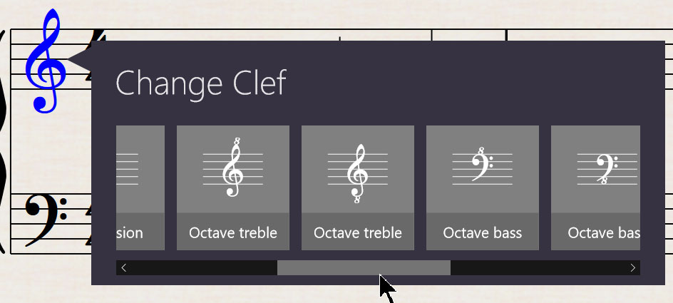

https://www.microsoft.com/ja-jp/store/apps/staffpad/9wzdncrddkrb

Surfaceシリーズに特化した手書き楽譜入力ソフト StaffPad ですが、先日、April Updateが行われ、新機能が幾つか追加されました。

http://blog.staffpad.net/staffpad-april-update-2/

ところで StaffPad はリリースから1年を迎えたそうです。おめでたいですね。

<!--more-->

## アップデート内容

完全には把握しきれていませんが、StaffPadの新機能を幾つか紹介したいと思います。

### Pick-up bars の追加

日本語で言うと **弱起** または **アウフタクト** ですね。 
曲の初めに一拍だけ追加するアレです（名前が思い出せなくて一生懸命調べた）。

いざ使う時にこの機能がなくて困っている方は多かったのではないでしょうか。 
嬉しい機能ですね。

画像は公式ヘルプより。 
五線上をロングタップすればメニューが出てくるようですが、私は見つけることが出来ませんでした。

### D.C./D.S.  Coda/Segno  Fine の追加

これこそ、待ち焦がれた人が多いのではないでしょうか。 
ダ・カーポ、ダルセーニョ、コーダ、セーニョ、フィーネ、ですね。

クラシック音楽ではお馴染みですが、J-POP等では特にフィーネ等を使う曲は少ないのではないでしょうか。

こちらはメニューに追加されていました。

### ％ の繰り返し記号

そういえばこんな記号もありましたね（最近クラシックに触れていないから忘れている）。

これも必要な記号ですね。二小節繰り返しや、四小節繰り返しも作れます。

### Flip note sterm direction

恐らく音符の符尾（縦線）の位置を上下自由に入れ替えることが出来るようになった、ということだと思います。（日本語訳に自信がない）

Surface Penのボタンをクリックしながら音符を囲って選択し、右上のボタンから入れ替えることが出来ます。

### その他

* サブタイトル、編曲者、作詞者が書けるようになった
* ダブルシャープ、ダブルフラットが書けるようになった
* オクターブ付きの音部記号が選択できるようになった

* 音声認識の機能の追加（例「"D.C. al Coda at bar 16"」、英語のみ対応）

他の手書き楽譜入力ソフトと比べられがちな StaffPad ですが、着実に進化を遂げていっているソフトだと思います。

まだ完全に何もかもこれで済ませられるというわけではありませんが、これからも応援していこうと思います。

