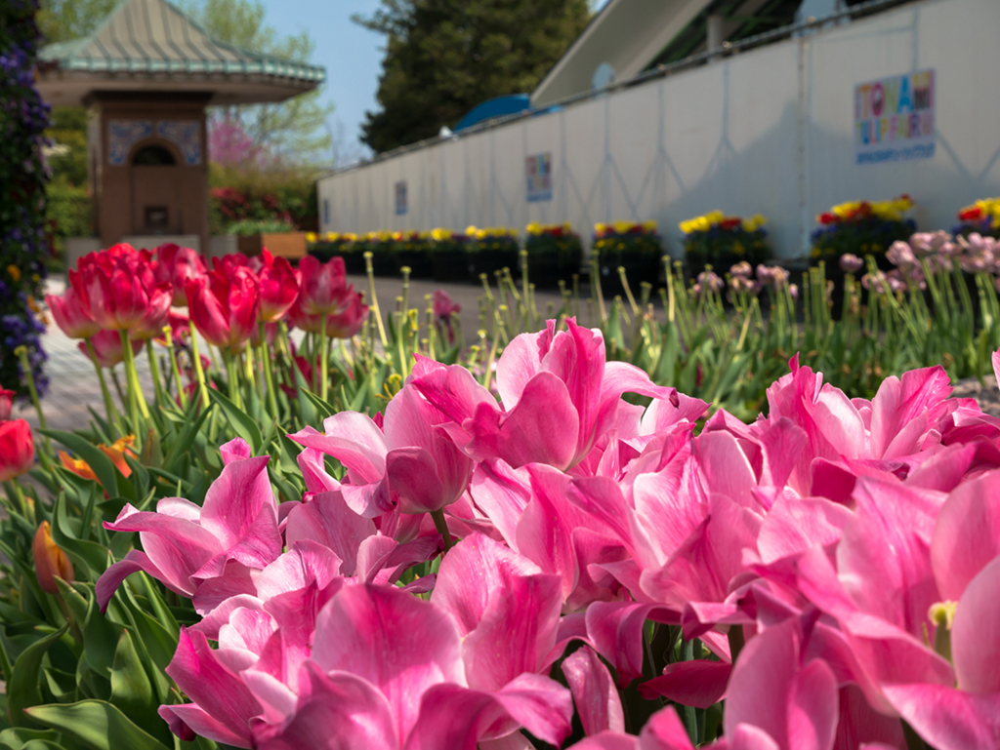
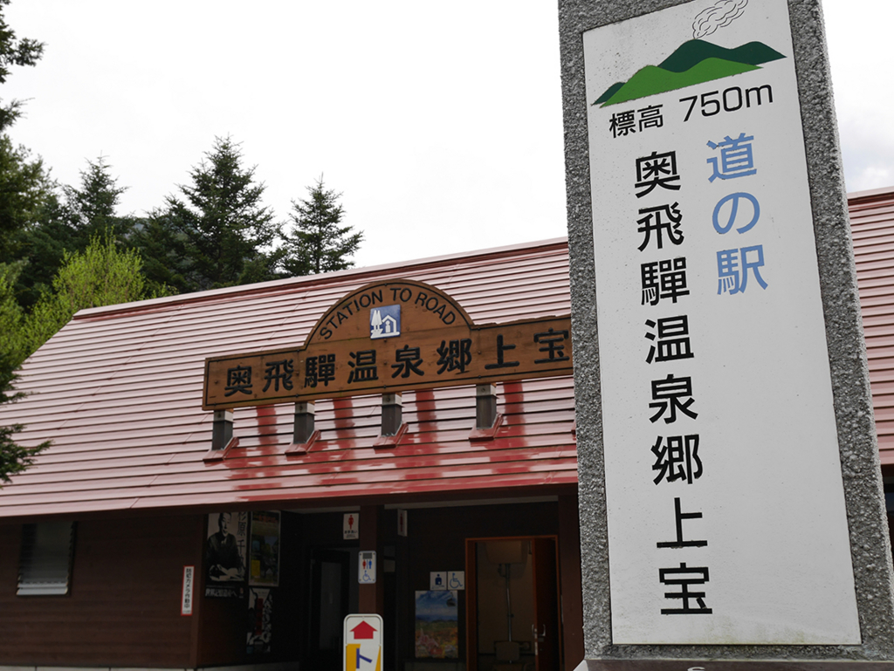
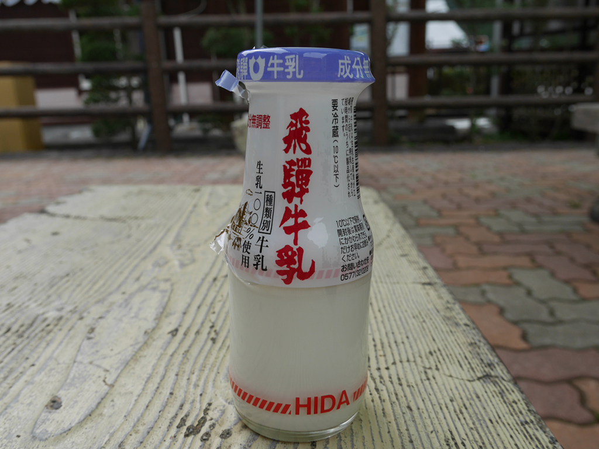
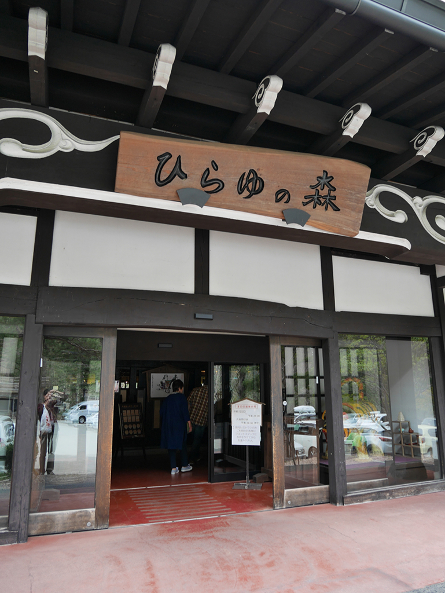
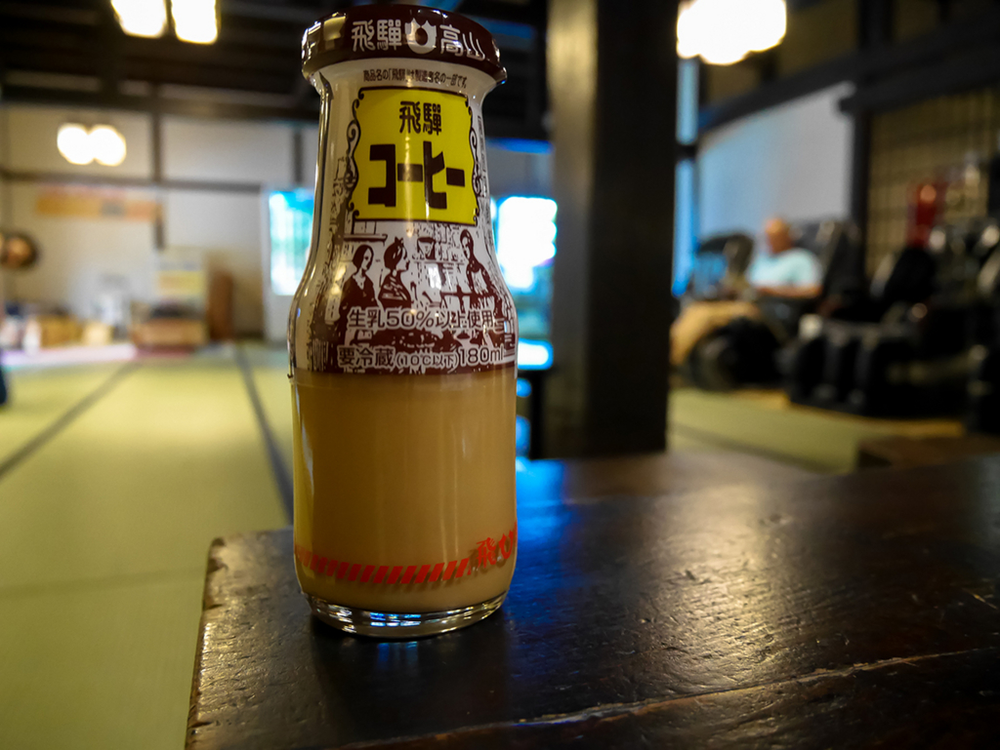
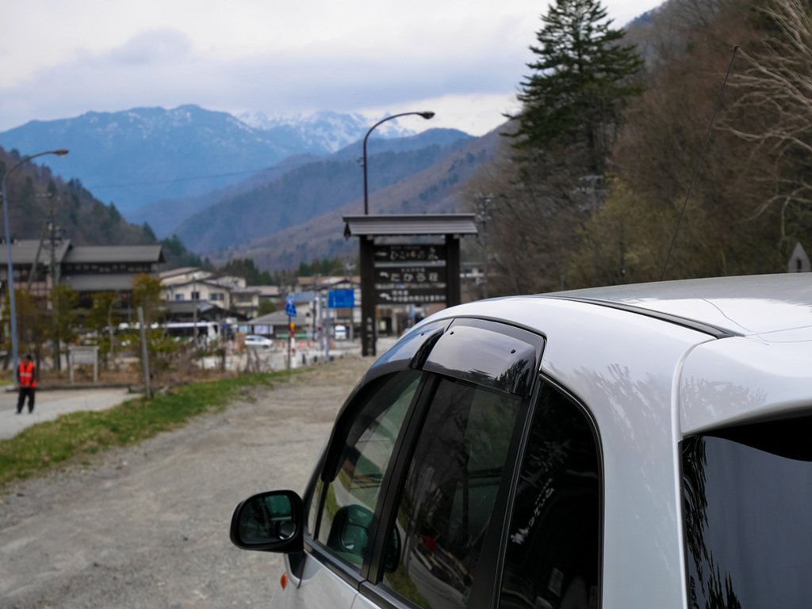
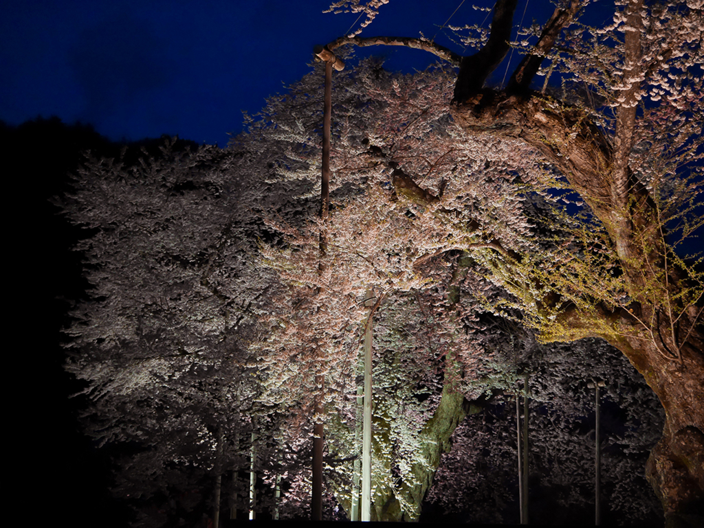
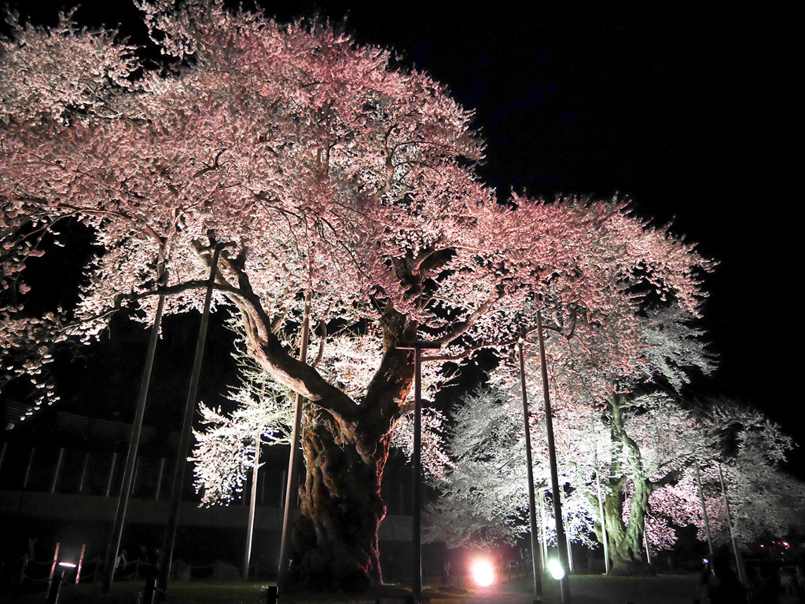

今日は 金沢→砺波→奥飛騨→荘川 を走りました。350kmぐらいです。

<!--more-->

## となみチューリップフェア

http://www.info-toyama.com/event/40007/

看板を見つけてフラフラと。

駐車料金500円払って入り口に行くと入場料1000円の文字。

入り口のチューリップを撮って、さっと帰っていくのであった。

### 道の駅 奥飛騨温泉郷 上宝

牛乳美味しいです。 
（ラベルを剥がし始めてから、写真を撮ることを思い出した）

### ひらゆの森

http://www.hirayunomori.co.jp/

露天風呂5種、日帰り入浴500円、安い。

ここではコーヒー牛乳を飲みました。

まだ山の方では雪が残っているようです。

### 荘川桜

帰り途中にラジオを聴いていたら、荘川桜が８分咲きと言っていたので。

http://www.shokawa.net/introduction/452

上手く写真が撮れるようになりたいですね…！

先日、ついにカメラを買いました。Panasonic の DMC-GF7W という機種です。



早く使いこなしたい。
