GW前半の3日間を使って、金沢～長野～草津あたりをブラブラしてきました。

<!--more-->

## 親不知

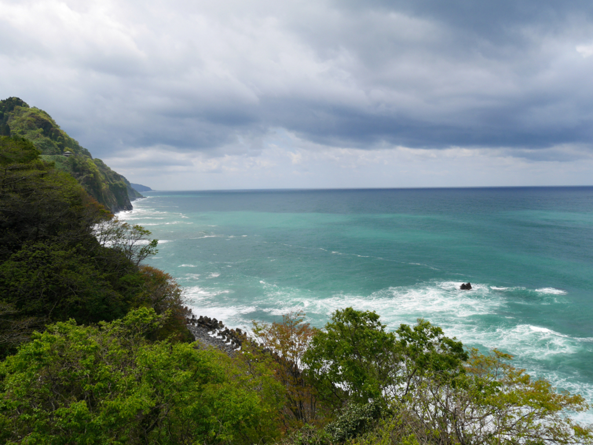

国道八号線沿いに、親不知の景色が一望できるスポットが有ります。

天険断崖黎明と言うそうです。

<iframe src="https://www.google.com/maps/embed?pb=!1m18!1m12!1m3!1d5359.1045839410945!2d137.70506921284502!3d36.99684863914927!2m3!1f0!2f0!3f0!3m2!1i1024!2i768!4f13.1!3m3!1m2!1s0x0000000000000000%3A0x4614e8ca39797a42!2z5aSp6Zm65pat5bSW6buO5piO!5e0!3m2!1sja!2sjp!4v1462092993642" width="600" height="450" frameborder="0" style="border:0" allowfullscreen></iframe>

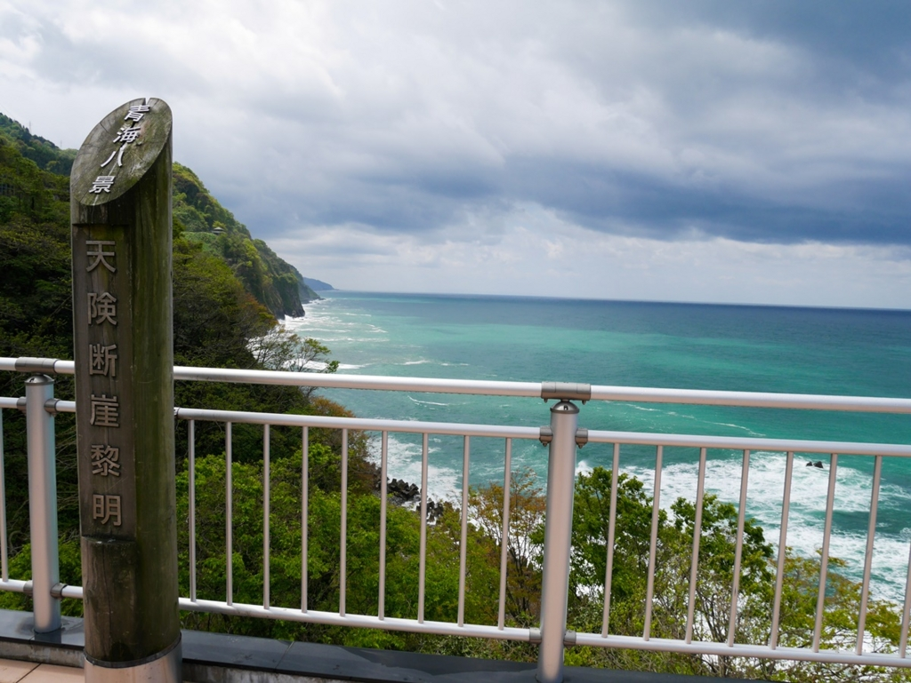

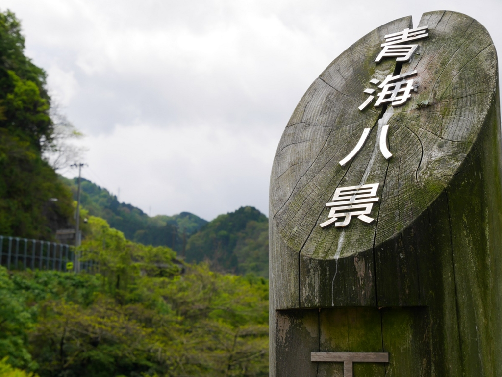

 

## 蒲原沢

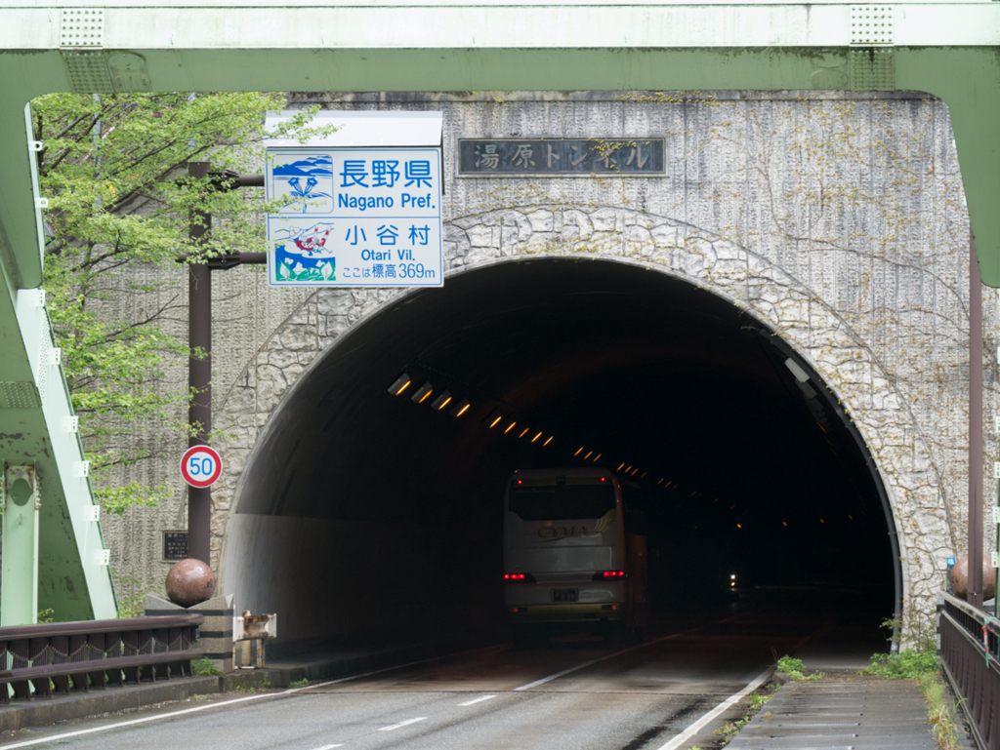

新潟県糸魚川市と長野県小谷村の堺にある蒲原沢は、1996年12月6日に土石流災害が発生した場所です。 
慰霊碑が置かれていました。

https://ja.wikipedia.org/wiki/%E8%92%B2%E5%8E%9F%E6%B2%A2%E5%9C%9F%E7%9F%B3%E6%B5%81%E7%81%BD%E5%AE%B3

<iframe src="https://www.google.com/maps/embed?pb=!1m14!1m12!1m3!1d1477.055725447091!2d137.8755153199165!3d36.8663245657896!2m3!1f0!2f0!3f0!3m2!1i1024!2i768!4f13.1!5e0!3m2!1sja!2sjp!4v1462094005452" width="600" height="450" frameborder="0" style="border:0" allowfullscreen></iframe>

ここから見える鉄橋が、とても綺麗でした。

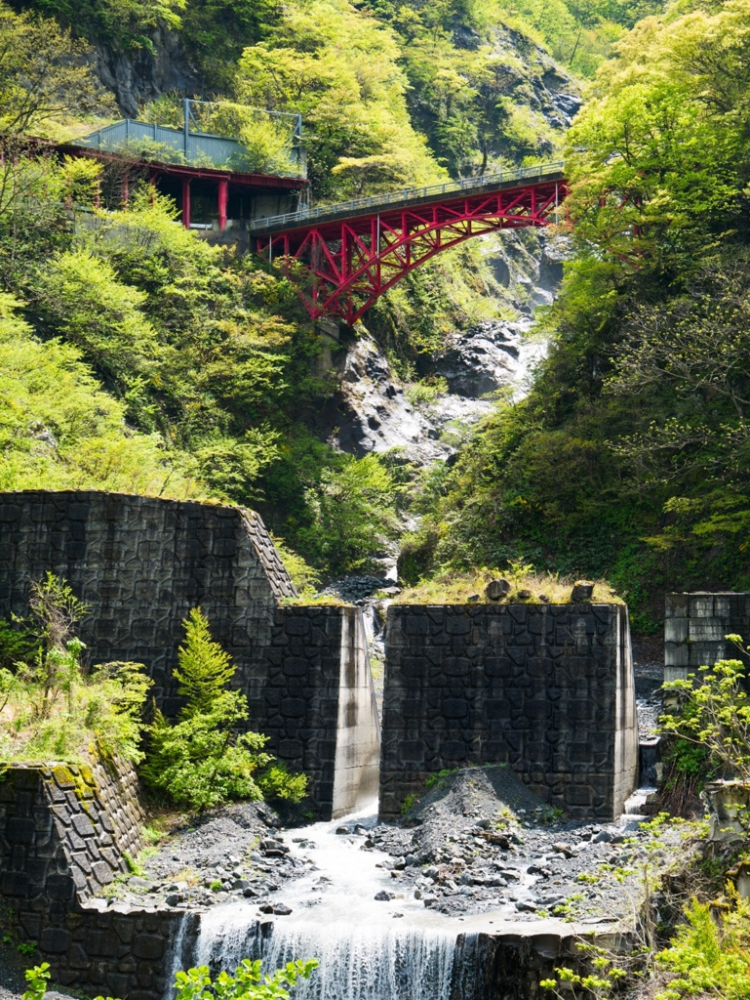

 

## 八ッ場ダム

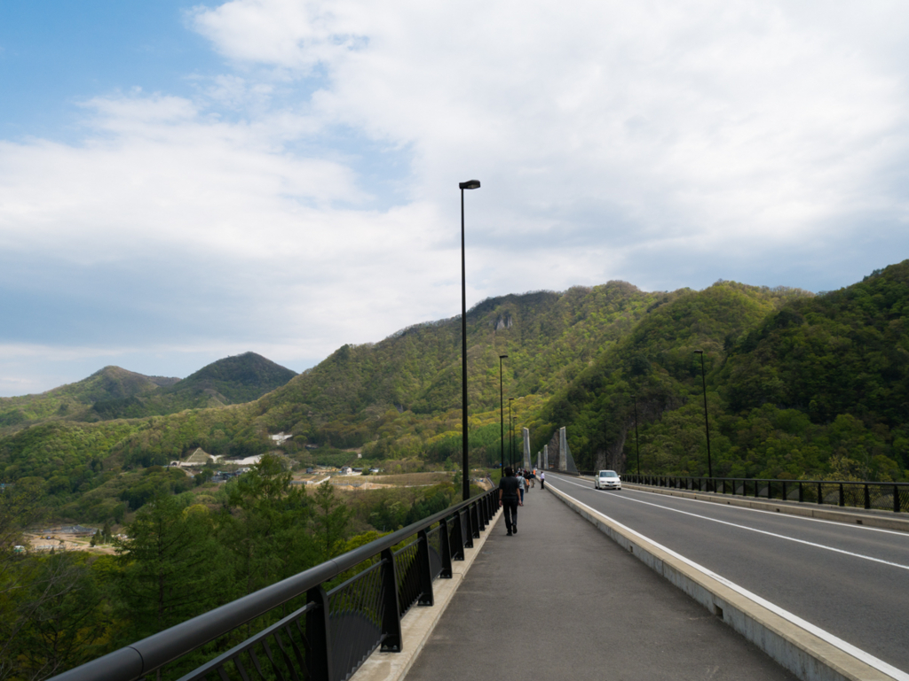

場所は変わって群馬県。 
建設するかしないかで騒いでたダムです。

吾妻線の移設も終了しており、着々とダムの建設が進んでいるようでした。

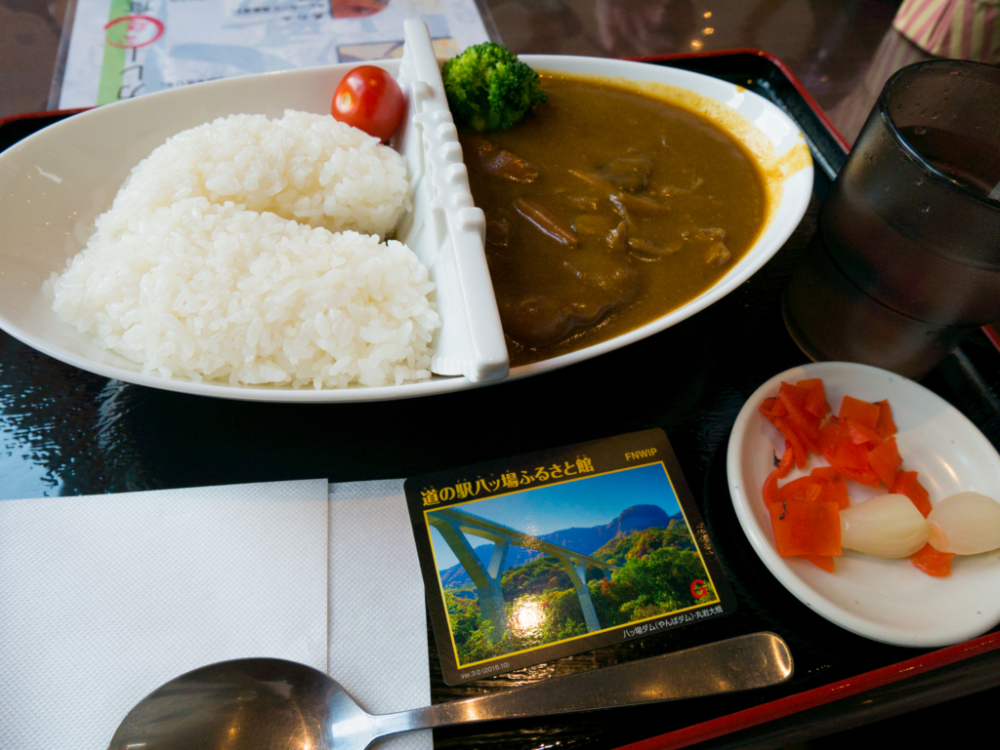

<iframe src="https://www.google.com/maps/embed?pb=!1m18!1m12!1m3!1d36261.60206285843!2d138.67023712367862!3d36.55162720771354!2m3!1f0!2f0!3f0!3m2!1i1024!2i768!4f13.1!3m3!1m2!1s0x0000000000000000%3A0x4ed2b59155b09de3!2z6YGT44Gu6aeF44O75YWr44OD5aC044G144KL44GV44Go6aSo!5e0!3m2!1sja!2sjp!4v1462094432797" width="600" height="450" frameborder="0" style="border:0" allowfullscreen></iframe>

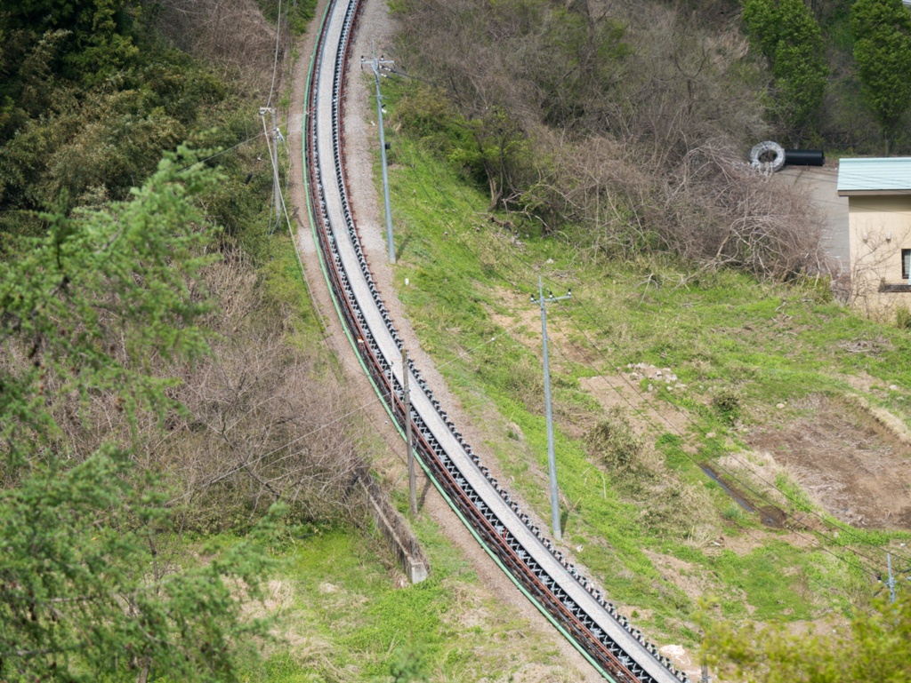

古い線路は工事によって出た土石のベルトコンベア通路として使われていました。

 

移設前の川原湯温泉駅には、以前訪れたことがあります。

現在は、工事のため道路にすら入れません（多分）。



 

## 草津温泉

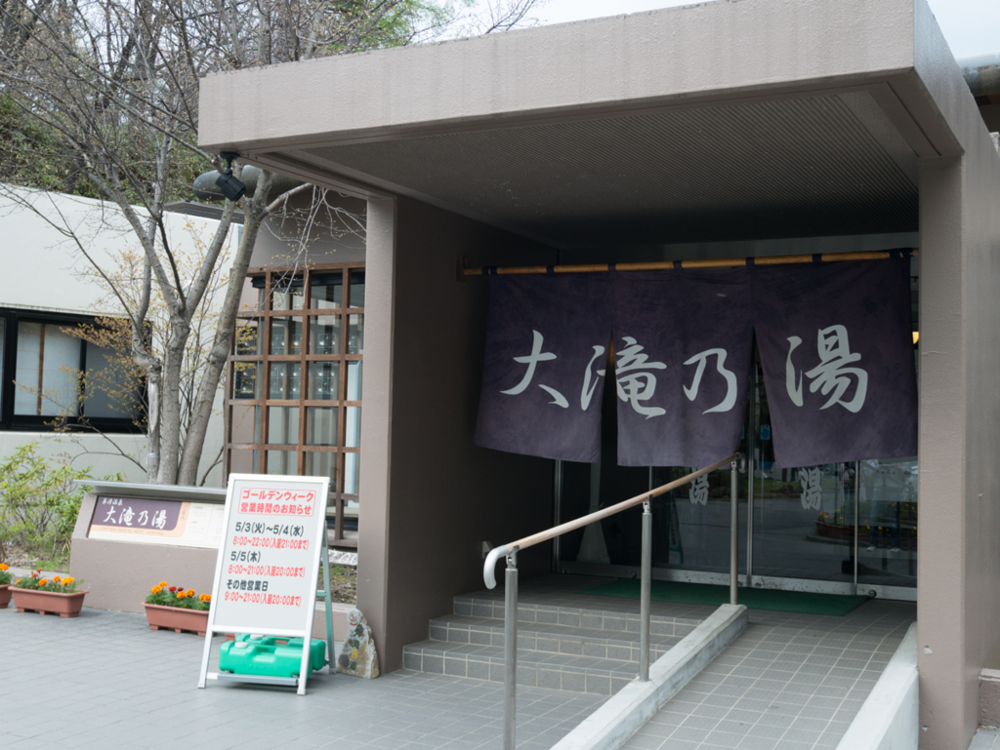

草津温泉にも寄りました。 
入浴をしたのは、大滝乃湯です。

<iframe src="https://www.google.com/maps/embed?pb=!1m18!1m12!1m3!1d3202.141758684512!2d138.59962361204035!3d36.62297425515773!2m3!1f0!2f0!3f0!3m2!1i1024!2i768!4f13.1!3m3!1m2!1s0x601de701cf73dbdf%3A0x157432875b64c20a!2z5aSn5rud5LmD5rmv!5e0!3m2!1sja!2sjp!4v1462094693340" width="600" height="450" frameborder="0" style="border:0" allowfullscreen></iframe>

 

## 草津の湯畑

<iframe src="https://www.google.com/maps/embed?pb=!1m18!1m12!1m3!1d283.03274753493866!2d138.59650800457862!3d36.622775833131385!2m3!1f0!2f0!3f0!3m2!1i1024!2i768!4f13.1!3m3!1m2!1s0x0000000000000000%3A0xe9421fc4cee55f20!2z5rmv55WR!5e0!3m2!1sja!2sjp!4v1462094908660" width="600" height="450" frameborder="0" style="border:0" allowfullscreen></iframe>

これを見ないと草津に来たという感じがしないですね。

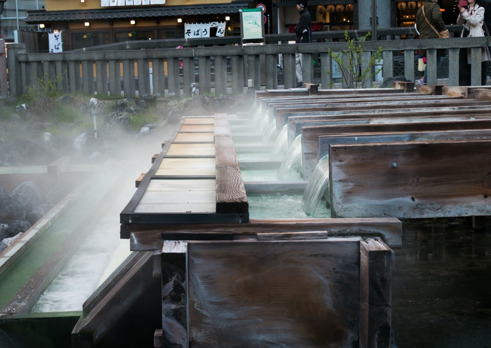

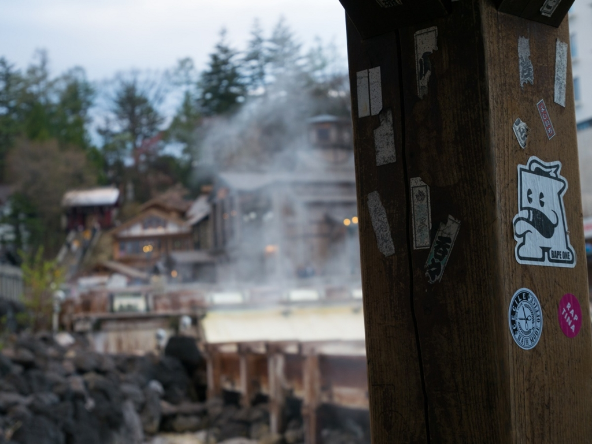

 

## 栄屋うどん

<iframe src="https://www.google.com/maps/embed?pb=!1m18!1m12!1m3!1d283.0297782739486!2d138.5941275446214!3d36.62358451237198!2m3!1f0!2f0!3f0!3m2!1i1024!2i768!4f13.1!3m3!1m2!1s0x601de6546e1cf265%3A0x52596d198acd9c11!2z44CSMzc3LTE3MTEg576k6aas55yM5ZC-5aa76YOh6I2J5rSl55S66I2J5rSlIOaghOWxi-OBhuOBqeOCkw!5e0!3m2!1sja!2sjp!4v1462094874908" width="600" height="450" frameborder="0" style="border:0" allowfullscreen></iframe>

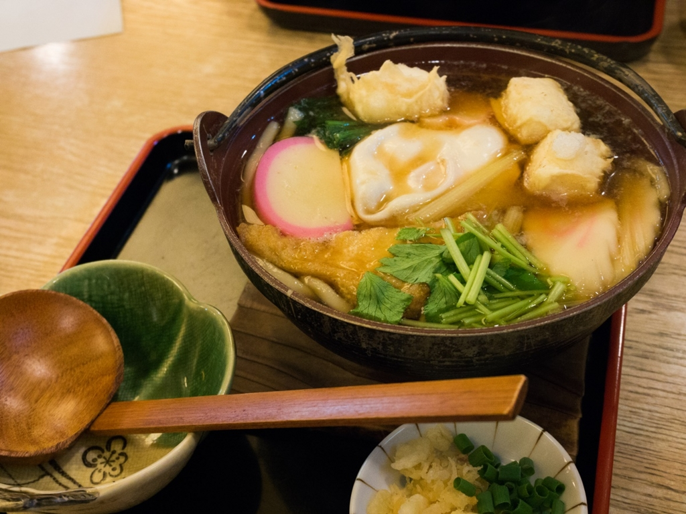

お餅のうどんがとても美味しかった。

 

## 草津温泉の夜

19時からロウソクでライトアップを行っていました。

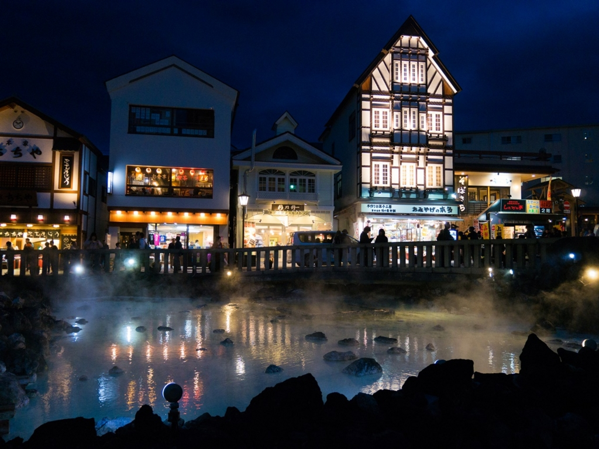

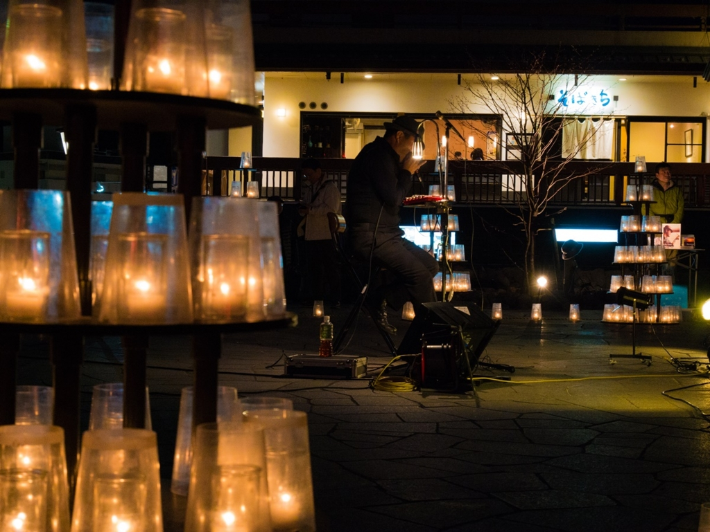

ハーモニカのようなものを演奏されていましたが、有名な方なのでしょうか。 
プロの演奏でした。

 

3日間で、700kmぐらいです。

全て一般道を走ってきたので、割とクタクタですが楽しかったですよ。

 

## 寝た場所

4月29日(金)は、長野市の友人宅。

4月30日(土)は、新潟県妙高市の 道の駅 あらい です。

<iframe src="https://www.google.com/maps/embed?pb=!1m18!1m12!1m3!1d3185.315731343544!2d138.2236923512642!3d37.026117579804044!2m3!1f0!2f0!3f0!3m2!1i1024!2i768!4f13.1!3m3!1m2!1s0x5ff66d6f6f2f238d%3A0xc757065c5c160d67!2z6YGT44Gu6aeF44GC44KJ44GE!5e0!3m2!1sja!2sjp!4v1462095427237" width="600" height="450" frameborder="0" style="border:0" allowfullscreen></iframe>

車中泊してる人がかなり多かったです。

