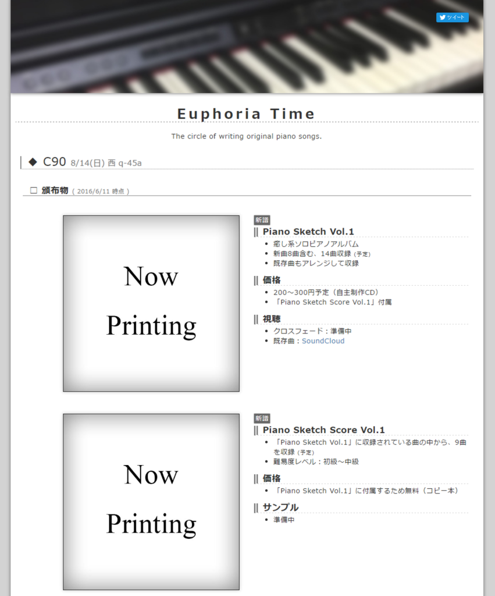

夏コミ（C90）に当選していました。 
**3日目 8月14日(日) 西 q-45a** です。 
去年の冬にも申し込んでいましたが落選したので、今回が初サークル参加です。

<!--more-->

## 頒布物

頒布するものは、ソロピアノアルバムのCDです。 
何かのカバーではなく、オリジナルです。 
初めてなので、プレス会社に頼まずに、自主制作します。その分頒布価格も安いです。

ピアノアルバムということで、是非弾いていただきたいので楽譜も付けたいと思っています。 
これもコピー本で。初めての経験がたくさんです。

ピアノ曲というと、クラシック曲（ベートーヴェンとかショパンとか）を想像するかもしれませんが、私の曲はジャンル的には映画音楽とかBGM系になると思います。 
久石譲さんや、坂本龍一さんを尊敬しています。 
寝る前や、少し落ち着きたい時に聴けるような少し寂しげなソロピアノ曲集ですので、一般の人でも十分に楽しめると思います。

クロスフェードなども出来次第公開していきます。

## ホームページ

Euphoria Time というサークル名なのですが、ホームページもコミケ用に作り変えました。 
といいますか、一から作りなおしました。

Bootstrap 3を使ってレスポンシブに対応しています。

内容は随時更新予定です。

http://euph-t.com/

2020/06現在　→　https://rallentando.net

 

まずは作曲頑張ります。
