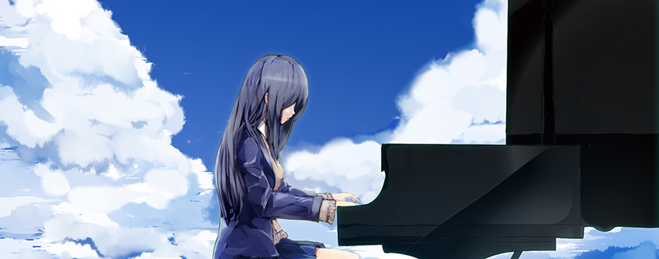

## はじめに

こんにちは。 
夏コミ（C90）も無事に終わりましたね。なにより。

今回のコミケで、次回に活かしたい反省点が沢山見つかったので、残しておこうと思います。

<!--more-->

この夏コミで、私は、自身の個人サークルである [Euphoria Time](http://euph-t.com) で初めてサークル参加をしました。 
結果からいうと、サークルで頒布したオリジナルソロピアノCD「**Piano Sketch Vol.1**」は、なんと**完売**することが出来ました。 
しかも**開始1時間**（ただし17部しか持ち込んでいなかった）。

 

## コミケ当落通知

6月中旬にコミケの当落通知が来ました。 
去年の冬コミであるC89には落選していたので、ある程度当選する気ではいたのですが、本当に当選すると焦りますね。<del>（なんで申し込んだ）</del>

当選通知から夏コミまでは約2ヶ月。長く苦しい戦いは既に始まっていたのでした。

 

## 頒布物の計画



何を頒布するかは決まっていました。ピアノCDと楽譜です。 
決めるべきものは、何曲入れるのか、これから新規に作曲するのは何曲か、製本・CDプレスはどうするのか、等です。

Piano Sketch Vol.1 では、当初は13曲の予定でしたが3曲を削って10曲になりました。 
既存曲のアレンジをするつもりだったのですが、その既存曲の長さが長く想像以上に時間を取られそうだったのと、新曲の作曲に時間がかかってしまったためです。 
次回は少しは時間に余裕があるので、計画的に進めます。

 

私の作曲のフローは、 
・ラフで曲の流れを作る 
・楽譜におこしながら本作曲（この時の楽譜を使って後に製本） 
・自分で弾けるように練習 
・MIDIでリアルタイム録音、変な所を直す 
・MIDI音源に通して録音、エフェクト、マスタリング 
といった感じです。

ラフ作曲は、Surface 専用の手額楽譜入力ソフト、StaffPad がオススメです。有料ですが書き心地最高です。

https://www.staffpad.net/

他の作曲をされている方に比べて回りくどいことをしているので時間がかかりますが、段階を踏んで作曲ができるので、納得のいく曲を作ることが出来ます。 
（何度も見直すことで、濾過されるみたいな？）

 

この流れを、2ヶ月の間に組み込みます。 
実際は印刷したりレーベル印刷したり、クロスフェードの動画を作ったりの時間が必要なので、コミケの2週間前にはデジタルデータの頒布物が用意し終わっているようにしておきます。

私は、Excelで進捗を管理しました。



 

## 頒布物の制作



デジタルデータを用意したら、いよいよ製本とプレスです。 
今回の「Piano Sketch Vol.1」のジャケットは、知り合いの方に描いて頂きました。 
本当にありがとうございます。またお世話になります。

 

まず楽譜の製本ですが、これは想像以上に大変でした。主に印刷が。 
レーザープリンタを持っていない自分（普通はそうですよね？）は、やむなくインクジェットプリンタで印刷を始めるのですが、楽譜は両面印刷で表紙を合わせて22枚。それを21部。 
印刷だけで時間がかかるだけではなく、インク代がバカになりませんでした。800枚印刷で、多分6000円ぐらい。

次回は、せめて楽譜は印刷所に頼みたいですね。高品質なものを作ってくれますし。

 

CDも、日本製の高品質（らしい）CD-Rを購入し、一斉レーベル印刷。 
もう少し光沢のあるディスクでも良かったかもしれません。



 

製本は、平タイプのMAXのホチキスで止めた後、製本テープでガッツリ止めました。 
個人的にデザインが好きです…が、**楽譜なのに内側まで印刷がされていて、かつ平綴じなので楽譜が開きづらい**という…本当に反省点です。



なにはともあれ、完成です。

 

## 頒布スペースの計画



コミケには何度も参加したことがあったのですが、まじまじとスペースを観察したことがなかったので、ネットで調べて今回は必要最低限のものだけを揃えました。

* 値札（と「見本誌」の札）
* 見本誌やおしながきの台
* テーブルの上に敷いておくもの

コミケの数日前に急いでダイソーやホームセンターを回って用意しましたが、やはりテーブルクロスは必須なのですね…夏なので涼しめの すのこ のようなマットを用意したのですが、机に直に置いていたので色が被って地味でした。これも今回の反省点。

自作のプレートは中々に良いと思います。



試聴機は用意が出来なかったのでいいかなーと思っていましたが、やはり当日慌てて用意しました。 
詳しくは後半で。

 

## いざ遠征

私は石川県金沢市に住んでいますので、東京まで遠征に出ます。

コミケでスーツケースは辞めたほうがいいと言われますが、サークル参加で遠征なので申し訳ないと思いつつスーツケースで行きました。 
もちろん、4つ足でピッタリ自分にくっつける形ですね。さすがに引っ張るのは邪魔だと思います。

 

ということで、前半はここまで。 
コミケ当日の話はまた後半に。

 
