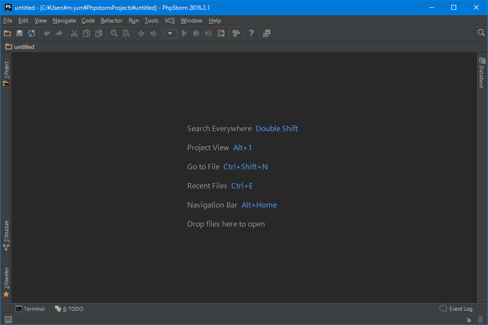
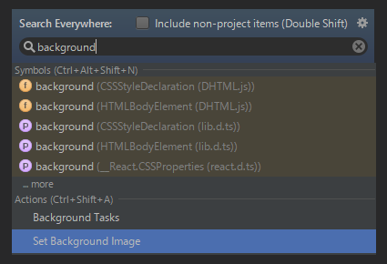
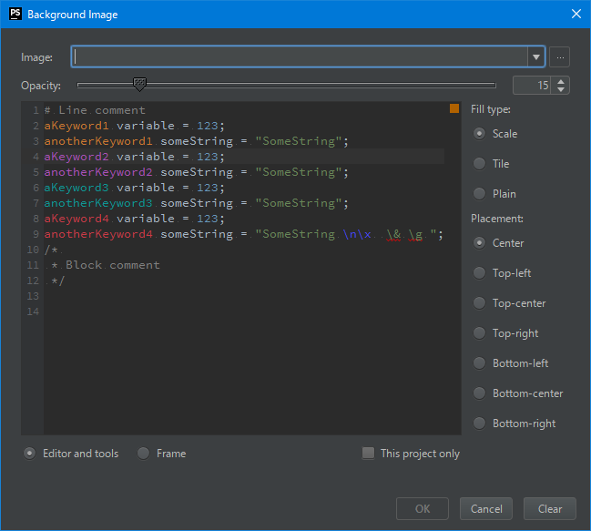
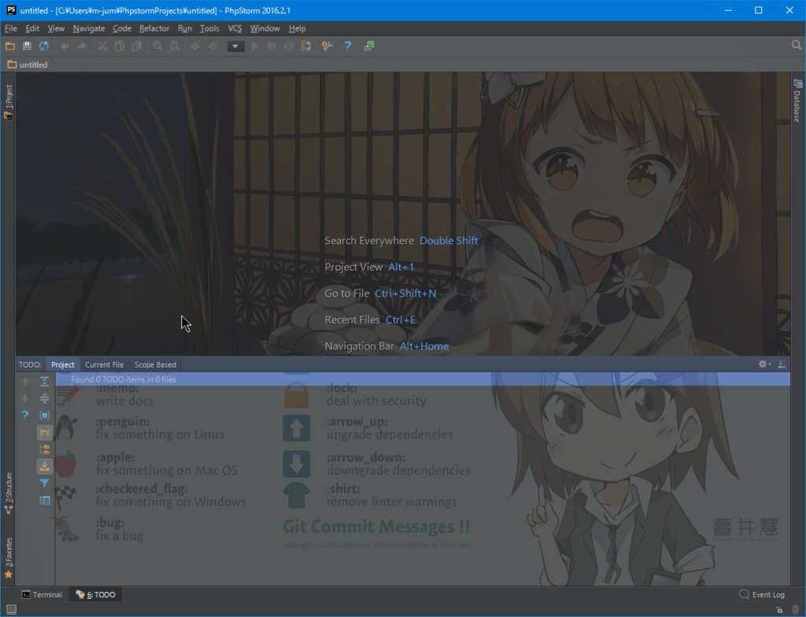

IntelliJ ベース IDEA（記事では PHPStorm ）の背景画像を変更する方法です。

バージョンは、**2016.2** 以降で可能です。

<!--more-->

https://www.jetbrains.com/help/idea/2016.2/setting-background-image.html

 

* 設定方法

ここで **Shift, Shift** (Win or Mac 共通) を押して「Search Everywhere」を召喚。

**background** を入力して「Actions」の中にある「Set Background Image」を選択。

 

画面下のラジオボタンでの切り替えを行うことで、「Editor and tools」と「Frame」の2種類を設定することが出来ます。 
Frame から説明します。

* **Frame** 
Frame で設定をした画像は、エディタやツール（Explorer や Database 等）以外の場所の背景画像になります。 

* **Editor and tools** 
Editor and tools で設定をした画像は、その名の通りテキストエディタや各種ツールの背景画像になります。 
テキストエディタ部にのみ画像を設定し、ツールには何も画像を設定しないという方法は出来ないようです。

「Fill type」は画像の拡大方法、「Placement」は配置方法です。 
ウィンドウのサイズを変更して、配置等に問題がないかどうかを確認しながら設定を繰り返して決定をします。

設定が終わるとこんな感じ。

上部では何もエディタやツールが表示されていないので Frame に設定された画像が背景になっていて、下部ではツールの TODO を開いているので、ここの背景は Editor and tools に設定された画像が背景になっています。

Frame 画像はともかく、Editor and tools の画像に透過率の低い画像を設定すると文字が見づらく作業に支障が出そうなので、私は Opacity を 5～10 ぐらいに設定して普段使っています。

 

以上
