[Surface](https://www.microsoft.com/surface/ja-jp) （または互換性のある端末）向けの手書き楽譜作成アプリである **StaffPad** の、今年2回目のアップデートが配信されました。

<!--more-->

## StaffPad について

http://www.staffpad.net/

StaffPad は、 Surface Pen 等のデジタイザペンで画面の楽譜へ直接手書き入力をすることで、自動で整形をしてくれる楽譜作成ソフトです。 
本格的な楽譜作成というよりは、作曲をしていて、思いついたフレーズをどんどん書いていく、という位置付けです。

今年の4月には、 Staffpad April Update ということで、いくつかの新機能を加えてアップデートされました。

[StaffPad April Update が配信されました](./0407-staffpad)

今回は、先日 Microsoft から発表された Surface Studio 及び Surface Dial に対応した StaffPad November Update の内容を追ってみたいと思います。

 

## Surface Studio / Surface Dial への対応



### Surface Dialの機能（公式ブログから抜粋）

* 押すことによる、楽曲の再生・停止機能
* 左右に回すことによる、リドゥ/アンドゥ機能
* 左右に回すことによる、選択範囲の移調機能（多分）

また、Surface Studio を使用している場合は画面上で Surface Dial を使用することで、各種機能に簡単にアクセス出来るようになったり、「スタンプ」という機能で小節のコピーを素早く行えるようです。

 

## 機能の追加、修正

### Windows 10 Anniversary Update の適用が必須

今年の8月に公開された Windows 10 Anniversary Update を適用していない端末では StaffPad のアップデートが表示されないようです。 
表示されない方は、Windows 10 Anniversary Update を適用した上で、Windows Store へアクセスしてみて下さい。

以下のように表示されるはずです。

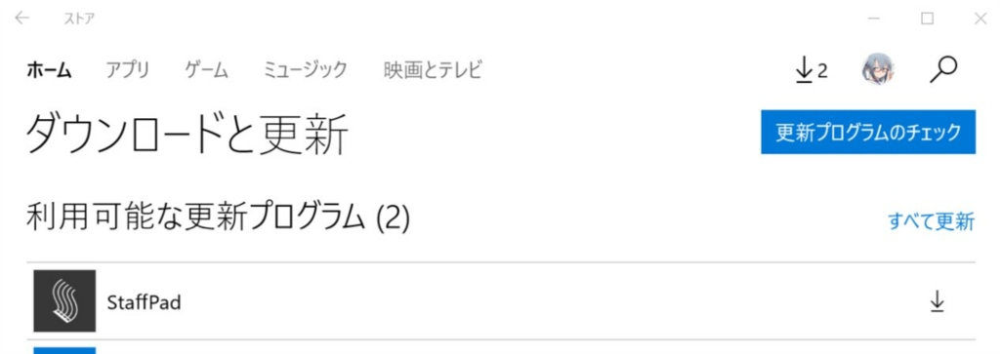

 

### ペンを使った小節の移動・コピーが楽に行える

指で五線譜をタップして選択、その後ペンで書くようにドラッグをすると移動、ファンクションボタンを押しながらドラッグするとコピーになります。 
青色が移動、黄色がコピーになります。

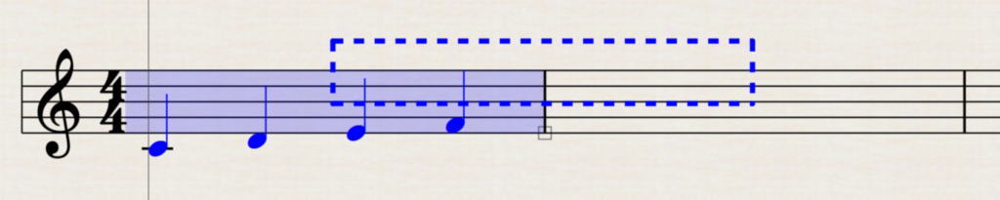

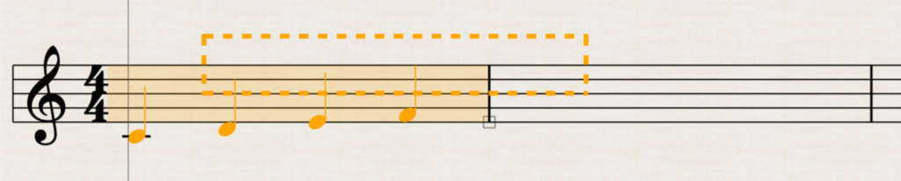

 

### 小節番号の変更が可能に

楽譜の始まる小節番号を変更することが出来るようになりました。 
途中から変更というわけではなく、あくまでも楽譜の初めの小節番号の変更ですね。

基準とする小節を右クリック（or 長タップ or ファンクションボタン）でメニューが出てくるのでそこから変更できます。

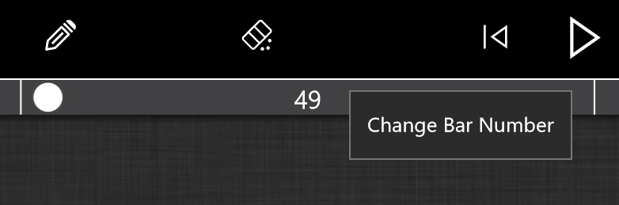

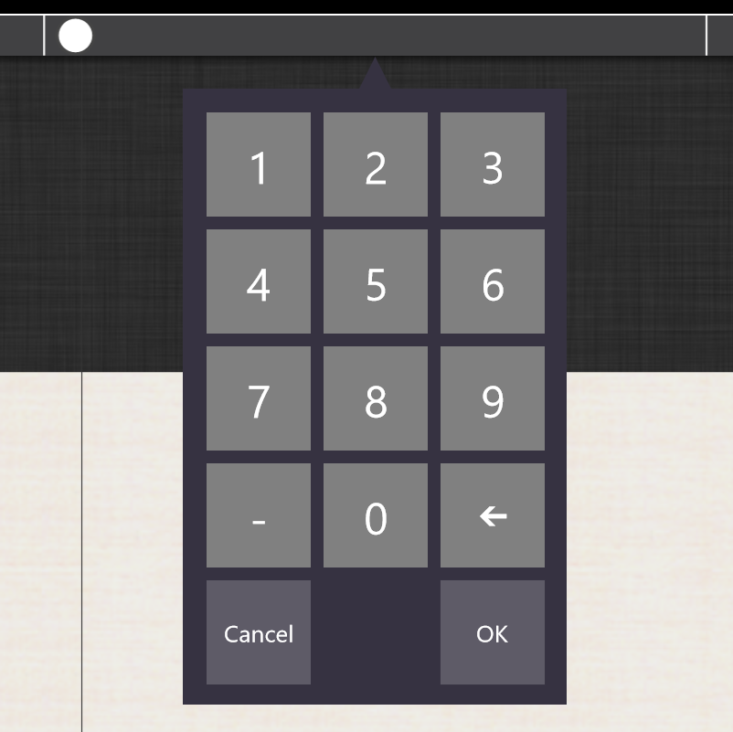

 

#### 印刷時の楽譜サイズの変更が可能に

今まで、印刷時に五線譜のサイズは固定でしたが、50％～200％の範囲で指定できるようになりました。

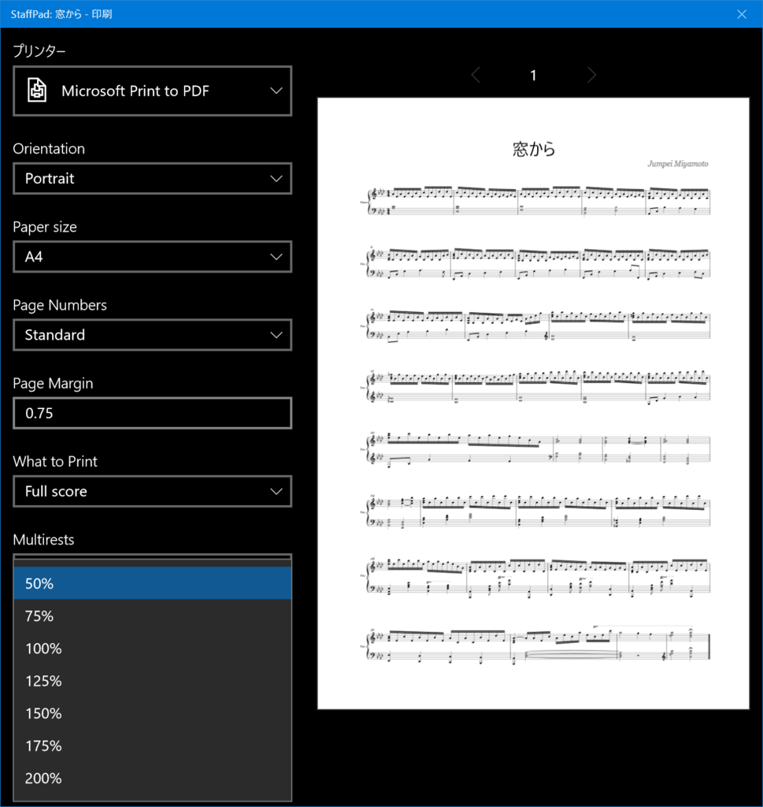

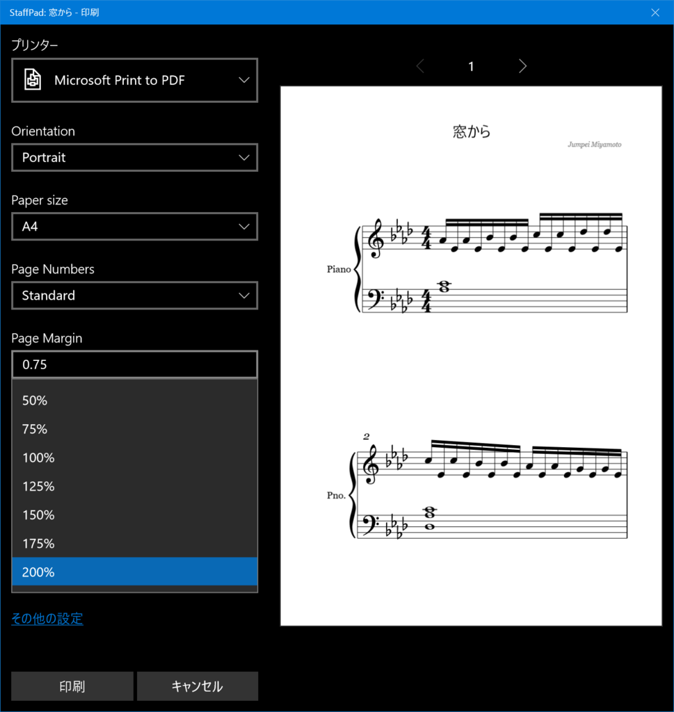

 

### 連鉤（連桁）の認識精度向上、また手動編集

公式ブログでは、「This is surprisingly useful!」と絶賛していています。 
連符入力の認識精度が向上したようです。 
また既存の音符に対して、音符を足して連符にすることができます。

まずは、既存の連符の連鉤（れんこう、実は初めて名前を知りました）を右クリック（or 長タップ or ファンクションボタン）してメニューを出し、「Create Taplet」を選択。

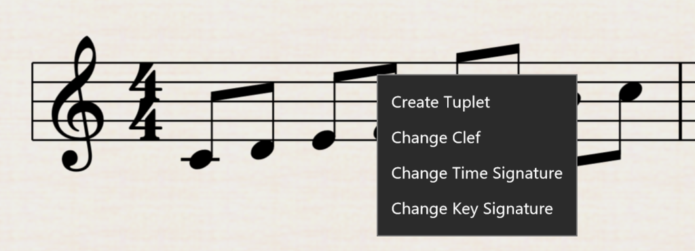

すると、数字が表示されます。これが現在の連符です。

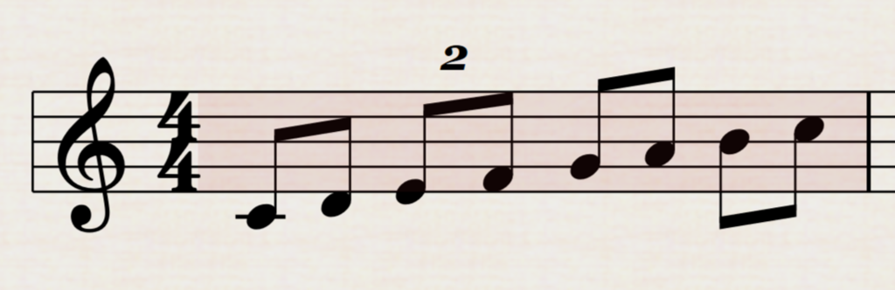

音符を書いて、三連符にすることができました。

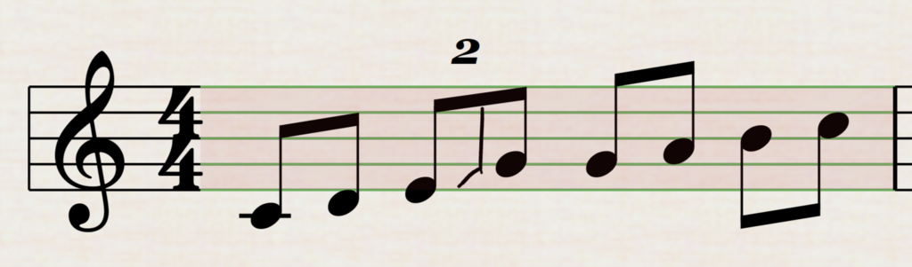

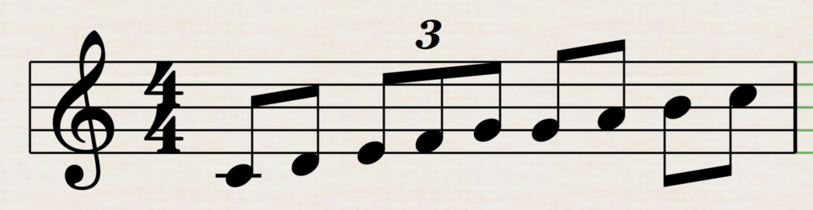

八分音符の場合は三連符の音の長さに自動調節されます。 
つまり、「後からここは三連符にしよう」といったときに音符を書き直さなくても良い機能…ということでしょうか。

 

## その他細かいアップデート内容

* **楽曲の再生がより早く**

今までは再生されるまでに時間がかかっていたようです。

* **ペダルの記入がより楽に**

今までは踏む・離すが別の記号だったのに対し、一つの線で表されるように。 
また、一つのペダルのまとまりを先に線を引き、その後ペダルの踏み変えのタイミングでペンを上にスワイプすると踏み変え記号が表示さえるようになります。

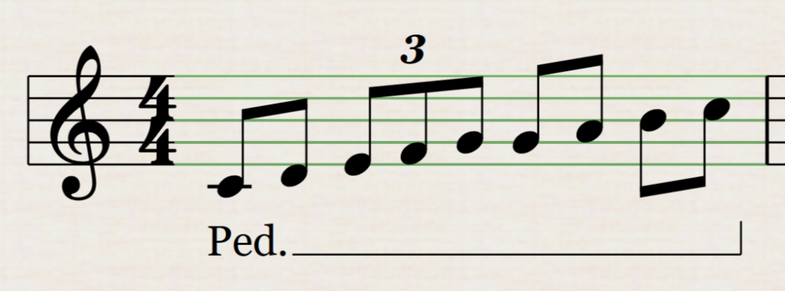

好きなだけ増やせます。

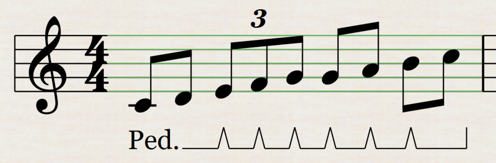

* **強弱記号の入力が楽に**

譜面にちゃんとくっついて入力しやすく。ペンで右上方向にドラッグするとクレッシェンド、右下方向にドラッグするとデクレッシェンドになります。

* **ショートカットキーの追加**

もともとStaffPadはタッチパネル＋ペンでの使用を想定されていたが、思ったよりもキーボードを使用しているユーザーも多いので対応したとのこと。 
・アンドゥ・リドゥ・カット・コピー・ペースト等の基本機能 
・スペースで再生・停止 
・＜ ＞ キーで小節の移動（うまく動かなかった） 
・「0」キーで楽曲の先頭へ移動

* **MusicXML形式の出力がより良いものに**

Sibelius への取り込みが楽になった。

* **「FFward」アイコンをダブルタップすると楽曲の最後まで移動できる**

ようですが、FFwardアイコンが何かわかりません(´・ω・｀)

* **ストリングス系の再生がより良いものになった**

* **チェレスタとハープの再生バランスの調整**

* **Welcome ページから Eメール で楽曲を送る場合、メールタイトルに楽曲タイトルが入るように**

* **スラー系の認識精度の向上**

slurs and beams と書かれています。

* **半休符と全休符の認識精度の向上**

これ結構苦労しているので助かります。

* **スケッチレイヤーの描画が以前よりも正確に**

レイアウトの話をしているようです（丸投げ）

> Note that this has a noticeable affect on the bar spacing. Before, StaffPad would optimise bars for print layout for maximum efficiency. Since this would cause some issues with the placement of the sketch layer, the app now does some additional work to space things differently to accommodate for sketch layer markings. This will only affect the score if there's sketch layer marks used within the score.

* **多くのバグ修正**

 

前回の April Update に引き続き、着実に機能を増やしていますね。

Surface Studio や Surface Dial に対応したのは大きい点ではないでしょうか。 
Surface の強みを大きく活かしているこのアプリを、これからも応援していきたいと思います。

 
