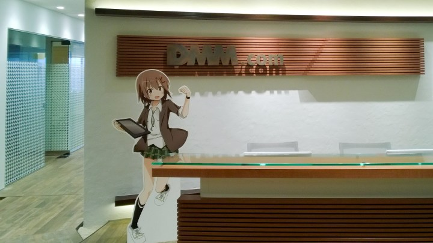

すみません大遅刻しました。 プロ生ちゃん Advent Calender 11日目です。

http://www.adventar.org/calendars/1631

今年プロ生であったこと、来年プロ生でやりたいことを書きます。

<!--more-->

## プロ生ちゃんと2016年

2016年は、大きな一歩がありました。

今年の3月に、金沢にてプログラミング生放送＠金沢を主催させて頂きました！



また、そのセッション用にプロ生ちゃん素材を使ったアプリも作成しました。



それとは別に、

* 2月マスコットアプリ文化祭表彰式＠東京
* 10月勉強会＠東京
* 11月勉強会＠名古屋

に参加をさせて頂きました。圧倒的感謝。

 

今年1年、仕事でもプライベートでも充実をした1年を過ごすことが出来ました。

勉強会は、自分の知らない知識を知ることが出来るとても有用なものだと思っています。

しかも、プロ生ちゃんの素材が無償でかなり自由に使えるという点でも、開発者にとっては嬉しいものです。

今年も大変お世話になりました。

 

## プロ生ちゃんと2017年

2017年は、素材を活かしてどんどん作っていきたいですね。

まだインストールしただけですが、Unity を初めてみようと思っています。

http://pronama.azurewebsites.net/pronama/download/

もちろんプロ生ちゃんの Unity モデルもあるので、それを使って何か面白いものでも作れたらと！

 

短いですが、2017年もよろしくお願いします！
