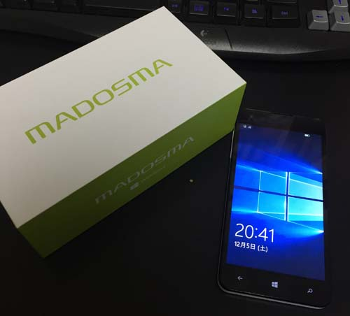

 
※写真は1年前です。

[Windows 10 Mobile / Windows Phone Advent Calendar 2016](http://www.adventar.org/calendars/1471) の 18日目 の記事です。 
http://www.adventar.org/calendars/1471

前日は、霜月のい さんです。明日は、FIWWA さんです。

<!--more-->

このような真面目な Advent Calendar に参加をするのは初めて、また Windows 10 Mobile が好きと言っているだけのただの素人ですので、暖かく見守ってくださると嬉しいです。

内容としては、今年（といっても今年の3月）にリリースをした「星空予報 with 暮井慧」の紹介と、**私が思う**（ココ重要） Windows 10 Mobile について好き勝手に書きたいと思います。

https://www.microsoft.com/ja-jp/store/apps/%E6%98%9F%E7%A9%BA%E4%BA%88%E5%A0%B1-with-%E6%9A%AE%E4%BA%95%E6%85%A7/9nblggh4rjv9

## リリースをしたアプリについて

作成をした経緯としては、今年の3月に石川県の金沢で主催をした「プロ生勉強会第40回@金沢」にて、「初心者でも Windows 10 Mobile アプリを作りたい！」という内容で登壇をするために急遽（初めて）（初心者の私が）作成をしたアプリです。

その時のスライド。

<iframe src="//www.slideshare.net/slideshow/embed_code/key/NTAeLJS8mp9UHl" width="595" height="485" frameborder="0" marginwidth="0" marginheight="0" scrolling="no" style="border:1px solid #CCC; border-width:1px; margin-bottom:5px; max-width: 100%;" allowfullscreen> </iframe> 
 <strong> <a href="//www.slideshare.net/naba0123/windows-10-mobile-60052999" title="初心者でも Windows 10 Mobile アプリを作りたい！" target="_blank">初心者でも Windows 10 Mobile アプリを作りたい！</a> </strong> from <strong><a href="https://www.slideshare.net/naba0123" target="_blank">naba0123</a></strong> 

アプリの中身は簡単で、GPS と OpenWeatherMap API を使用して天気を取得、また別の API を使用して日の出、日の入り、月の出、月の入りを取得し、現在星が見るかどうかを「プロ生ちゃん（暮井慧）」に話してもらう、という内容です。

ちなみに、<del>2016年11月23日現在、ソースコードを **紛失** してしまった（GitHub等にも上げていなかった）ため</del> 記事投稿時点（2016年12月18日）で、ソースコードを発見しましたが時間がないため、、Windows 10 Anniversary Update に対応していません…突貫工事で作成をしたアプリを放置するわけにもいかないので、どうにかしたいです。</del>

構想１週間、実装１週間程で作成をしました。**突貫工事** にも程がある。

実際の使用ユーザーからのお問い合わせが1件ありました（現在地が「地球」と表示される。GPSをOFFにしている場合に表示される）。

  

といった、**本場の人に助走をつけて殴られるレベル**程度のことしかしていなかった私ですが、少し話を変えて、普段の所持端末について書きたいと思います。

## 所持端末について

**もちろん Windows 10 Mobile のみ**…と言いたいところですが、アプリの充実度合いや使い勝手の点から、普段は iPhone と W10M の2台持ちをしています。

W10M は、**MADOSMA** (Q501の方) を所有しており、**DMM Mobile** にてデータ通信のみ契約で運用しています。

また開発用端末でもあるので、**Insider Program** に登録をしています。

2台持ちだとアプリ面で勝る iPhone しか使わないかと思いますが、私なりにちゃんと使い分けをしています。

 

#### Skype が統合されている

Windows 10 Mobile のメッセージアプリは Skype と統合されているため、Skype アプリを入れてログインをして…としなくても、Windows 10 Mobile に Microsoft アカウントでログインをしておけば、（Skype と Microsoft アカウントの連携ができていれば）普段のメッセージアプリ内で Skype のコンタクトと連絡を取る事が出来ます。

Skype クレジットに残高があれば（私は Office 365 Solo に契約をしているので毎月 Skype クレジットがもらえる）、通話 SIM でなくても電話アプリから一般の通話をかけることができます。iPhone や Android よりもスムーズで、個人的に気に入っています。

 

#### テザリングに使える

私の iPhone は mineo で契約をしているのですが、残念ながらテザリングが使えません。

MADOSMA + DMM Mobile の組み合わせはテザリングが使えるため、出先で PC をネットに繋ぐときに重宝をします。

 

#### 1台持ちよりも電池切れの心配が少ない

1台のみで出かけると、どうしても出先でバッテリー残量が怪しくなり、モバイルバッテリーを持ち歩くことになってしまいます。

2台持ちにしておくと、iPhone が出先でバッテリーが怪しくなっても、W10M の方でカバーすることができます。

実際、MADOSMA の電池持ちは素晴らしいと個人的に思います。ほとんど使わないのであれば、4,5日は電池が持つかと思います。

 

 

Windows 10 Mobile の直接の恩恵は少ないかもしれませんが、これだけのメリットがあります。

正直に言うと、他の人も感じているように、コンテンツやアプリの量において遅れを取っているため普段からガッツリ使えるメイン端末には向かないかもしれません。 
しかし、逆に言えばまだまだ開拓途中のコンテンツ、誰もまだ踏み入れていない領域があると思うので、アプリ開発は続けていきたいと思います。

 

さて、今年は Microsoft のイベントで Windows 10 Mobile 系の発表が殆どなく、半お通夜モードかもしれませんが、私は Surface Phone を楽しみにしていますので、Microsoft さんをこれからも応援しています。

色々書きましたが、私は Windows 10 Mobile が好きです。Microsoft が好きです。

…といったところで今回は締めたいと思います。

内容が無いようで申し訳ないです。

 
