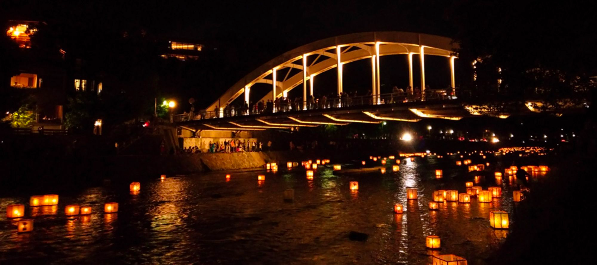
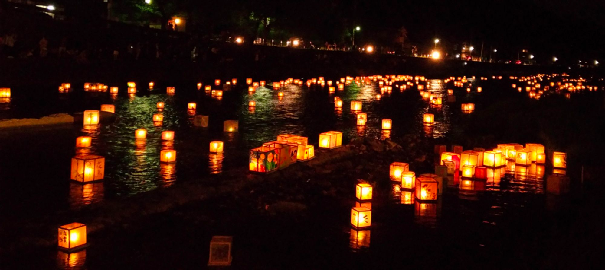
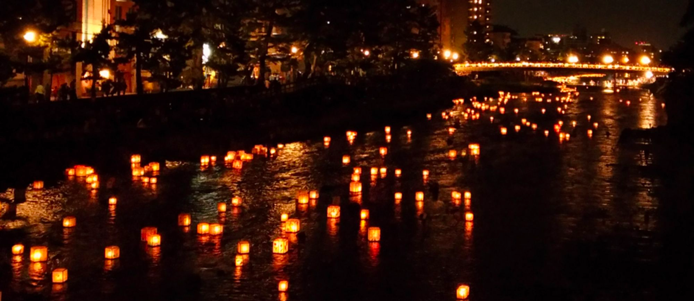

金沢百万石まつりの協賛行事として行われた、加賀友禅灯篭流しを見てきました。 毎年、浅野川(天神橋上流～浅野川大橋間)で行われるようです。

<!--more-->

[第66回 金沢百万石まつり](http://100mangoku.net/)

[灯籠流し | 加賀友禅 KAGAYUZEN」](http://www.kagayuzen.or.jp/infomation/%E7%81%AF%E7%B1%A0%E6%B5%81%E3%81%97/)

当日の朝はひどい雷雨で、雨天延期かと思いましたが、その後は晴れて無事に予定通り開催されました。

近くの駐車場は全滅かと思い、近江町市場付近の駐車場に停めて800mほど歩いていきましたが、雨天を心配した人が多かったためか、歩いてくる途中の駐車場も「空」の文字が目立ちました。

浅野川大橋と梅の橋の間の北側に本部があり、諸々のイベントが行われていました。

30分ほど本部のイベントを見学し、周りが暗くなった頃を見計らって灯籠が流れてくる上流の方へ。

（※一眼レフカメラを忘れてしまったため、Zenfone 3で撮影）

かなりの量の灯籠が流れてきて、ずっとぼーっと見ていても飽きず、心が洗われるようでした。

また、雨天の影響があったのか、人こそ多かったもの、殆ど止まらずに歩ける程度の人の多さだったのも良かったです。