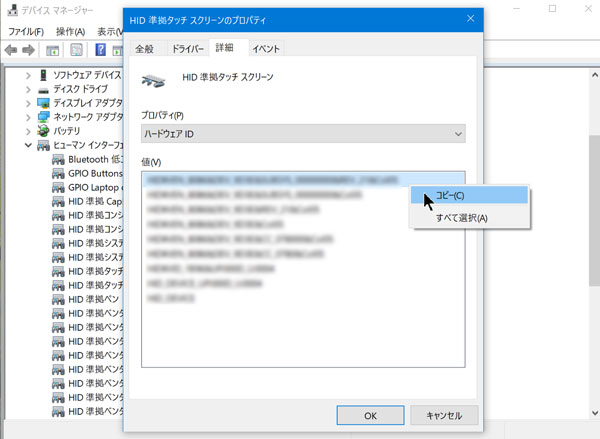
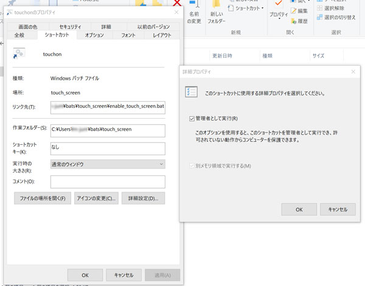

## あらすじ

Surface Pro 4 + 外部ディスプレイを使っていて、「外部ディスプレイに表示のみ」にした場合に**タッチパネルが反応して外部ディスプレイの操作の邪魔をする**など、一時的にタッチパネルを無効化したい場合もあるかと思います。

デイバイスマネージャから「HID 準拠タッチ スクリーン」を無効化すれば解決するのですが、いちいち開いて変更するのが面倒なのでバッチファイルを作成して「Win+R」からサクっと呼び出します。

<!--more-->

## 必要なもの

コマンドラインからデバイスの有効・無効化を行うには「DevCon」という
Windows Driver Kit (WDK) に含まれるソフトを使用するため、WDKをインストールします。

https://developer.microsoft.com/ja-jp/windows/hardware/windows-driver-kit

> 重要: WDK をインストールすると、モダン アプリケーションを開発することができなくなります。

と書いてあります（分かってない）。 
また、Visual Studio 2017 とはまだ互換性がないようです。

## バッチファイル

まず、「デバイスマネージャ」→「ヒューマン インターフェイス デバイス」→「HID 準拠タッチ スクリーン」のハードウェアIDの一番上の長いものをメモります。（今回は「HID 準拠タッチ スクリーン」は2つあったので両方メモ）



その2つに対して、`devcon`コマンドを使用してデバイスを無効化するバッチファイルを作成します。

```
:: devcon.exeのパス（Windows 10 Pro）
@set DEVCON="C:\Program Files (x86)\Windows Kits\10\Tools\x64\devcon.exe"

:: HID タッチスクリーンの無効化
%DEVCON% disable "メモしたハードウェアID1"
%DEVCON% disable "メモしたハードウェアID2"
```

有効化のバッチファイルも、同様に作成します。
```
:: devcon.exeのパス（Windows 10 Pro）
@set DEVCON="C:\Program Files (x86)\Windows Kits\10\Tools\x64\devcon.exe"

:: HID タッチスクリーンの無効化
%DEVCON% enable "メモしたハードウェアID1"
%DEVCON% enable "メモしたハードウェアID2"
```

## Win+Rから実行したい

このバッチファイルには管理者権限が必要で、それをバッチファイルで書くと大変（というか知らない）ので、 
バッチファイルのショートカットを作成して、その実行に管理者権限が必要なように設定します。

バッチファイルのショートカットを作成し、「プロパティ」の「詳細設定」から「管理者として実行」にチェックを入れます。



あとは、このショートカットキーを Path が通っている場所において、Win+Rから叩けば簡単にタッチスクリーンのオンオフを制御することが出来ます。

### 参考

https://qwerty.work/blog/2015/03/wdkdevconbatcommand.php

