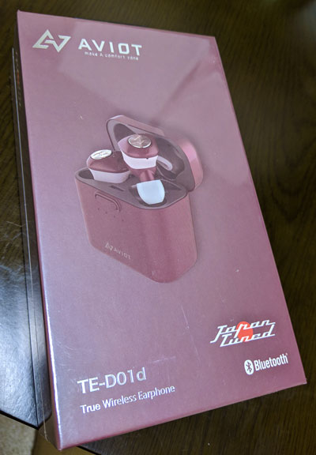
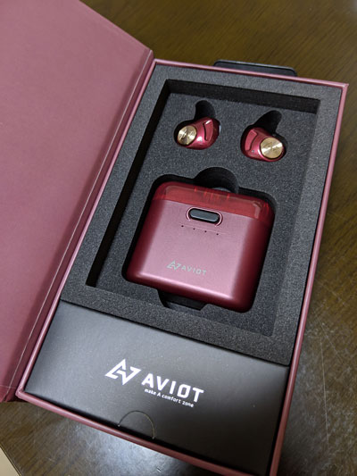
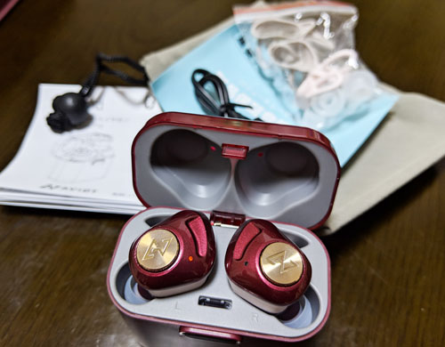
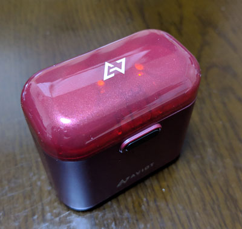

## はじめに

ワイヤレスイヤホンというと、有名なところで言うと Air Pods かもしれませんが、 
Air Podsは、装着した際の見た目<s>（うどん）</s>が好きではなかったのと、 
現状カラーバリエーションに黒がなかったという理由で、候補には入らず。 

良いのはないのか～、と会社で雑談をしたところ、 
「YouTuberとかおすすめしてるのありますよ！」と後輩が教えてくれました。

<!--more-->

http://aviot.jp/products/te-d01d/

特にこだわりはなかったのと、そこまで高級なものでもなかった（１～２万）ので、 
最悪売るか～、ぐらいの気持ちで購入。

カラーは、ワインレッド系が好きなので、ダークルージュを購入。

人気なのか、Amazonで注文してから発送まで1週間かかりました。 
（まだ1週間で済んだのが良かったのか？）

## ざっくり感想

* デザインがスタイリッシュでかっこ良い
* 音質はかなり良い方じゃないんですかね、比べたことはないですが、有線と変わらないと感じた。
* 起動時、ベアリング時の女性ナレーション「接続しました」「電源ON」などが心地よい。すき。
* 日本人向けの低音寄りというレビューを聞いていたのもあり、「確かに低音寄りだなー」といった感じ。個人的には好きな調整方針。
* モバイルバッテリーにもなるらしい（まだ試してない）
* 小さい音量でも個人的には遮音性が高い方なので、周りの音が聞こえなければいけない場所では不向き？
  * 逆に言うと、多少うるさい場所でも、音楽に集中できる

総合的に満足です。 
もっと使い込んでみて、また何かあれば追記でもしたいと思います。
