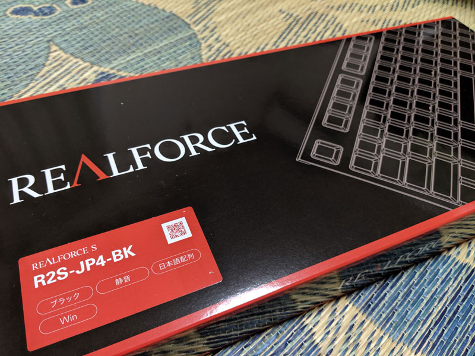
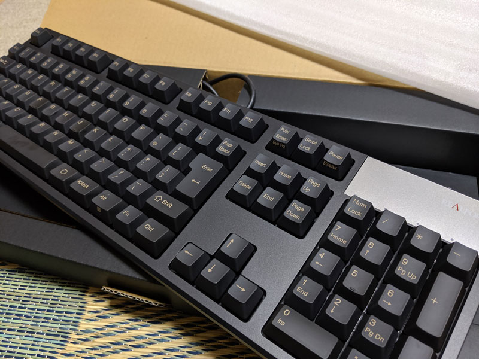
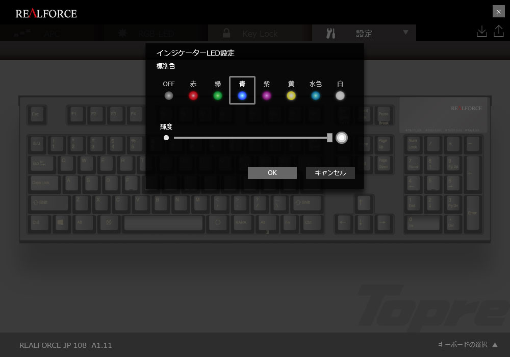
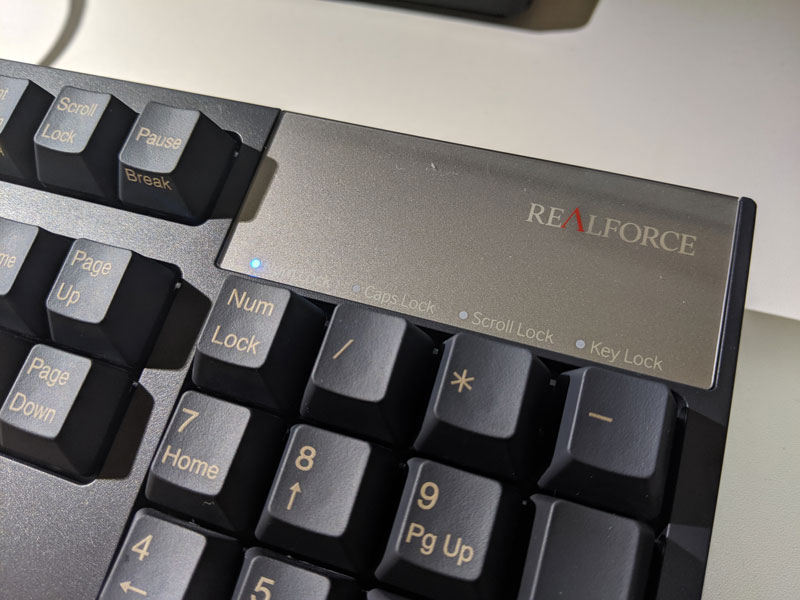
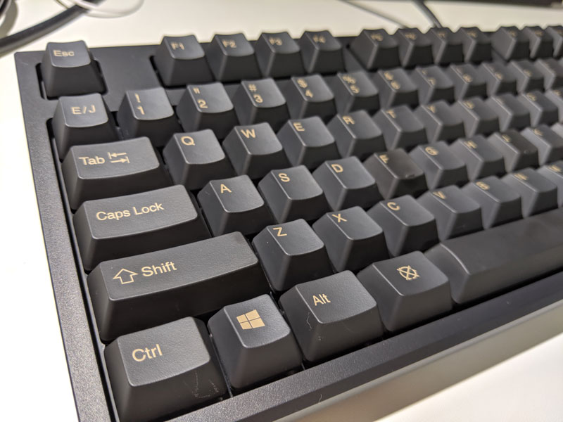

 

言わずとしれた名キーボード、REALFORCE についに手を出しました。

購入したのは、

* 無接点
* 日本語
* キー荷重45g
* 静音
* フルNキー

の **R2S-JP4-BK** です。

<!--more-->

http://www.realforce.co.jp/products/R2S-JP4-BK/index.html

普段職場では、ごく普通の PC 付属キーボード、もしくは MacBook Pro のパタパタキーボードを、 
自宅ではLogicool の安い無線キーボード（たまに Shift が反応しない）を使用しているのですが、それと比べた感想としては、 

**打ち心地が雲泥の差**

でした（個人の感想）。 

多少の打鍵感はあるものの、基本は指をストンと下ろすだけで入力することができ、 
文字を滑らすように軽く入力することができます。

静音モデルにしたからか、よくある高温域のカタカタ音がなく、 
重低音の物理音が軽くするぐらいです。

もちろん、強くキーボードを叩けばそれなりに音はします。そこはしょうがない。

 

普段からPCを業務で使用する人に使わせてみたところ、 
「位置が高くて入力しづらい」とのことでした。

確かに、キーボードの高さは普通のキーボードよりも高いかも…？と思いましたが、 
男性の私の手ではちょうどよかったので、合う合わないは人によるのかもしれません。

気になるようであれば、多少腕側にタオルなどで高さを持たせて上げると、 
また打ち易さは変わるのかもしれません。

 

また、左側のWindowsキー、Ctrlキーの大きさが少し小さいので、 
多用する人は少し慣れが必要かもしれません。

### LEDインジケーターの色変更

公式HPからドライバーを落としてインストールすると、 
「REALFORCE Software」というソフトウェアが一緒についてきます。

このソフトウェアから、LEDのインジケーターの色を変更することができます。

そういえば、正しいホームポジションを覚えないまま大人になってしまったな…。

