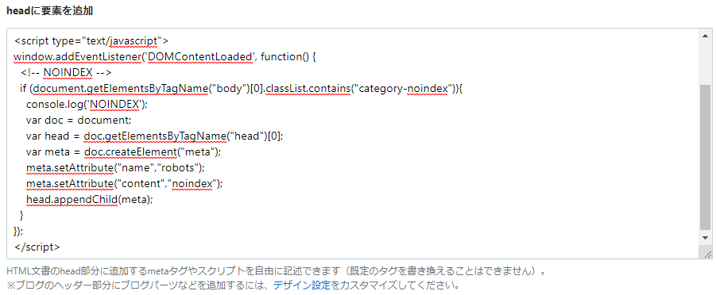

## 結論

### 1. 以下のタグを、設定の「headに要素を追加」に追加



↓

### 2. noindex にしたい記事のカテゴリに「noindex」を追加する
新規の記事でも、過去の記事でも。

### 3. noindex カテゴリを非表示にする
ユーザーに見えてしまうので、消してしまいます。 

* CSSで`.category-noindex .categories a:last-child`を`display:none`にすれば大丈夫です。

<!--more-->

詳しくは下記の記事を参照 
https://clrmemory.com/hatena/specific-entry-noindex/#i-3

気になるならやる、ぐらいですかね。 
個人的には、「こんな記事なんで、noindex って書いておいたほうが見た人も心理的安全でしょ」という謎持論を展開しておきます。

### 4. おわり
noindex の追加が検索エンジンに反映されるまでは、多少は時間がかかると思います。

 

以下、ポエム

## 経緯

はてなブログで、検索の邪魔になりそうな記事（自分用のメモなど）を投稿したいときに、特定の記事のみ noindex にしたいときがありますが、残念ながら公式ではブログ単位でしか noindex は設定できません。

きっとはてなブロガーの方は、何かしら良い方法を思いついてやっているだろうと思い、検索してみた。

### 1. noindex にしたい記事すべてに貼り付けていくパターン

https://www.pogu-note.com/entry/hatena-noindex-tagsetting#%E8%A8%98%E4%BA%8B%E6%AF%8E%E3%81%AB%E8%A8%AD%E5%AE%9A%E3%81%99%E3%82%8B%E3%82%84%E3%82%8A%E6%96%B9

はじめはこれが出てきましたが、記事毎に設定するのはメンテナンス性が悪いのと、忘れそうなので、別の方法を探すことに。

### 2. カテゴリに noindex を作り、JavaScript (jQuery) で判別して制御

https://clrmemory.com/hatena/specific-entry-noindex/

なるほど、これは良い方法だ！　と思いましたが、 
jQuery の読み込みで手が止まりました。

懸念点としては、

* jQuery の読み込みを行うので多少記事が重くなる
* jQuery を記事の別の場所で使っている場合、複数バージョンの読み込みにより予期せぬ動作が起きる可能性がある 

といった感じでしょうか。

使っている jQuery の機能が

* $(function(){～});
* $().hasClass()

ぐらいだったので、生の JavaScript で置き換えちゃいましょう。 
ということで、できたのが記事の冒頭で記載したコードです。

これで好きなだけ記事が書ける（？）

おわり。
