Google Api の設定をして、Developツール上で情報が取得できるところまでの確認

## API 準備

### Google Api Console ログイン

https://console.developers.google.com/

### 新規プロジェクトの作成

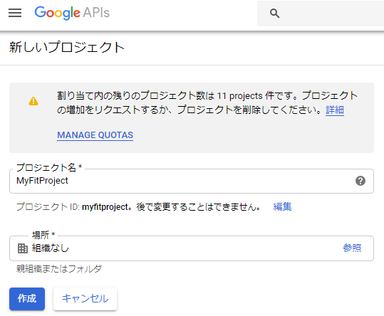

### Fitness API 追加

左側メニューの「ライブラリ」または、ダッシュボードページ上部「APIとサービスを有効化」をクリックし、ライブラリへ。

そこで、Firness と検索し、追加。

<!--more-->

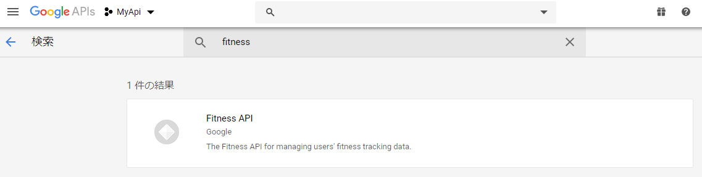

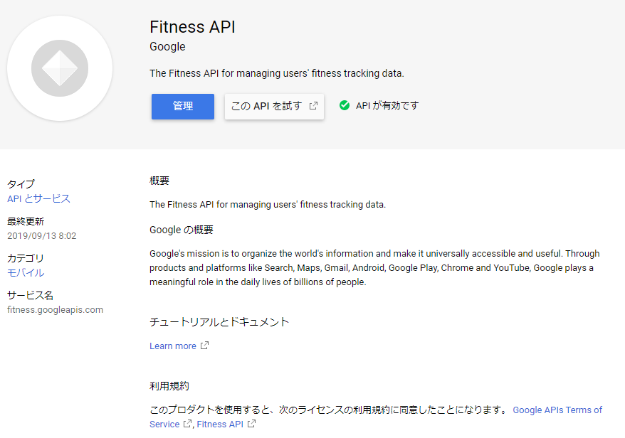

### OAuth 同意画面、認証情報追加

ユーザー（自分）に許可を出すための画面設定が必要。 
APIとサービス画面の、「OAuth同意画面」から、アプリ名のみをとりあえず設定。

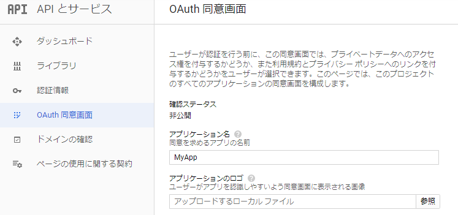

設定したら保存してください。

次に、認証情報を追加。 
「認証情報」をクリックし、「認証情報を作成」をクリック。 
「OAuth クライアントID」を選択。

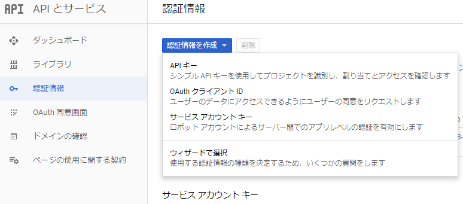

「ウェブアプリケーション」を選択し、
「承認済みのJavaScript生成元」には
```
https://developers.google.com
```
を、「承認済みのリダイレクトURI」には
```
https://developers.google.com/oauthplayground
```
を設定してください。このあたりはドキュメント通りです。

https://developers.google.com/fit/rest/v1/get-started?hl=ja

### OAuth 2.0 Playground で動作準備

Google Developers OAuth 2.0 Playground 上で実行してみます。 
Google API のテスト環境のような形でしょうか。

https://developers.google.com/oauthplayground/?hl=ja

下記は OAuth 2.0 Playground についての記事
https://developers.google.com/identity/protocols/OAuth2

アクセスしたら、「Step1 Select & authorize APIs」で「Fitness v1」を探してクリックで展開、 
いろいろ試してみたいので、全てのエンドポイント？にチェックを入れて、「Authorize APIs」をクリック。

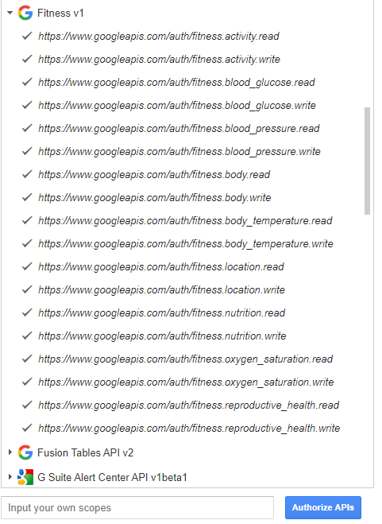

すると、どの Google アカウントで認証するかの、見たことある画面になりますので、アカウントを選択し、許可をクリック

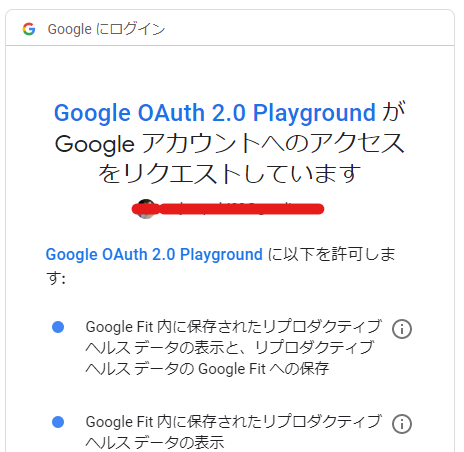
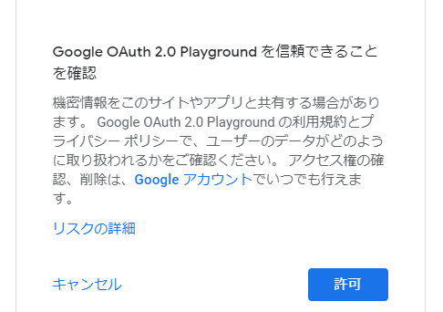

すると、前の画面に戻ってAuthorization code が入力された状態になりますので、 
「Exchange authorization code for tokens」をクリック。 

Authorization code は一時的なアクセス許可をするための橋渡しのような状態で、
これを利用することで、Refresh token と Access token に変換することができます。

▽参考
https://developers.google.com/identity/protocols/OAuth2

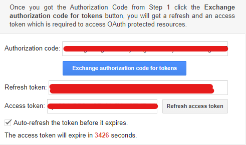

アクセストークンは1時間期限なので（カウントダウンされてますね）、 
期限が切れたら Refresh token を利用してアクセストークンを再取得する必要があります。

この Playground ではAuto Refresh できるみたいなので、チェック入れておきましょう。

## 動作確認

使用できるAPIについては、Google Fit REST API のドキュメントに記載されています。

https://developers.google.com/fit/rest/v1/reference/

体重を取ってみましょう。

使用できる dataSources (運動だったり、血圧だったり、体重だったり、睡眠だったり)は、
```
https://www.googleapis.com/fitness/v1/users/me/dataSources
```
にGETをすることで取得できます。

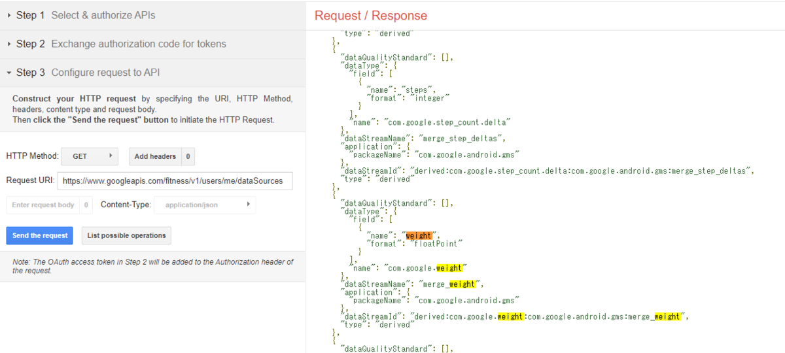

体重の部分のJSONを観ると、「dataStreamId」というのがあります。これが Google Fit API でのデータ種別IDになります。

最後に、この dataStreamId を使って、過去の体重保存結果を取得しましょう。 
テンプレートは以下
```
https://www.googleapis.com/fitness/v1/users/{user}/dataSources/{dataSourceId}/datasets/{start-end}
```

*{user_id}* は *me* 、 *dataSourceId* は先程の dataStreamId、datasets の *{start-end}* は、取りたい期間を *ナノ秒* で指定する必要があります。
```
GET https://www.googleapis.com/fitness/v1/users/me/dataSources/derived:com.google.weight:com.google.android.gms:merge_weight/datasets/0-1568432908000000000
```

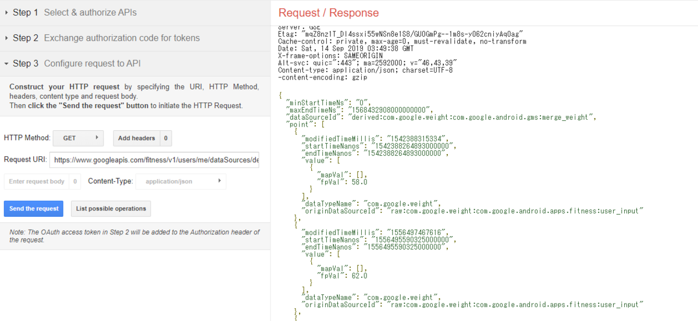

無事に取れていそうですね。 
もちろんですが、過去に値を追加したことがなければ値は帰ってこないと思います。

それにしても、なぜナノ秒…？

## 最後に

APIドキュメントを読めば簡単にPOST もできそうですが、自分用メモとしてまた記事を作るかもしれません。

