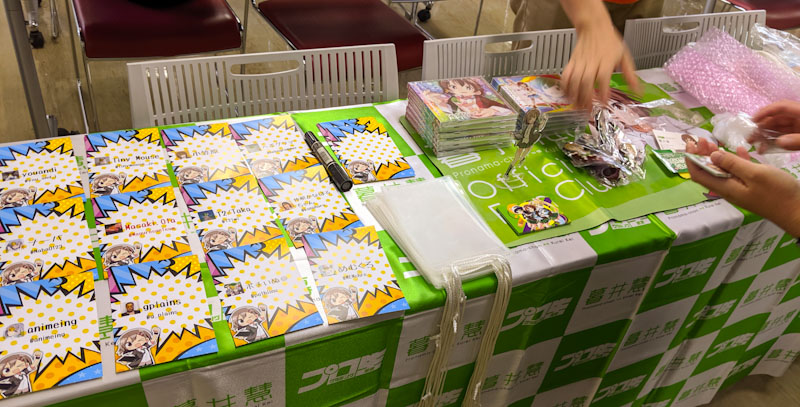
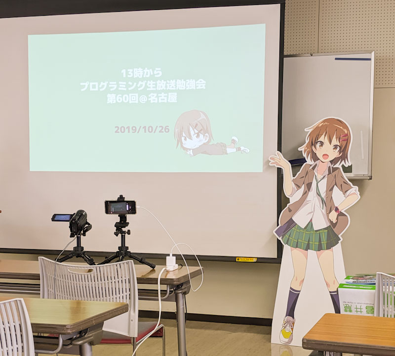
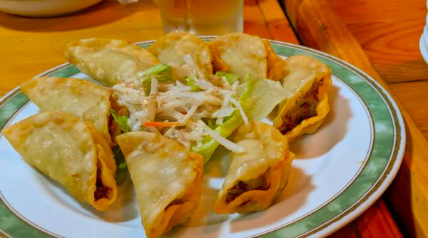
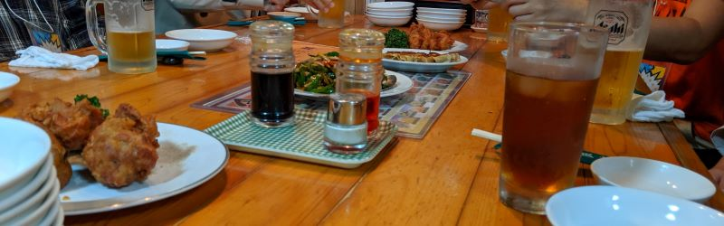

プログラミング生放送は、ITネタであれば何でもOK、オールジャンルの勉強会となります。

参加は2年半ぶりぐらいでした。

10/26(土)に行われた第60回目は、名古屋で開催。 
今回はいつもの YouTube Live 配信ではなく、Twitter での生放送だったようです。

自分含めて現地参加者は12人でした。

<!--more-->

https://pronama.jp/2019/09/25/pronama-60-at-nagoya/

https://atnd.org/events/108992

## 本題の勉強会の話

セッションの内容は、登壇者それぞれ別の技術を紹介されていたので、 
普段は触る機会がないような技術についても幅広く知ることができ、 
**視野が広がった**ので、とても有意義でした。

更に言うと、技術的な内容はセッション後にググって調べてばよく、 
色々なアプリを作ったりしている方が、どういう考えてこういう実装にしたのか、 
どういった点で苦労したのか、等が聞けたのが一番の収穫だと思っています。

あとは、9Uのサーバーラックを衝動買いする方とか、 
ノートPCが壊れたので急遽デスクトップPC持ってきてそのままセッション始めたりする方とか、 
そういう意味でも面白かったです。

「自分も頑張ろう！」って気になるのが勉強会で現地に赴く醍醐味ですね。

参加された方、お話してくださった方、ありがとうございました！

### 自分の LT の話

自分は前日に急遽やって、って言われたので、 
慌てて過去のブログネタをほぼそのまま LT として発表を行いました。

▼ブログ記事
[Laradock + Laravel + VSCode + Xdebug 環境構築](./0630-laradock)

▼発表資料
<iframe src="//www.slideshare.net/slideshow/embed_code/key/tdvXljOwdEd0IE" width="595" height="390" frameborder="0" marginwidth="0" marginheight="0" scrolling="no" style="border:1px solid #CCC; border-width:1px; margin-bottom:5px; max-width: 100%;" allowfullscreen> </iframe> 
 <strong> <a href="//www.slideshare.net/naba0123/laradock-laravel" title="Laradock を使って 気軽に Laravel を触ってみよう" target="_blank">Laradock を使って 気軽に Laravel を触ってみよう</a> </strong> from <strong><a href="https://www.slideshare.net/naba0123" target="_blank">naba0123</a></strong> 

### 今後について

過去に金沢でプロ生を主催したことがありますが、 
また来年あたりにできたらいいなぁーとふわっと話していたので、  期待？

[プログラミング生放送勉強会 第40回＠金沢を主催＆登壇した話](../../2016/0329-pronama)

## 余談の話

勉強会後の懇親会で食べた台湾料理屋が、めちゃくちゃ美味しかった…

https://atnd.org/events/108993

食べ飲み放題で、料理種類も多いが、味も良し、生ビールも飲める。

名古屋に来る際はリピートしたくなる美味しさでした。
