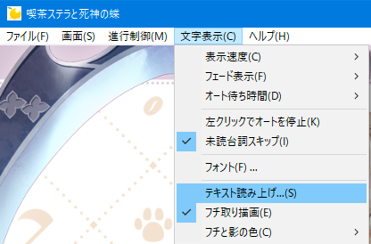
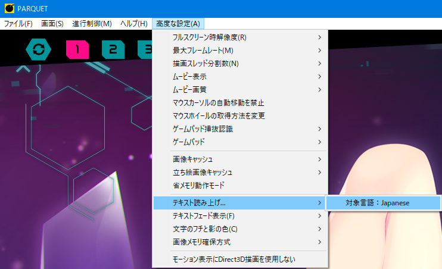
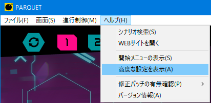
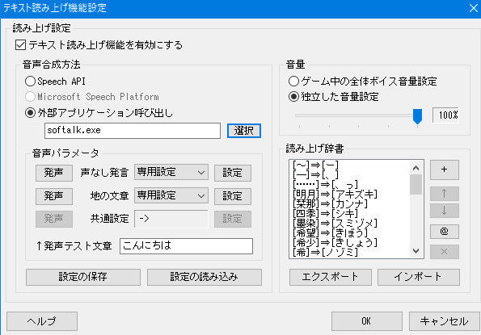
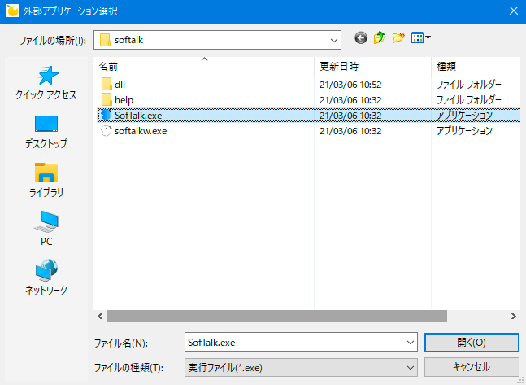
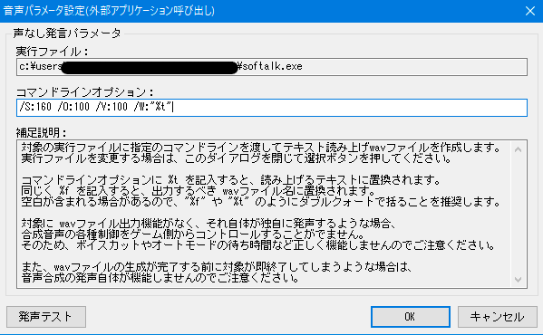
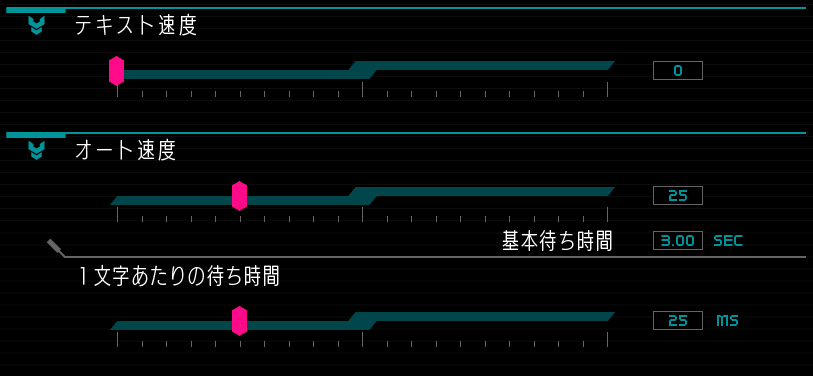

## 前提

本記事では、吉里吉里のゲームエンジンを使用しているゲームに入っている機能である「テキスト読み上げ機能」を使い、ゆずソフト製のゲームなどで、主人公や地の文を読み上げる方法を説明します。

対象の機能がないゲームについては本記事の対象外です。

<!--more-->

## 動作確認済

### 環境

* Windows 10 Pro 21H1

### ゲーム

* PARQUET
* 喫茶ステラと死神の蝶
* RIDDLE JOKER   

<!--more-->   

## 導入方法

### SofTalk のダウンロード

https://w.atwiki.jp/softalk/

ダウンロードし、適当な箇所に解凍してください。 
このあとの動作確認のため、`SofTalk.exe` を起動をしておいてください。

### 設定画面の出し方

対象のゲームを起動し、下記のどちらかで「テキスト読み上げ機能」の設定画面を出してください。

#### 「文字表示」→「テキスト読み上げ」パターン

#### 「高度な設定」→「テキスト読み上げ」→「対象言語：Japanese」パターン

### 設定内容

「テキスト読み上げ機能を有効にする」にチェックを入れると、諸々の設定が可能になります。

今回は SofTalk に読ませることが目的なので、 
「外部アプリケーション読み出し」から SofTalk.exe を選択します。

ここからはお好みですが、「声なし発言」（主人公など）と「地の文章」で、 
SofTalk の設定などを切り替えることが可能になります。

もちろん、「声なし発言」は読み上げさせずに「地の文章」のみ、ということも可能です。

今回は、それぞれ別々に設定してみるので、「共通設定」を「専用設定」に変え、「設定」ボタンを押します。

コマンドラインオプションに、SofTalk に読ませたい声質だったりを設定します。

ここで指定できる内容については、 
起動してある SofTalk のウインドウの「ヘルプ」→「目次」→「引数指定」を参考に指定してください。

目的の声質になったら、「OK」を押して保存してウインドウを閉じ、満足がいくまで設定を繰り返してください。

### 読み上げ辞書について

持っているゆずソフトのゲームでは、先程の画像のようにキャラの名前だったりが辞書に登録されていますが、 
正直それだけではキレイに再生されなかったので、プレイしながら随時調整をするようにしてください。

### テキスト表示速度などの設定

この「テキスト読み上げ機能」と音声再生時間まで連携できる「Speech API」であれば、 
オート中にテキスト読み上げが終わってくれるまでゲーム側で待ってくれますが、 
SofTalk で行う場合にはうまいこと連携できないようです。

そのため、ゲーム側の「テキスト速度」と「オート速度」をうまいこと調整して、 
ゲーム側が先に進まないようにしないといけません。

このあたりはどうしても感覚値になるのですが、 
私は PARQUET では以下のように設定をしていました。

* テキスト速度 : 0
* オート速度 : 25 (基本待ち時間 3.00 sec)
* 1文字あたりの待ち時間 : 25ms (基本待ち時間プラス、文字数に応じて追加で待つ時間）

余談ですが、最後の文字数あたりの追加待ち時間の機能は「喫茶ステラと死神の蝶」には存在していなかったので、更に調整がしやすくなってそうです。 
（喫茶ステラのときは最大まで遅くしても長文だと間に合わなかった）

## あとはプレイするのみ

プレイ時の注意事項ですが、 **プレイ中は SofTalk を手動で起動しておいてください** 。 
そうしないと、毎再生ごとに SofTalk を起動しようとして、フリーズのような挙動になってしまいます。

あとは、シーン中はさすがに読み上げが辛くて切ってました。。

それでは、良いノベルゲーライフを。