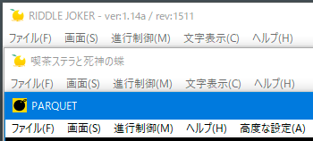

## それは突然きた

ゆずソフトの最新作「喫茶ステラと死神の蝶」が発売されてから1年半。 
コロナ等でスケジュールが遅れていることが予想はしてましたが、そろそろ新作の発表が来ないかなーと待っていました。



そんな中、7/30 に行われたゆずソフトの生放送で「全年齢版新作！このあと24時から配信専用で発売！」と発表されたのが、 
この「PARQUET」です。

<!--more-->





早速購入し、即日プレイ完了したので、感想を書いていきます。 
ネタバレを含んでいるので、プレイを予定している方は先にプレイをしてくださいね。

<!--more-->

## 今までの作品との違い、所感

ストーリーやスタッフ情報などは公式の情報を見ていただくとして、一番の驚きは

* 完全全年齢版（天神乱漫のようにR18を全年齢版に移植したものではない）、その代わり iOS / Android でのリリースも予定
* OP が 3D モデル

ということでした。

まず完全全年齢版について。 
プレイ前までは「正直R18のシーンは飛ばすことが多いが、無ければ無いで物足りなくなるのではないか？」と思っていました。

これについては、後ほど感想でも述べますが全年齢版としてのシナリオとして気持ち良い感じに落とし込んである、と感じました。 

また今までアニメで通していた OP が 3D モデル使用になったことについて。 
生放送（YouTube）では結構な言われようでしたが、個人的にはむしろ新鮮でよかったです。 
言われているほどモデルが悪いものとも思いませんでした。（予算的には 3D の方が安いんですかね？）

なお本編は、今まで通りのイラストなので、そこを心配されている方はご安心ください。

## システム感想

システム面の使い勝手や機能面は、今までのゆずソフト作品とほとんど変わりはないように思います。

私が普段プレイするときの既存設定からの変更項目は、
* 「テキスト読み上げ機能」の ON（棒読みちゃんに読ませてオート、作業のお供として流しておく）
* 上記のテキスト読み上げ機能に伴い、「オート速度」をかなり遅めに
* 手動でプレイするとき用に「ボイスカット」を OFF に
  ぐらいなのですが、今まで通り設定できました。

少しだけ迷いました（テキスト読み上げ機能の場所が変わってた）が、機能の中身は変わっておらず安心しました。

## シナリオ感想

あまり自分自身ノベルゲーマーではありません（ゆずソフトをメインに、他数ブランドをかじったことがあるぐらい）が、 
今までのプレイ内容から、ゆずソフトはキャラゲーと言われながらもシナリオが面白いと感じていました。

そんな期待通り、今作もシナリオが安定の面白さでした。

全年齢版ということもあり、本編にラッキースケベ含むそれっぽい描写や発言がほとんど存在しないため、 
エロゲだと思ってプレイするとがっかりするかもしれません。

普段のゆずソフトがキャラクターと（物理的に）絡みすぎているからか、プレイしていて、なんとなく「強制的に選択肢が通常ENDを選んでいる」かのような無難な話題の収まり方、キャラクターとの絡みの終わり方に感じました。

しかし、普通にシナリオゲーとして進めていれば、もやもやせずにプレイできるのかなと思います。

ガッツリお色気シーンこそないものの、 
細かい心理描写や、可愛くて悶絶してしまうようなセリフや仕草が散りばめられており、 
キャラクターの魅力を十分に感じることができました。

ただ、可愛い立ち絵やスチルを見ていくとどうしても「あぁリノ可愛い、あぁツバサ可愛い」となるわけで……。 
でも「全年齢版だから期待しちゃだめだ」と胸の高鳴りを抑えながらプレイを進め……。 
その気持ちを挑発するかのように描画されるリノの恋煩い……。

**ああ尊い！！**

なんて思いながらプレイし、誰とも結ばれることなく（攻略対象いないし…）本編が終了。 
開放されたアフターストーリーもエロい展開は一切期待せずプレイを初めたのですが……。

**ありがとうございます！！ありがとうございます！！**

良い意味で裏切られ、（自分の我慢が）報われたと感じました。 
正直全年齢版でここまでやってくれる（特に音声）と思わなかったので、画面の前でガッツポーズしてました。

ただ、これ特に iOS 版は審査通るんですかね……と要らぬ心配をしてました。

あとは、終盤なんとなくツバサは助かるんだろうな、という予測をしながらプレイしましたが、バッドエンドじゃなくて本当に良かった。 
もうずっとみんなで幸せに暮らしてほしい。

と、全体的にとっても満足ですが、ただの素人の感想として気になったところを。
* 警察にめっちゃ協力してるけど、1回ぐらい身元確認されないの……？（身分証明書もないのに）
* 夜空を見上げるリノの前に立ちふさがったカナト、近すぎない？（その先に繋げるためにはあの立ち位置じゃないといけないのはあるけど…）
* 三吉さん転職するか云々で盛り上がってたけど、三吉さんの人生は何も変わらず波も立てず終わってしまって不完全燃焼感（完全サブキャラなのでこれでもいいのかもしれませんが、初めの方はかなり三吉さんベースの話だったのでちょっと気になった）

### ボリュームについて

ボリュームについては、2,500円(DMM販売)という価格から、サクッと終わってしまったらどうしようと思いながらプレイしていましたが、 
オート7割、手動3割ぐらいで進めて14時間ぐらいのプレイ時間で結構良いボリュームだったと思います。

とはいえ、R18版とは違い攻略対象というものがないので個別ルートもなく、一通り見終わって終わり、という感じです。

## キャラクター感想

絵のことは本当に分からないので、本当にただの素人感想にはなります。

本家の前作「喫茶ステラと死神の蝶」からか髪の色に反射光やらアクセント色がつくようになったのですが、 
本作の近未来的な世界観とも合わさりとてもマッチしていました。

もちろん可愛いという感想もありますが、それよりも「オシャレ」「カッコいい」という感想の方が大きかったです。

特にリノのアクセント色いいですね……。

## まとめ

いろいろ書きましたが、

* 全年齢版ではあるが、ドキドキするシーンや萌えるセリフは健在
* 2,500円という低価格（個別ルートシナリオやスチルがない分価格が低め…にしても安くない？）
* シナリオ、キャラクターなどは安定のゆずソフトスタッフ
* つまり面白い（面白かった）

とのことなので、ぜひプレイしてみてください！

（物語の核心はネタバレしてないので、未プレイの人はぜひ）

https://dlsoft.dmm.com/detail/yuzu_0005/

https://www.dlsite.com/soft/work/=/product_id/VJ014636.html