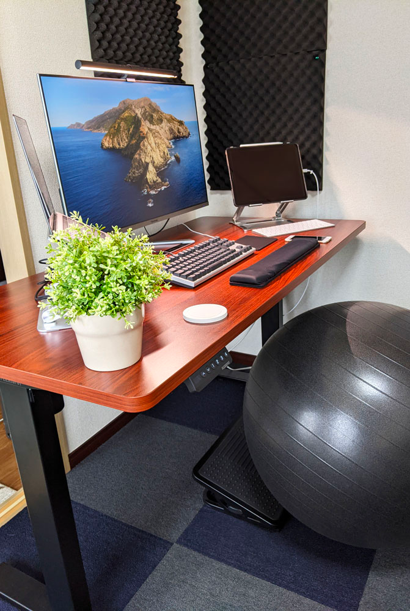
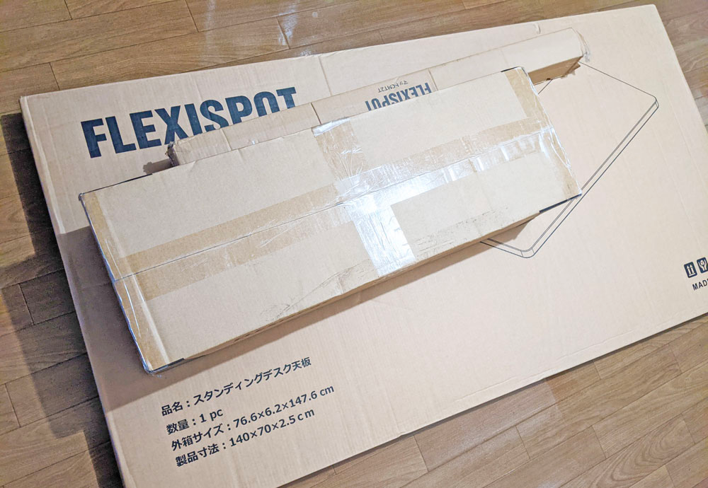
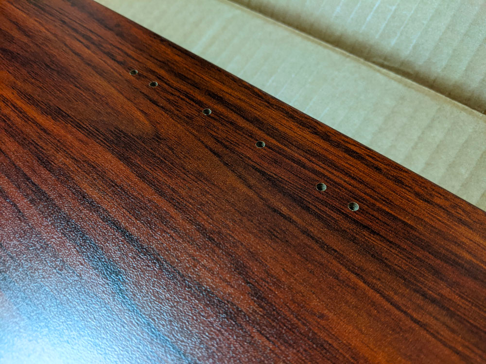
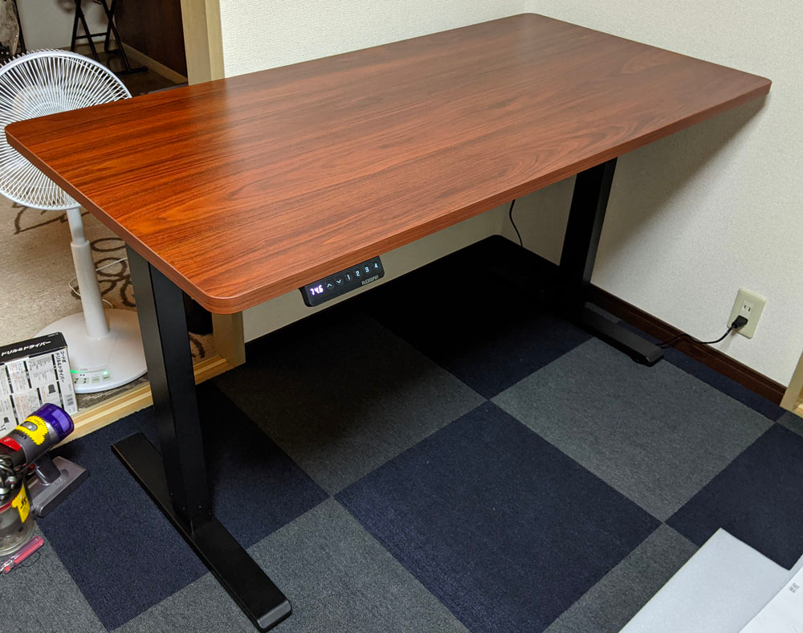
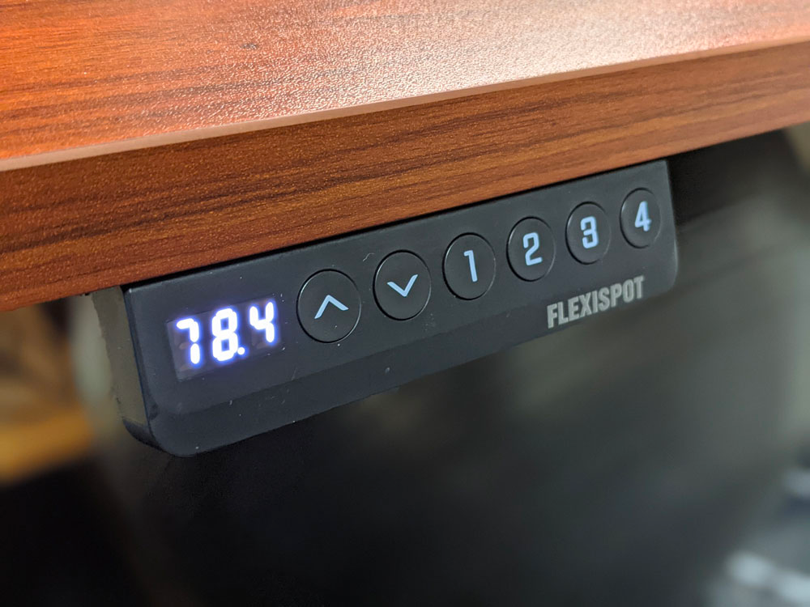
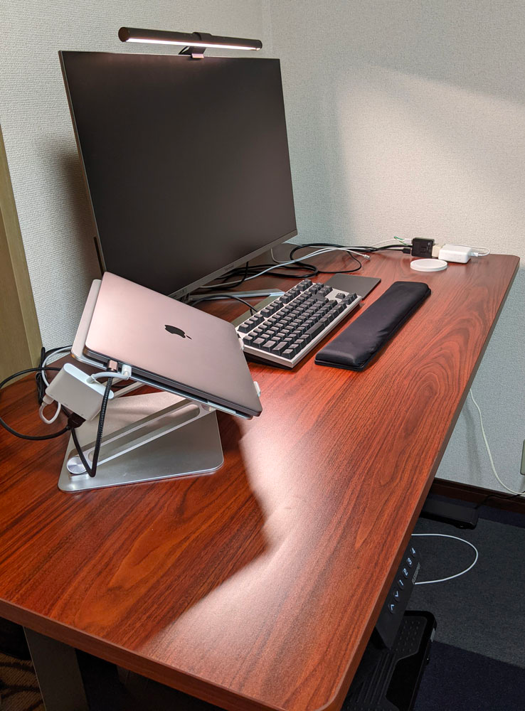

## はじめに

FLEXISPOT というメーカーの EF1 という電動昇降デスクを購入しました。

買った理由としては、リモートワーク環境、かつ仕事環境のためです。 
ここ1年ずっとリモートワークをしていて、これからも続くだろうという算段から購入に踏み切りました。

<!--more-->

FLEXISPOT を購入した理由としては、

* 他の似たような電動昇降デスクの中では手が出しやすい（といっても天板込みで4万円超えましたが…）
* YouTube などでレビューしている人が多く使い勝手の想像がしやすかった

といった感じです。

YouTube で色合いや機能などを見るうちに気に入ってしまいました。

在庫が復活するとすぐに売り切れてしまう人気ぶりのようで、自分も日課の在庫チェックでようやく在庫ありの状態を見つけて購入できました。

## 組み立てについて

天板と脚、それぞれ別のダンボールで複数個口の荷物として佐川急便で届きました。 
（プレゼントのマットもあるので3点です）

注文したのが午前7時、次の日の18時の便で届きました。
大型便なので時間がかかるかなと思いましたが、かなり早く届いたので驚きました（関東だとこんなもん…？）。

組み立て自体は説明書を見ながら行えば、1時間ちょっとでできました。

リモコンの位置をてっきり右側と左側のどちらでも設置できるのかなと思いましたが、組立説明書に「モーターと同じ側にリモコンをつけてください」と書いてあったので、左側だけかなと思いました。 
ただ、公式サイトの画像を見ると右側にリモコンを付けているので、もしかしたら右側にもリモコンが付けられたかもしれません。

また、専用天板を買った場合は予め取り付け用の穴が空いているので、組み立てのときに重宝しました。 
（一部穴が空いていない部分に木ネジを回さなければいけない部分があるので、ドリルなども使える電動ドライバーがあると便利です。

## 組み立てたところ

一人だと天板を組み立てたあとにひっくり返すのがめちゃくちゃ重いので、怪我などに注意してください。

## モニタやら置いてみたところ

配線はこれから整理します。 

## ざっくり所感

### 高さメモリー機能が本当に楽

下位モデルのEG1にはついていない高さを覚えておいてボタン一つでその高さにしてくれる機能があることがとれも便利でした。

自分は、以下のように4メモリーを使い分けています。

* バランスボールで座って勉強、仕事するときの高さ
* 別の椅子で座ったときに丁度よい高さ
* 立って仕事するときの高さ
* 立って読書するときの高さ（肘を置きたいから最大まで高くしたい）

これを毎回手動で操作していたら、おそらく面倒くさくて使わなくなっていたかもしれません。

### 高さを最大まで高くしてもそこそこ安定性がある

以前ニトリで、手回し式の昇降デスクを試したときに、最大まで高くするとかなりぐらついてしまい仕事に集中できなさそうだったので、ここが結構心配なところでした。

しかし想像をいい意味で裏切られ、かなりずっしりしているので、低いときはほぼ揺れなし（普通の机と変わらない）。 
最大まで高くしても揺らしたら揺れる、ぐらいでキーボードを叩いたり肘を置いたりするぐらいではほとんど揺れませんでした。

### 想像していたよりも稼働音が静か、ただし振動は少なからずある

モーターの音などは、思ったよりもうるさくないです。 
集合住宅で夜間に稼働しても問題はないと思います。

ただ、床にカーペットを敷いていても少なからず床から振動を感じました。 
うるさいというわけではありませんし個人的に気になったわけではないですが、気になる人は気になるかもしれません。

### 付属の配線パーツがあまり役に立たない

机の裏側に配線と両面テープで固定できる器具がついているのですが、貼り付け場所が悪かったのか引っ張られてしまったのか、数時間で剥がれてしまいました。 
何度つけ直しても剥がれてしまったので、<s>両面テープを持っている強力なものに変えたところ、ちゃんとくっつきました。</s> → 更に剥がれてしまったので、養生テープで上から固定しています。見える場所じゃないのでOK。 

## おわりに

このモデルでも天板込みで4万超えなため、正直買って後悔したらどうしようと思っていましたが、今のところ買って大正解です。

他社だと平気で10万円を超えてくるので、この安定感でこの価格ならかなりコスパは良いと思います。