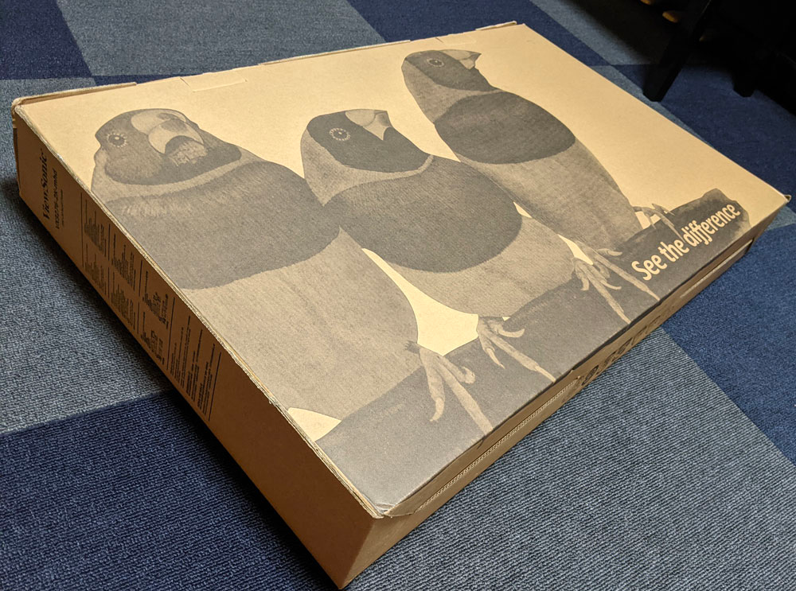
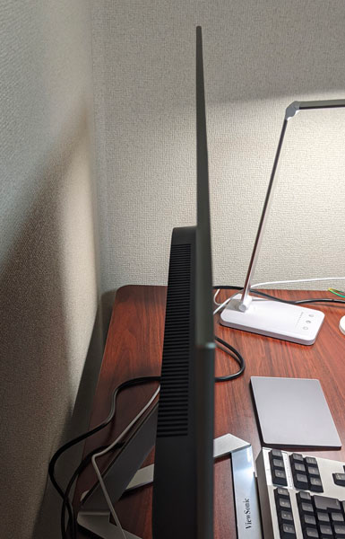
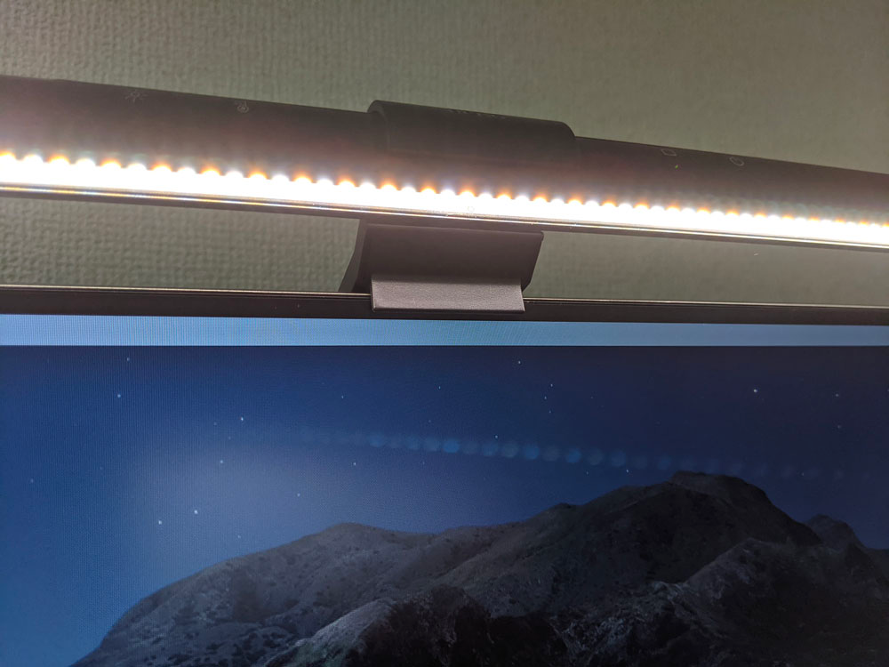
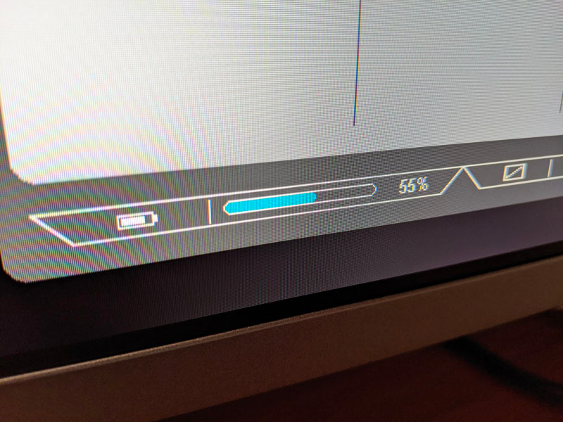

## はじめに

最近電動昇降デスクを買い、そのデスクに置くディスプレイを探していました。

[FLEXISPOT EF1 / 脚ブラック / マホガニー 140 x 70 cm を購入しました](../0806-flexispot/)

条件としては、以下のようなものを探していました。

* WQHD (27型でこの解像度のディスプレイを持っていますが丁度よい広さで便利なため)
* 30型以上（27型でも良いのですが、もう少し文字が大きいほうが良いと思ったため）
* IPS（なんとなく）
* DisplayPort が使える（持っているケーブルの関係）

<!--more-->

色々調べていくと、今回買った VX3276-2K-MHD-72 がこれらの条件に合致し、かつかなり安かったため、思い切って購入をしてみました。

https://www.viewsonic.com/jp/products/lcd/VX3276-2K-MHD-72

ViewSonic はアメリカの会社のようです。

https://www.viewsonic.com/jp/shop-guide

## 所感

### 箱が小さい

ディスプレイを自分で買うのが3年ぶりぐらいなのですが、箱がめちゃくちゃ小さくて驚きました。 
本体自体がかなり薄く、それに合わせて箱も薄くなったのだと思いますが、31インチのディスプレイが入っているか心配になるぐらいの薄さでした。

### もちろん本体が薄い

今のディスプレイってこんな薄いもんなんですかね……？ 
最近発売された新型 iMac を彷彿とさせる薄さでした。折れそう（折れない）

### ベゼルがかなり狭い。でもスクリーンバーを置けるぐらいのベゼルは残ってる

公式サイトの画像通り、かなりベゼルは狭いです。 
ただ、それでも自分が使っている BenQ のスクリーンバーを置くぐらいのスペースは残っていました。よかった。

https://www.amazon.co.jp/dp/B0785D93KD

### 明るさはブライトネス50ぐらいが個人的には丁度よい

このモニターに限った話ではないかもしれませんが、ブライトネス100は大体個人的には眩しいです。

ゲームをするわけでもなく、デザイン関係の仕事をしているわけでもないので、ブライトネスは自分は50ぐらいに設定すると丁度よくなりました。

ついでに、設定画面の下に表示されているバッテリーマーク（恐らく消費電力の度合いを示していると思います）が、かなり減ったので、節電にも良さそうです。

### モニタ裏側のボタンの物理音がうるさいのと、ある程度力が必要

モニターの裏側に設定切り替え用のボタンがあるのですが、このボタンが固く押すのに力が必要です。 
また、かなり「ガツン」という音がするので、ポチポチするとかなりうるさいです。 
会社などで他の人がいるような場合は頻繁に押せないうるささです。
このあたりは、自宅で使う分や、設定を頻繁に切り替えない人は問題ないかなと思います。 

## おわりに

まだ購入して数日なため耐久性などは分かっていませんが、ドット抜けなどもなく今のところ満足しています。
初期不良などを引かないことを祈りつつ、また何かあれば記事にしたいと思います。