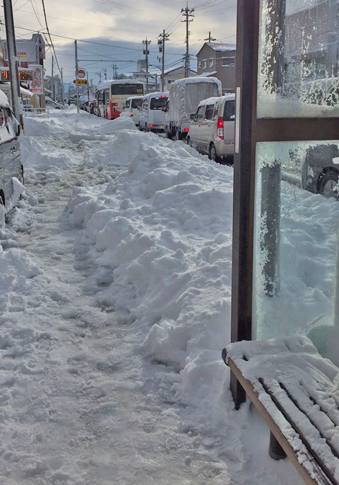

## はじめに

2015年11月、東京から石川県金沢市に引っ越しました。 
その後2度金沢市内で引っ越しをし、この5月に北陸を離れました。

金沢市に引っ越した際の理由は転職ですが、現在の居住地に引っ越した後はリモートワークで変わらない仕事を続けています。

この記事では、今まで北陸に住んだことがなかった人が5年間金沢市に住んで良かったところ、大変だったところなどを書いていきたいと思います。

<!--more-->

## 住んだ地域

地元トークになるかもしれませんが、住んだ箇所は以下の3地域です。

### 無量寺

<iframe src="https://www.google.com/maps/embed?pb=!1m18!1m12!1m3!1d6405.925243279657!2d136.6083900798812!3d36.60320926995847!2m3!1f0!2f0!3f0!3m2!1i1024!2i768!4f13.1!3m3!1m2!1s0x5ff9ccecdf195d59%3A0xfa46fe43750da14f!2z44CSOTIwLTAzMzMg55-z5bed55yM6YeR5rKi5biC54Sh6YeP5a-6!5e0!3m2!1sja!2sjp!4v1628306118272!5m2!1sja!2sjp" width="100%" height="300" style="border:0;" allowfullscreen="" loading="lazy"></iframe>

無量寺（むりょうじ）は金沢港（最近新しくなりましたね！）の近くです。 
こちらには2年間ほど住んでいました。 
コロナワールドが近いので、歩いて映画館などに行けるのはかなりのメリットだと思います。

ただ交通の便は、正直よくありません。 
近くのバス停が少なく、歩いて気軽に金沢駅にいけるようなバス路線はなかったと思います。

金沢の街中（片町）の方に行くためには、金沢港線の道路まで行けばかなりの本数のバスが通っているので、そこまで行く手段があれば便利だと思います。（その場合バス停は「観音堂」ですね） 
ただ、バス定期券を買う場合は金沢市が運用しているパークアンド・ライドシステムが使えるので、観音堂バス停近くのゲンキーに車を停めることが出来ます。

https://www4.city.kanazawa.lg.jp/11031/taisaku/tdm/park-and-ride/kpark/kpark.html

ただ、海側環状線（と呼んでいましたが正式な名前は分からないです）が近いので、市外へドライブするときに金沢の街中を通らずに行けるのはいいですね。 
のと里山海道へも比較的近く、気軽に能登の方へドライブにいくこともできます。

### 大額

<iframe src="https://www.google.com/maps/embed?pb=!1m18!1m12!1m3!1d6413.275395034728!2d136.6172774798754!3d36.51460687003357!2m3!1f0!2f0!3f0!3m2!1i1024!2i768!4f13.1!3m3!1m2!1s0x5ff835e3a9ab7641%3A0xa9e4eb81243c7dc2!2z44CSOTIxLTgxNDcg55-z5bed55yM6YeR5rKi5biC5aSn6aGN!5e0!3m2!1sja!2sjp!4v1628306734088!5m2!1sja!2sjp" width="100%" height="300" style="border:0;" allowfullscreen="" loading="lazy"></iframe>

続いて大額（おおぬか）に2年間住んでいました。

こちらの地域は、金沢の街中からはかなり南の方で、野々市や白山市が近いです。 
ただ、交通の便に関しては、鉄道（北鉄石川線）が近いのと、金沢駅に通じるバスが1時間に数本のペースであるので、そこまで困らないと思います。（金沢駅までは30分～40分ほど）

私が住んでいた2年間では開業しませんでしたが、最近フィットネスジム（エイム）が開業したので、ジム通いしたい人は良さそうです。

ただ、山に近いということもあり、海側に比べると雪が積もります（大額ではないですが一部の信号は縦になっていた）。 
2018年の豪雪のときはそれはもう大変でした……。

その代わり山側環状線が近いので、森の里方面に行ったり、白山の方に遊びに行くには良い立地でした。

### 円光寺

<iframe src="https://www.google.com/maps/embed?pb=!1m18!1m12!1m3!1d6411.7673711053785!2d136.64344187987658!3d36.53280042001809!2m3!1f0!2f0!3f0!3m2!1i1024!2i768!4f13.1!3m3!1m2!1s0x5ff83431dfc31def%3A0x4e6a66d70427b3a2!2z44CSOTIxLTgxNzMg55-z5bed55yM6YeR5rKi5biC5YaG5YWJ5a-6!5e0!3m2!1sja!2sjp!4v1628307643760!5m2!1sja!2sjp" width="100%" height="300" style="border:0;" allowfullscreen="" loading="lazy"></iframe>

最後に住んでいたのは円光寺（えんこうじ）です。 
ここには1年住みました。

これまた山に近いので、2021年の豪雪時は雪かきに追われました。

交通の便はそこまで悪くはありません。 
先程の大額に比べると片町などの街中が近く（といっても歩いていける距離ではありませんが）、駅の方へ通じるバスもそこそこの本数あります。

ただ、昔ながらの道が多く狭い道が多いです。 
金沢は片側1車線道路が多いのですが、円光寺の周りはほとんど片側1車線です。 
そこを路線バスも頻繁に通るので、慣れるまでは少し大変かもしれません。

## 北陸（金沢）に住んだ感想

関東出身ではあるものの大学は長野に4年間住んだこともあり雪には比較的慣れているつもりでしたが、北陸の地域に関しては未知数でした。 
そんな中で5年間住んだ感想をざっくり。

### 信号は横、でも降るときは降る

北陸は雪国のイメージがありますが、金沢市内に関しては信号は縦ではなく横です。 
とはいっても、融雪装置はあちこちの道路についているので、雪が降ったからといってすぐに交通が麻痺することはありません。

ただ、2018年や2021年の豪雪ぐらい降ってしまうと、物流などにも影響が出てしまいます。 
特に鉄道と高速道路が止まってしまうと、かなり絶望的です。

長野と比べたときに、長野では静かに、でもしっかりと降るというイメージでしたが、金沢（というか北陸）は猛吹雪かつ雷が鳴る、嵐のようでした。 
関東に住んでいたいた頃は、冬に雷が鳴るイメージがなかったので、ここは特に驚きました。

写真は2018年の大雪のときのもの。

### ドライブに行ける場所がたくさんある

よく自然豊かな場所にドライブに行くのですが、海も山も近く見どころがたくさんある北陸の中心地に5年住めたことはとてもよかったと思っています。

海岸を車で走ることができる道路「千里浜なぎさドライブウェイ」から、少し遠いですが世界遺産の白川郷（岐阜）など、行ききれないほどスポットはたくさんありました。

### 金沢市の道が覚えられない

城下町あるあるなのかもしれませんが、まっすぐではない道が多く、くねくねしているので道を覚えるのがとにかく大変です。 
頻繁に通る道であれば覚えてくると思いますが、5年間住んで、なんとなく金沢市の全体像は覚えましたが、どこで曲がればどこにつながるのかは覚えきれませんでした。

## おわりに

北陸という未知の地に5年間住んだわけですが、結果としてはとっても気に入りました。 
地元の次に長く住んだ土地になったため思い入れもかなりあり、また旅行などで訪れたいと思っています。 
（ [8番ラーメン](https://www.hachiban.jp/) の虜になったので、また食べに行きたい）

ここ10年で8回引っ越していて自称引っ越し芸人な私ですが、何も知らなかった北陸地方の魅力を知れたのがとても良い人生経験になったかなと思います。 
（また機会があれば別の地方に引っ越してその土地の良いところをたくさん知りたい）
