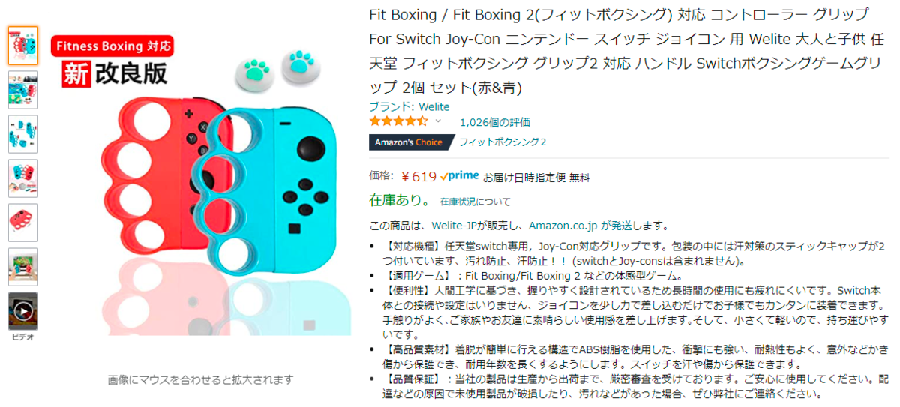
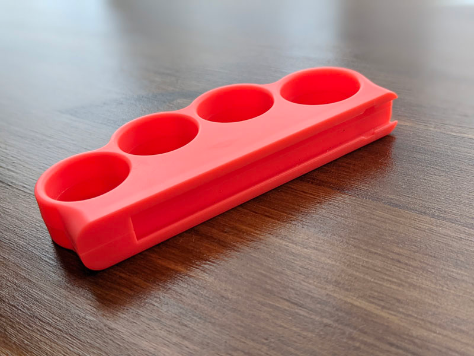
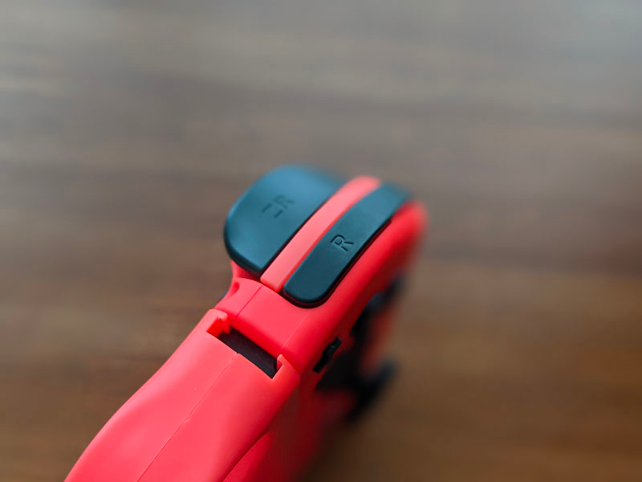
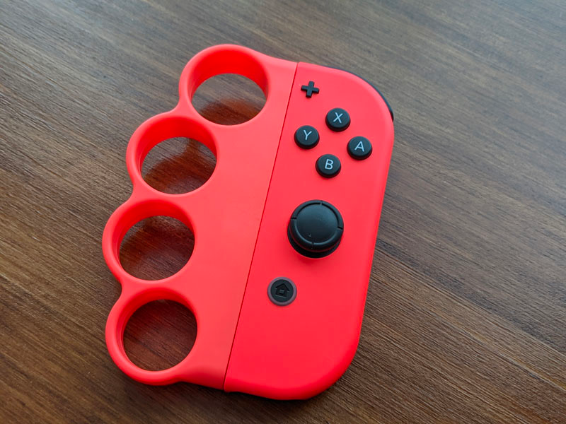
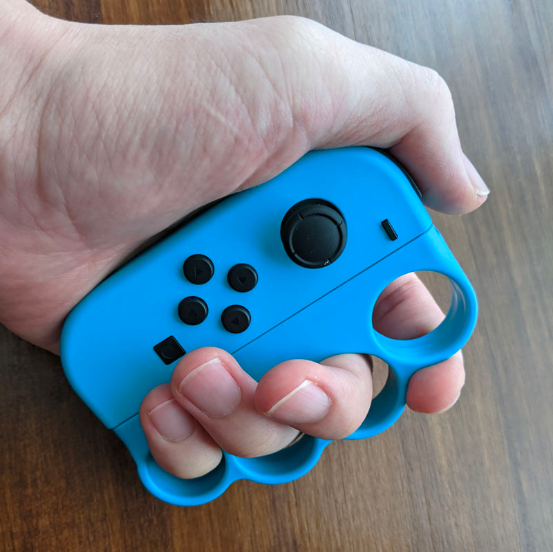

## はじめに

Fit Boxing 2 をここ最近は2日に1日のペースでプレイしているのですが、先日プレイ中に Joy-Con を服に引っ掛けてしまい、運悪くロックの爪が割れてしまいました。



<!--more-->

爪が折れてしまって取り外せなくなったかと心配しましたが、取り外しのボタンを押しながら力を入れてみると、ちゃんと取れました。 
参考にしたのは、公式が配信している Joy-Con のストラップを逆に取り付けてしまったときの対処法の動画です。



さすがにストラップの修理は無理そうだと思ったので、新しいストラップを Nintendo Store から注文しようにも、売り切れ。

ということで、安かろう悪かろうの精神で、いかにも Fit Boxing のための商品だろう中華製のグリップを買ってみました。 
2つで600円ほどでした。

## 装着性

公式のストラップとの組み合わせでは、ロックが2箇所（ストラップ側の爪で引っ掛ける部分と、Joy-Con 側のボタンを押す部分）あるのですが、この商品ではグリップ側には何もついておらず、実質 Joy-Con 側のボタンのみがロックになります。

装着したところ

ストラップ部分はなく手に固定ができないため、勢い余って落とさないように注意してください。 
とはいえ、しっかり握ればそうそう落とさないとは思います。

## 握り方について

Amazon の参考画像ように、そのまま握っても良いのですが、自分の場合手の大きさが合わず人差し指が痛くなってしまったので、下記画像のように握っていました。

このあたりは個人差がありそうです。 
男性の自分でも大きいと思ったので、女性が握るともっと大変かも。

## おわりに

公式の Joy-Con ストラップと比べたら、一長一短ありますが、壊れたときの代用品としてはとても満足しています。