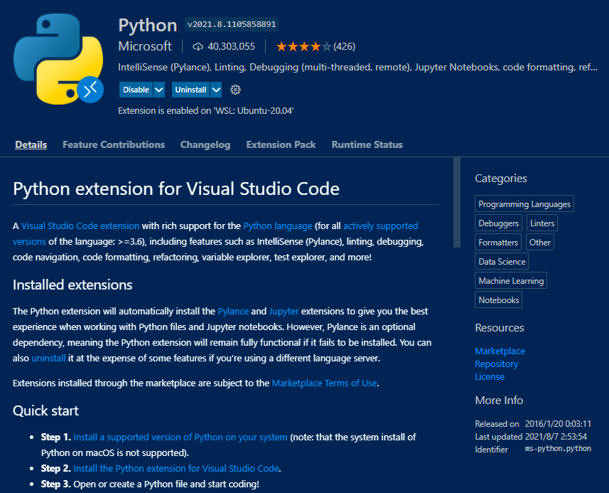
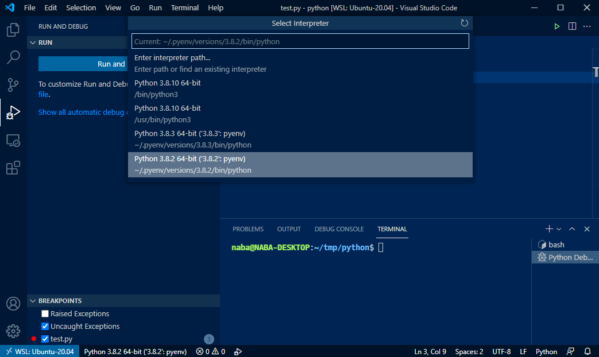
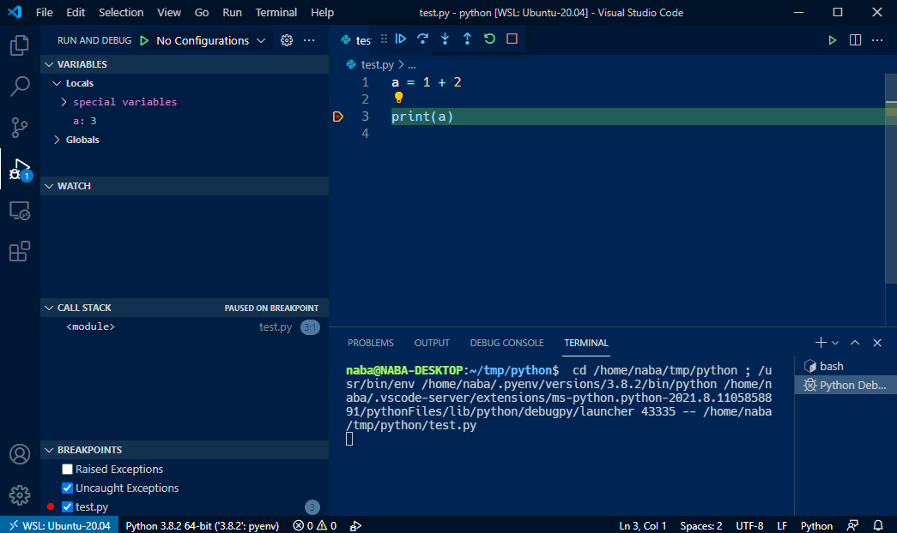

## はじめに

この記事では競プロ用にローカル環境で Python の環境を整えます。 
折角なので、Python のバージョンを切り替えることができる pyenv を導入します。

ゴールは Visual Studio Code でブレークポイントを使ったデバッグができるようになることです。

ググると似たような記事が出てきますが、pyenv 周りで引っかかった部分があったので、そのあたりも書いていきます。

構築する環境は以下の通り。

* Windows 10 Pro 21H1
* WSL2 Ubuntu-20.04
    * ターミナルは bash
* pyenv 2.0.4
* Python 3.8.2
* Visual Studio Code 1.59.0

<!--more-->

### 前提

* WSL2 Ubuntu-20.04、および VSCode が導入済みであること
* 各コマンドの実行は、Visual Studio Code の Remote Development 機能を用いて WSL 2 上で行う
    * WSL 2 のターミナル上で `code .` などと叩くと自動で Remote Development 機能を使った VSCode が起動するはず

## VSCode の Integrated Terminal の設定

VSCode の組み込みターミナル（ `Ctrl+Shift+@` で起動）から実行した bash は、デフォルトではログインシェルになっておらず、 `~/.profile` （やそこから呼ばれる `~/.bashrc` ）が読み込まれません。 
ここが結構ハマリポイントでした。

VSCode の設定（ `settings.json` ）を変更します。 
ググると `terminal.integrated.shellArgs.linux` に書くという記事も出てきますが、現在の VSCode のバージョンでは非推奨になっています。

具体的には、`args` に `["-l"]` を指定してください。

```
    "terminal.integrated.profiles.linux": {
        "bash": {
            "path": "bash",
            "icon": "terminal-bash",
            "args": ["-l"]
        }
    }
```

#### 参考

* [https://stackoverflow.com/questions/51820921/vscode-integrated-terminal-doesnt-load-bashrc-or-bash-profile:title]
* [https://zenn.dev/nakaken88/articles/b3a40d977d5a53:title]
* [https://qiita.com/ikkyu193/items/5c9a87b22fdf7697422e:title]

## pyenv の導入

[https://github.com/pyenv/pyenv:title]

pyenv のインストールは pyenv-installer を使用しつつ、公式 GitHub のドキュメントを参考に行います。

[https://github.com/pyenv/pyenv-installer:title]

```
$ curl https://pyenv.run | bash
```

続いて、`~/.profile` を以下のように2箇所編集します。

### 1. `~/.bashrc` を読み込ませている前

2行（コメント含めると3行）足します。 
12行目あたりです。

```
# if running bash
if [ -n "$BASH_VERSION" ]; then
    # https://github.com/pyenv/pyenv  # 追加行
    export PYENV_ROOT="$HOME/.pyenv"  # 追加行
    export PATH="$PYENV_ROOT/bin:$PATH"  # 追加行
    # include .bashrc if it exists
    if [ -f "$HOME/.bashrc" ]; then
	. "$HOME/.bashrc"
    fi
fi
```

### 2. `~/.profile` ファイルの末尾

同ファイルの末尾に、1行（コメント含めると2行）を足します。

```
# https://github.com/pyenv/pyenv
eval "$(pyenv init --path)"
```

ググると、 `~/.bashrc` に書いたり、`~/.profile` と `~/.bashrc` の両方に書いたりしている記事もありますが、公式に書いてある通り `~/.profile` のみで OK です。

ターミナルを再起動し、pyenv にパスが通っていることを確認してください。

```
$ pyenv --version
pyenv 2.0.4
```

## Python のインストールに必要なライブラリのインストール

pyenv がインストールできましたが、このまま pyenv を使って Python をインストールしようとしても、エラーになってしまいます。 
そのため、予めインストールに必要な各種ライブラリをインストールしておきます。

```
$ sudo apt install -y \
  build-essential \
  zlib1g-dev \
  libssl-dev \
  libbz2-dev \
  libffi-dev\
  libreadline-dev \
  libsqlite3-dev
```

#### 参考

* [https://www.beeete2.com/blog/?p=2690:title]

## Python のインストール

pyenv を使って Python をインストールします。 
今回は、3.8.2 をインストールします。

```
$ pyenv install 3.8.2
Downloading Python-3.8.2.tar.xz...
-> https://www.python.org/ftp/python/3.8.2/Python-3.8.2.tar.xz
Installing Python-3.8.2...
Installed Python-3.8.2 to /home/naba/.pyenv/versions/3.8.2
```

`python` コマンドを打ったときにこの 3.8.2 のバージョンが呼ばれるようにし、バージョン一覧を確認します。

```
$ pyenv global 3.8.2  # global で、どこから python を呼ばれてもこのバージョンが呼ばれるようにします

$ pyenv versions
  system
* 3.8.2 (set by /home/naba/.pyenv/version)

$ python --version
Python 3.8.2

$ which python
/home/naba/.pyenv/shims/python
```

最後に、VSCode の Integrated Terminal を再起動などしてみても `python` コマンドが使えることが確認できれば、pyenv と Python の導入は完了です。

もし、Windows Terminal ではターミナルを再起動しても `pyenv` コマンドや `python` コマンドが使えるのに VSCode の Integrated Terminal は再起動するとコマンドのパスが通っていない状態になってしまうなどの場合は、 Integrated Terminal がログインシェルになっているかどうかを確認してみてください（記事上部参考）。

## VSCode に Python の拡張機能の導入

Microsoft 公式の Python 拡張機能で OK です。



## 動作確認

適当に Python ファイルを作成し、左下の Python のバージョン指定を、先程インストールしたPython バージョンに設定します。


ブレークポイントを設定したあと F5 (Start Debugging) を押します。



単体のファイルをデバッグするのであれば、特にカスタマイズデバッグ設定を作ることなく、そのまま「Python File」を指定すればOKです。 
とはいえ、この実行の仕方だと実行後にターミナルの方にアクティブが持っていかれるので、launch.json を作成しておいたほうが良さそうです（左ペインの「create a launch.json file」を押せば作成できます）。



ブレークポイントで自動で停止し、変数 `a` の値の中身を見れることが確認できると思います。

