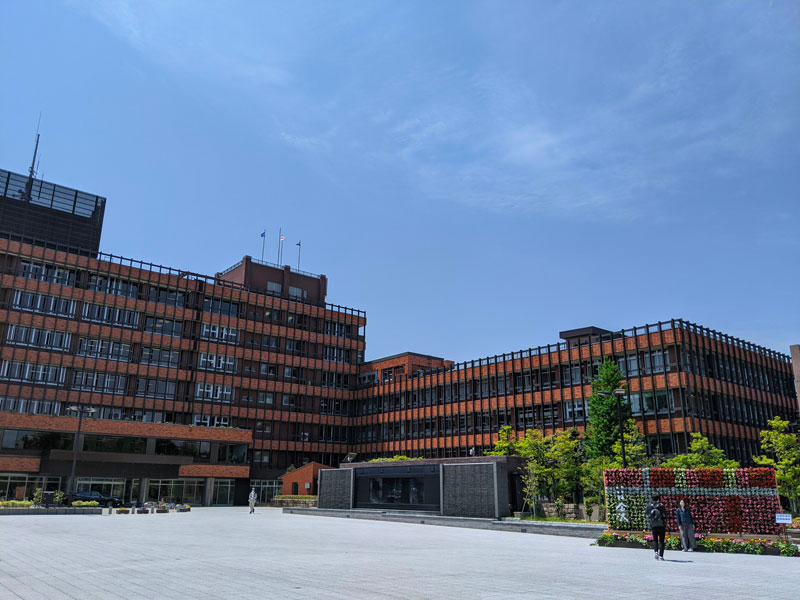
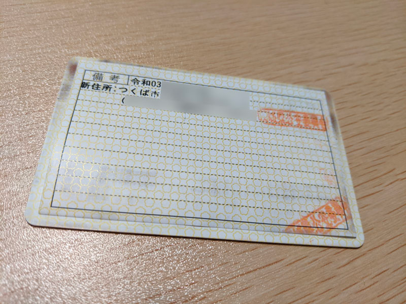
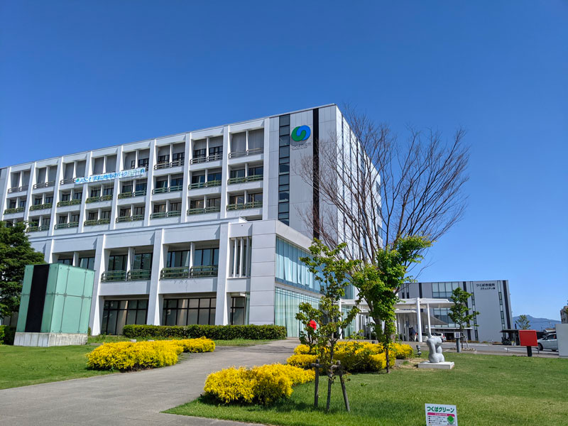
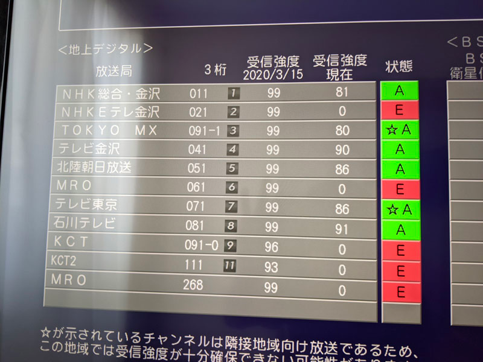
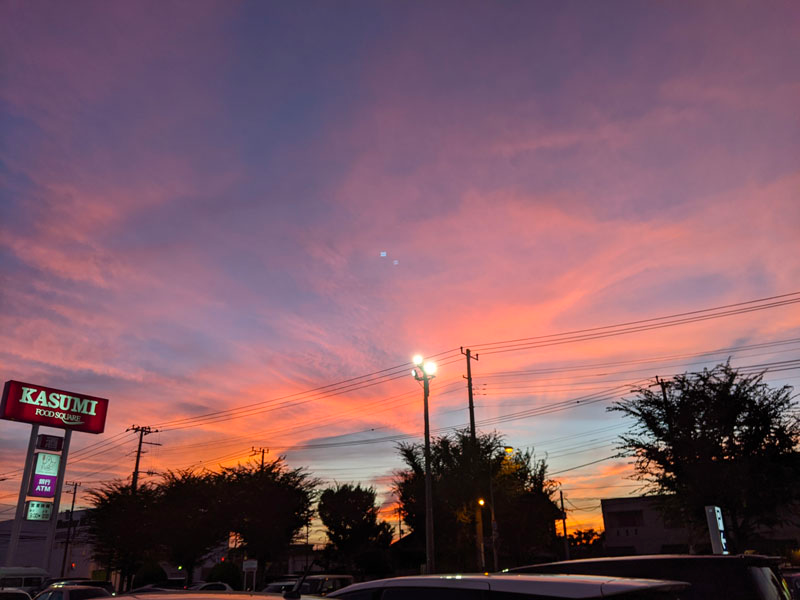
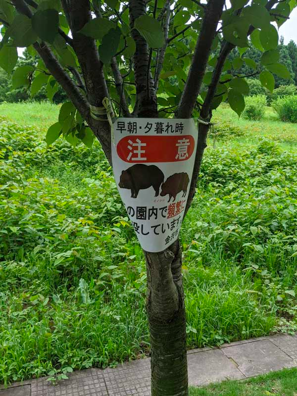

## はじめに

2015年11月から2021年5月までの5年半ほど、石川県金沢市に住んでいました。

この2021年6月に茨城県つくば市に引っ越したので、ざっくり経緯や、金沢市と比べたときのつくば市という土地について所感を書いていきたいと思います。

<!--more-->

## 現在の茨城県つくば市に引っ越すまでの移動経歴

自称引っ越し芸人（引っ越しを一般人よりは多く行っていると自負している民）を称しているので、移動経歴をざっくり書いてみます。

* 栃木県出身
* 2011年4月：長野県松本市（大学1年）
* 2012年4月：長野県長野市（大学2年～4年）
* 2015年4月：千葉県船橋市（新卒）
* 2015年7月：東京都国分寺市
* 2015年11月：石川県金沢市①（転職）
* 2018年2月：石川県金沢市②
* 2020年3月：石川県金沢市③
* 2021年6月：茨城県つくば市

ということで、この10年ほどで8回目の引っ越しです。

### ちなみに、免許証の住所変更の備考欄がいっぱいになってしまった場合

今の私の免許証は、前の前の前の住所が表に書いてあり、そこから3回引っ越しをしていて裏の備考欄に住所を書ききれなかったため、つくば市に引っ越しをした際は上に紙を貼ってもらいました。

紙をめくれば古い備考（住所）も見れるのでご安心を。

## つくば市に引っ越した理由

実は、つくば市自体に引っ越した意味は特にありません（転職したわけでもないです）。

会社が（コロナ後も）原則リモートになり、許可さえ得ればどこに住んでも良い、ということになりました。

北陸の地に居続けても良かったのですが、5年も住んだのでそろそろ新しい地域に住んで別の日本を知りたい、という気持ちが出てきたため、北陸から離れることにしました。

### 新天地の条件

引越し先のエリアは以下の条件で探していました。

* 家賃が高くない
* 東京に公共交通機関で2,000円以内で行ける
* 車で長野、東北方面に行きやすい

なんだかんだ東京は日本の中心地であり、文化イベント（コンサートなど）が頻繁に行われ（今の情勢は置いておいて）、そうしたイベントに参加しやすい位置に住んでおきたかったため、関東を選びました。

また、冬は多めにスキーに行く予定があり、車で気軽に高速に乗って長野や東北方面に行ける位置であることも条件でした。 
（そのため南関東はなるべく除外）

そんな感じで絞り込んだエリアが以下のエリアです。

* 茨城県（つくば、土浦）
* 埼玉県（川越、所沢、熊谷、本庄）
* 群馬県（藤岡、高崎）

群馬県まで行くとちょっと東京に出るのがしんどいけど、長野が近いのが魅力的。 
埼玉は暑そう。

など色々考えていましたが、結果つくば市に決定した理由は 
**なんとなく学園都市とか計画都市とかかっこいい** 
という安易な理由だったりします。

## ということで引っ越してみた

### 地域設定を石川にしたまま受信強度確認

### 地元のスーパー

石川に住んでいた頃はアルビスに行っていたので、離れてしまうと"あの曲"が恋しいですね。



ちなみにアルビスのメロディは 
**ファ・ファシ♭・シ♭ソ・ソシ♭・シ♭・・ラ・ソ・ラシ♭** 
です。

## つくば市に引っ越してみた所感

### 天気が比較的安定している

金沢（というよりは北陸）は日照時間が比較的短くあまり晴れることがないのですが、さすが関東はよく晴れています。

http://grading.jpn.org/SRB02401.html

上記のサイトによると、石川県は30位で1,861時間、茨城県5位で2,250時間なので、数字も体感も認める天気の良い地域です。

特に北陸は冬に吹雪が辛く…（この話は別の記事で）



### 東京に出やすい

つくばエキスプレスを使えば、1時間弱で秋葉原まで行くことが出来ます。 
多少運賃は高いですが、個人的にはそこまで気になりませんでした（つくば～秋葉原で1,205円）。

北陸にいた頃と比べたら、東京に出るハードルが一気下がり、とても嬉しいです。

つくば駅近の駐車場も1日停めて600円というところもあるので、活用しています。

### 人が多い

金沢市とつくば市の人口を比べるだけでは、金沢市の方が多い（2015年で金沢市が47万人、つくば市が23万人）のですが、交通の便が良いからか、ショッピングモール（イーアスつくば等）にいくとこれでもかと人で溢れかえっています。

大型のショッピングモールが近いことはとてもありがたいですが、北陸ぐらいの人の流れが早速恋しくなったりしています。

とはいえ、住んでいる地域はつくば市の中心部からかなり離れているので、自分で人混みに行かない限りは、静かに落ち着いた生活を送らせてもらっています。

### 筑波大学でかすぎない？

私は筑波大学に縁もゆかりも無いですが、地図で見ても分かるほど大きくてとにかく驚きます。 
端から端まで2～3kmぐらいあります。

https://www.tsukuba.ac.jp/access/tsukuba-campus/index.html

https://www.tsukuba.ac.jp/images/pdf/ut_map_tsukuba.pdf

他にもJAXAや国土地理院など、日本を代表する研究施設がたくさんあるので、コロナが落ち着いたら研究発表などでの一般開放に足を運んでみたいとおもいます。

### 熊、猪がいない

金沢にいたころはよく「○○地区で熊が目撃されました」という連絡が飛んできていました。 
よく行っていた公園も山に近いため「早朝・夕暮れは注意してください」などと張り紙が出されていたり……。

こういった熊や猪の心配がないのは、関東平野様様ですね。

### のんびりできるドライブスポットが近くにない

金沢にいたころは、ふらっと海を見に行ったり、山に温泉に入りに行ったり、といったことが片道1時間以内でできていました。 
また、少し足を伸ばせば日帰りで飛騨高山、能登、勝田、立山など自然豊かなスポット、温泉などがたくさんありました。

不満というわけではありませんが、どうしてもそうしたエリアと比べてしまうと関東（しかも東京に比較的近い）というのは個人的には物足りなく感じてしまいます。

もちろん茨城県には立派な筑波山があるので、コロナが落ち着いたら筑波山近辺は攻めてみようと思っています。 
（東筑波ユートピアには行ってみたい）

ただ、ドライブに行きたいという気持ちと同時に「でもどうせどこ行っても人が多いんだろうな……」と気が滅入ってしまってもいます。

## おわりに

つくば市に引っ越して2ヶ月、良いところも悪いところも徐々に感じてきました。

とはいえ別に嫌というわけではなく、天候も安定しているし家賃も高くないので、生活基盤を整えたり勉強をしたりする環境としてはむしろ最高に良い環境だと思っています。 
東京にも行きやすいですしね。

最低でも賃貸更新の2年間はいると思います。

その次は……関西か東北かな（気が早い）。
