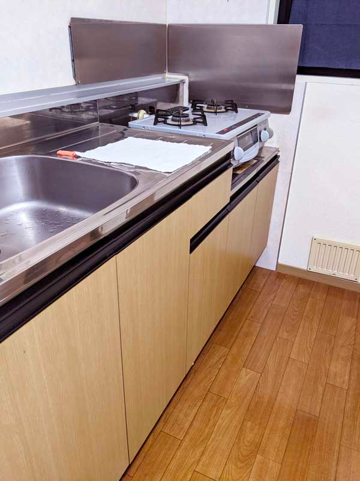
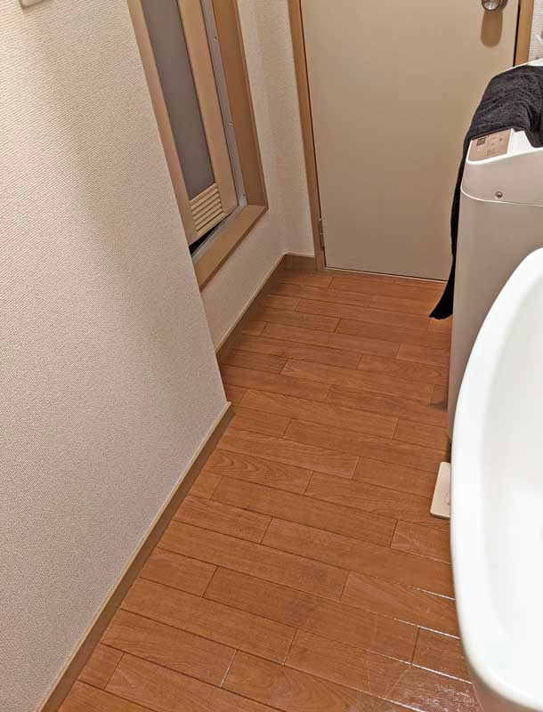

## はじめに

最近引っ越しました。

その前からなるべく無駄な物を減らしたい、家事の負担を減らしたいと思っており、たまたま見た動画（どの動画かは忘れてしまいましたが、ミニマリスト系な動画だったと思います）でキッチンマットやらバスマットやらバスタオルを廃止しているのを見て、これなら自分にも真似できそうと思い、試してみることにしました。

それから引っ越しも経て、引越し後も継続して取り組んでいるので、どういった影響があったのかを個人の感想で書いていきたいと思います。

<!--more-->

## キッチンマットを廃止した

今までは、よくあるニトリのキッチンマットを使っていたのですが、汚れたときにすぐ掃除できずに汚れが溜まっていくのが気になっていました。 
もちろんたまに洗濯はしますが、頻度はそこまで高くないのでどうしても綺麗なままを維持というのは難しいです。

そうすると、逆に床よりもキッチンマットの方が汚いのでは、と気になるようにもなりました。

 

ということで思い切ってキッチンマットをなくし、（キッチンマットがあった時もそうですが）スリッパのみでキッチンに立つことにしました。

### キッチンマットの洗濯から解放された

キッチンマットの洗濯は面倒です（ですよね？）。 
バスマットもそうですが、大型のネットに入れて、マットやらをまとめて洗濯機に入れて。 
厚物なのでなかなか乾きづらいし、キッチンマットを干している間は料理をしたくない（マットがないから）。

今回キッチンマットがない状態をデフォルトにしてみましたが、思った以上にキッチンマットを洗うということを考えなくて良いというのは、気持ちが良いものです。

考えることが減ると、それだけ別のことに頭を使うことができますね。

### 頻繁にキッチン周りを掃除するようになった

キッチンマットをなくしたということは、今までキッチンマットに落ちていた汚れなどが直が床に落ちるということで。

例えばソースなどが落ちてしまった場合、さすがに放置はできないので拭いて掃除をします。 
油がはねてしまうような料理をした場合、料理をしたあとにもやっぱり拭きます。

キッチンマットがあるときと比べて、正直掃除自体の手間は増えたかもしれませんが、その分いつもキッチンの床は綺麗な状態を保つことが出来ています。

キッチンの床が綺麗なので、ついでならと、コンロ周りも頻繁に掃除をするようになり、キッチンマットをなくしたおかげでいつも気持ちよくキッチンを使うことが出来ています。

といっても、もともと自分が掃除好きだったということもあるので、人によってはすぐに汚れが目立ってしまう状態は逆にストレスに感じるかもしれません。

必ずしも、キッチンマットをなくす＝掃除の手間が省ける、というわけではないですね。

## バスマット、バスタオルを廃止した

バスマットを廃止した理由は、不潔だと思ったから。 
（実際に数値で見たことはないので、正直ただの気分です）

私の場合、バスマットもキッチンマットと同じサイクルでしか洗濯していなかったので、それこそ数週間に1回の洗濯でした。

珪藻土バスマットなども考えましたが、荷物が増えるのも気になったので、いっそのことなくして他のもので代用してみることにしました。

バスタオルに関しても、他の洗濯物とは特別扱いしなくてはいけないことや、干すために場所を取る、わざわざ"バスタオル"という専用の製品を買わなくても他のもので代用できるのでは？と思ったこともあり、廃止をしてみました。

### バスマットの代わりに、2日替わりのフェイスタオルのローテーションを導入

フェイスタオルをまず用意します。 
Amazon で「タオル研究所」という名前のタオルを買ってみました。

https://www.amazon.co.jp/dp/B07K48L83L

5枚で1,400円ほど。 
フェイスタオルとしては安くはないですが、バスタオルとバスマットを買うよりは多分安いはずです。

かなりふっくらしていて、触り心地もとても良いです。

このタオルを、以下のようなローテーションで回します。

* 1日目：1枚新しいタオルを取り、バスタオルとして使用
* 2日目：前日干しておいたタオルを、同じくバスタオルとして使用
* 3日目：前日干しておいたタオルは、風呂上がりに洗面所に出る際の足置きとして使用。身体を拭くタオルはまた新しく取る
* 4日目：前日干しておいた2枚のタオルを、同じ用途で使用
* 5日目：前日干しておいた2枚のタオルのうち、身体を拭いていたタオルは足置きに、足置きにしていたタオルは洗濯機に、身体を拭くタオルとして新しく1枚を取る
* 6日目：4日目に戻る

始めの数日だけ「足置きどうすんねん」という話はありますが、一度ローテーションに入れてしまえばただの流れ作業です。

2日身体拭き、2日足置きのローテーションが気になる場合は、1日ごとのローテーションで良いと思います。 
その場合、洗濯の頻度が増えますけどね（私は一人暮らしなのでこれぐらいのローテーションが洗濯の頻度的にも丁度良い）。

 

ということで、これで、完全に「バスマットの管理」と「バスタオルの管理」から解放されることができました。 
普段の洗濯に、フェイスタオルが数枚増えただけですね。

また、風呂から洗面所へ出る前に、お風呂の中で予めある程度身体を拭いておくと、洗面所が濡れなくて済みます。

動画で参考に見た人は、足置きすら用意していませんでしたが、さすがにちょっと気になったので、独自にアレンジして足置きも用意するようにしてみました。

## おわりに

お試しで始めてみたキッチンマットとバスマットの廃止でしたが、個人的にはすんなりと受け入れることが出来ました。 
特にキッチンマットの廃止は不安でしたが、やってみたらむしろこの方が物が少なく家もスッキリするし、いつも綺麗な状態であることが嬉しく思うようになりました（ただし普段から掃除することが前提）。

スッキリした生活がしたい方、無駄（だと思う）家事から解放されてみたい方は、お試しでどうぞ。

