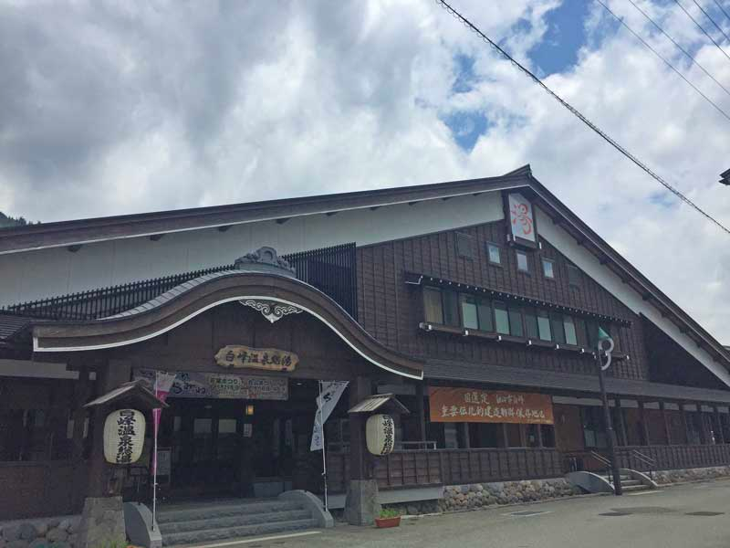
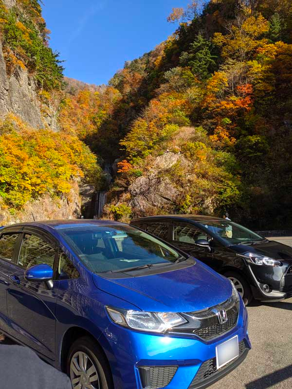
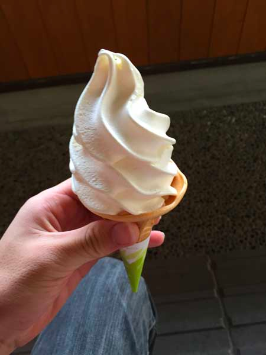
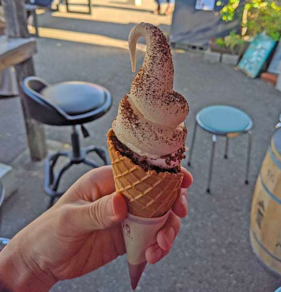

## はじめに

石川県金沢市に住んでいた5年間の間、よく通っていた温泉である白峰温泉（今回紹介するのは総湯）について紹介したいと思います。

正直アクセスなどはあまりよくありませんが、泉質や心地よさなど、住んでいた5年間であちこちの温泉に行った中で一番と言っても良いぐらい穴場の温泉でした。

今は北陸を離れてしまいましたが、自分の記憶が新しいうちに自分への備忘録も兼ねて書きます。

<!--more-->

## 白峰温泉の概要

http://www.shiramine-m.com/index.html

白峰温泉は、石川県白山（はくさん）市の白峰地区と呼ばれるところにあります。

### 場所

<iframe src="https://www.google.com/maps/embed?pb=!1m18!1m12!1m3!1d3220.679061134302!2d136.62441891605502!3d36.17436371037466!2m3!1f0!2f0!3f0!3m2!1i1024!2i768!4f13.1!3m3!1m2!1s0x5ff8885d253f681f%3A0x89027665b23d562b!2z55m95bOw5rip5rOJIOe3j-a5rw!5e0!3m2!1sja!2sjp!4v1629468376986!5m2!1sja!2sjp" width="100%" height="300" style="border:0;" allowfullscreen="" loading="lazy"></iframe>

白山市は金沢市と隣接こそしていますが、名峰白山を含む山の多くの土地を含んでいるため、石川県内の市町村面積ランキング堂々の1位（754.93 km^2）です。（東京23区の 627.6 km^2 よりも広いですね）

白峰地区は、そんな白山市の山の奥にあるため、金沢市の街中（というか白山市の麓）から車で1時間ほどかかります。

ただ、道路は比較的走りやすい（ところどころ急カーブなどはありますが）ため、楽しくドライブをしながら向かうことができると思います。

金沢市から白峰地区方面に行く途中、道の駅瀬女があるあたりで分かれ道があり、その道を真っ直ぐ（白峰地区は右折）いくと、有名な有料道路である白山白川郷ホワイトロードがあります。

新緑の季節や紅葉の季節になると渋滞が起きるほどの人気スポットです。

## 泉質、広さ

> 日本三霊山のひとつである白山のお膝元、自然豊かな白山市白峰地区。 
> その中心に位置する場所に、地元木材を活用して建てられた温泉施設「白峰温泉総湯」です。 
> 天然温泉100%の源泉の泉質はナトリウム炭酸水素塩温泉。 
> 湯上がりの肌が絹のようにスベスベになる「美人を生む絹肌の湯」を、山里の落ち着いた雰囲気の中でごゆっくりお楽しみ下さいませ。

と公式サイトに書かれている通り、お湯に入った瞬間肌がスベスベになります。

あくまでも個人の経験ですが、身体が芯まで温まるので湯上がりの湯冷めもしにくく、帰り1時間のドライブでも体調を崩したことはありません。

浴槽の広さは、大規模な温泉施設などと比べてしまうともちろんそこまで広さはありませんが、浅い浴槽と広い浴槽があり、広い浴槽では湯船の中で椅子のように座って肩まで浸かるぐらいの深さがあります。

http://www.shiramine-m.com/onsen/index.html

広くガラス張りになってるので、ゆったりお湯に浸かりながら外の雄大な自然を眺めることが出来ます。

露天風呂は、数人ぐらいの小さいものですが、自然の風景や音、風などを感じながら瞑想にふけることが出来ます。

週替りで男女が入れ替わり、露天風呂も檜風呂か岩風呂かで変わるので、是非週替りで行ってどちらも楽しんでください。

## ポイントカード

白峰温泉総湯にはポイントカードがあります。 
引っ越したときに丁度ポイントを使い切ったため手元になく、情報が間違っていたらすみませんが、1回の入浴で1ポイント、（多分）20ポイントで1回入浴が無料になります。

また、温泉に入ると、総湯そばにある「白峰特産品販売施設 菜さい」のソフトクリーム割引券がもらえます。

## 白峰温泉まとめ

https://www.urara-hakusanbito.com/spot/detail_1280.html

白峰地区は国の重要伝統的建造物群保存地区に指定されている地区で、昔ながらの建物が多くあります。 
そんな自然豊かな地区でゆったり温泉に入る非日常に私は完全に虜になりました。

金沢からは遠いですが、多いときは月に数回は通って日々の疲れを癒やしていました。

今はこんなご時世ですが、今後金沢の近くへ来た際は、是非温泉に入りに行ってみてください。

## （余談）金沢市から白峰温泉に向かう途中のおすすめスポット

折角白峰方面に行くなら、このあたりも是非。

### 白山比咩（しらやまひめ）神社

http://www.shirayama.or.jp/

白山比咩神社は、全国三千余社の白山神社の総本宮とのことです。 
初詣の季節になると、数kmの渋滞になります（1敗）。

### 獅子吼（ししく）高原

https://city-hakusan.com/shishiku/

ゴンドラに乗って山の上の方まで行けます。 
パラグライダーなども体験できるそうです（私はやったことはありませんが、やってる人は目の前で見ていました）。

### 道の駅 瀬名

https://city-hakusan.com/shopping/road_station_sena/

パン屋があったり、小さなカフェやレストランなど、色々ある道の駅です。 
おすすめは「蕎麦山猫とキジトラコーヒー研究所」さんのソフトクリーム。

https://www.facebook.com/yamanekokijitora

### 山法師の大判焼

https://www.facebook.com/profile.php?id=100057442278303

秘密のケンミンＳＨＯＷでも紹介された大判焼き。 
……実はいつか食べたいと思って、結局行けませんでした。誰か私の代わりに行ってきて感想を教えて下さい。