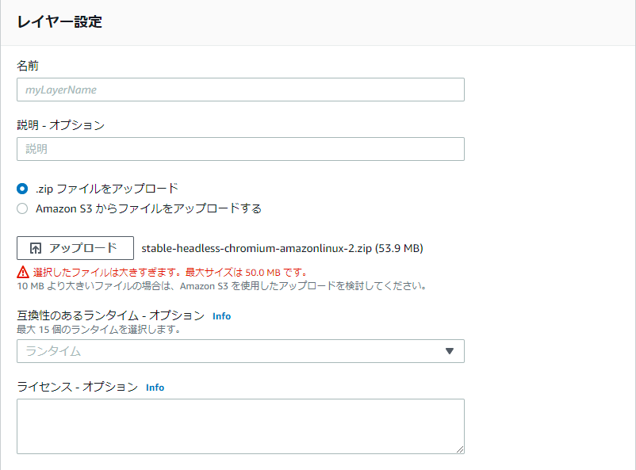
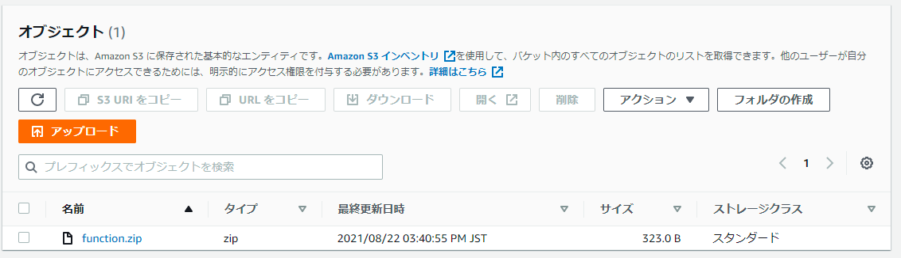
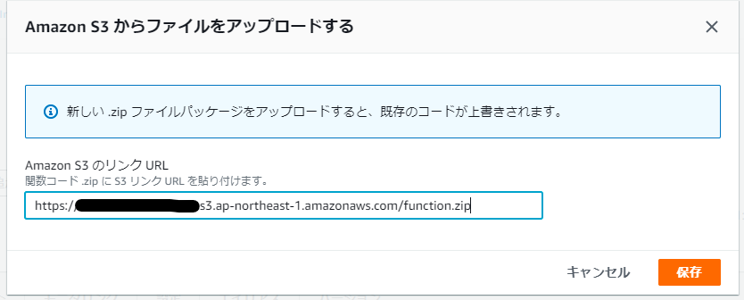
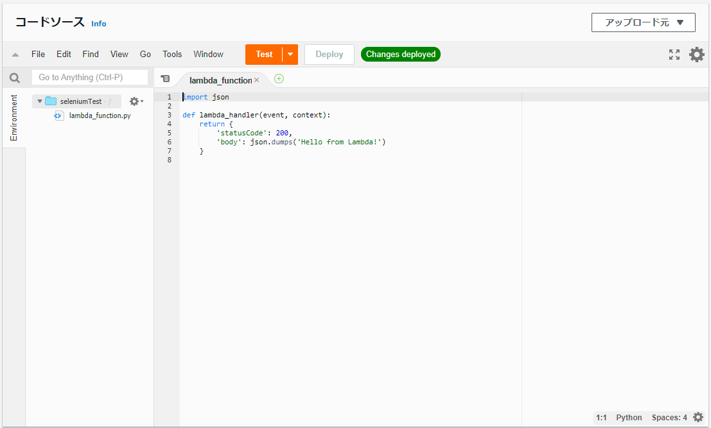
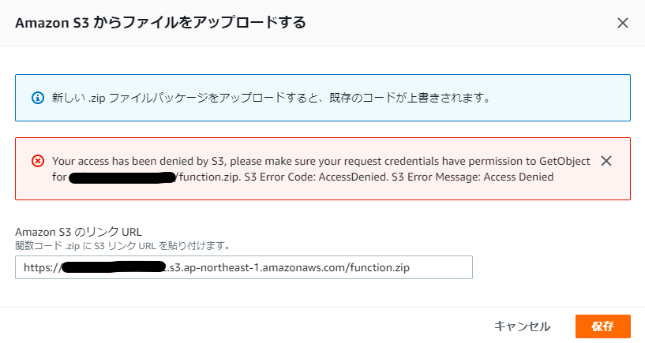

## はじめに

AWS Lambda の関数や、Lambda レイヤーに zip でコードを反映する際、50MB の制限があります。



50MB を超える zip を Lambda に読み込ませたい場合は、S3 に一度 zip をアップロードし、その S3 のパスを指定することで Lambda に読み込ませることが出来ます。

しかし、S3 からの読み込み時に AccessDenied エラーになってしまいました。

色々試した結果、結論としてはバケットポリシーの設定でIP制限をかけていたことが原因だったので、忘れないうちに状況などをメモしておきます。

<!--more-->

## 正常な場合

デフォルト設定の S3 バケットを作り、適当なファイルをアップロードします。



パスをコピーし、Lambda 関数に読み込ませてみます。



無事にコードが読み込まれました。



## バケットポリシーで、IPアドレス制限をかけてみる

先程の S3 バケットに対し、バケットポリシーで IP 制限をかけてみます。

```
{
    "Version": "2012-10-17",
    "Statement": [
        {
            "Sid": "IPAllow",
            "Effect": "Deny",
            "Principal": "*",
            "Action": "s3:*",
            "Resource": [
                "arn:aws:s3:::バケット名",
                "arn:aws:s3:::バケット名/*"
            ],
            "Condition": {
                "NotIpAddress": {
                    "aws:SourceIp": "許可したいIPアドレス"
                }
            }
        }
    ]
}
```

この状態で S3 から Lambda 関数へ zip を読み込ませようとすると、今回のエラーになります。



```
Your access has been denied by S3, please make sure your request credentials have permission to GetObject for バケット名/function.zip. S3 Error Code: AccessDenied. S3 Error Message: Access Denied
```

アクセス元の IP アドレスを制限したので、AWS サービスからもアクセスができなくなったということだと思いますが、そこが引っかかるのか、と原因にたどり着くまでにかなり時間がかかりました。

## 調査ログ

勉強中のため、間違った情報であればご指摘ください。

はじめは Lambda 側の IAM の権限かと思いましたが、Lambda で設定するのは関数の実行時のロールであり、コードの読み込み時には IAM は関係なさそう。

一応、対象の関数の実行ロールに S3FullAccess ポリシーをアタッチしてみましたが、結果は変わらず。

もしかしたらバケットポリシーの書き方で Lambda サービス自体からのアクセスの許可？があるかもしれませんが、私の検索力では見つけることが出来ませんでした。（そもそも同様の現象に陥っている人にたどり着けない）

## おわりに

今回の現象のキーワードは Lambda, S3, import, AccessDenied あたりになってくると思いますが、これでググると「LambdaからS3の操作を行った際に起こる権限エラー」系が引っかかるので、調査に非常に難航しました。

同じ現象の人のヒントになれば幸いです。
