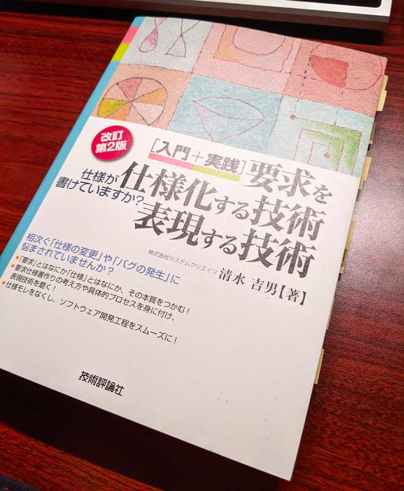

## はじめに

会社の人からのおすすめで、「要求を仕様化する技術・表現する技術」という本を買い、読みました。

<iframe style="width:120px;height:240px;" marginwidth="0" marginheight="0" scrolling="no" frameborder="0" src="//rcm-fe.amazon-adsystem.com/e/cm?lt1=_blank&bc1=000000&IS2=1&bg1=FFFFFF&fc1=000000&lc1=0000FF&t=nabalog-22&language=ja_JP&o=9&p=8&l=as4&m=amazon&f=ifr&ref=as_ss_li_til&asins=4774142573&linkId=bf785b252713b2f3a29b25d4809c8f8d"></iframe>

仕事では、社内の人が書いた仕様を確認して設計、実装を行っていますが、どうしても仕様の認識違い、条件のモレなどが発生してしまっています。 
その都度内容を質問し、ちょっとした対応のみで終わればよいのですが、仕様の結論によっては、今まで作っていたものを作り直したりすることが起きてしまっています。

こういったことに苦労している（疲れている）人や、どうにかしたい、と思っている人にこそ読んで欲しいと思いました。

この記事では、印象に残った内容や、感想などを忘れないうちにざっくり書いておきます。

<!--more-->

## 「要求」と「仕様」は違う

前職で「要求概要書」「要求仕様書」やらを書いていましたが、いまいちどう違うのかを分かっていませんでした。

本を読み、私は以下のように理解をしました。

* 「要求」は、その要求にぶらさがる仕様の希望や概念を表したものであり、要求だけで設計はできない（してはいけない）。
* 「仕様」は、実際に何かしらの動きや計算方法などが特定できている状態であり、気持ち（～して欲しい）が入ることはない。

要求は、あくまでも「希望」やその理由を書くことであり、例えば「画面の右上には現在時刻を表示して欲しい」というのは要求ではなく「仕様」になります（まだ曖昧な情報を含んでいますが）。 
この場合の要求は、「操作に夢中で時間を忘れないようにして欲しい」であり、その要求の中に含まれる仕様として「現在時刻を表示する」という階層構造になります。 
また、この「表示する」という動詞からも、表示形式など決める必要があることが分かりますし、もともとの要求が「時間を忘れないように」なので、例えば「起動から1時間経ったら『まだ操作を続けますか』のポップアップを出す」などの仕様が出てくるかもしれません（この例は本の内容ではなく適当に考えました）。

今までのような開発をしていると、このポップアップの仕様は一度作って動作確認をした後に「やっぱりこういう追加仕様が欲しいんだけど」と相談が来て「また仕様変更か…」というやり取りがされていたかもしれません。

しかし、「要求」を正しく表現し、それに付随する「仕様」の出し方を練習していけば、このような「後から追加するであろう」仕様を、予め仕様書を作る段階で発見し、仕様に組み込むことが可能になります。

## 紹介されていた内容

本の中で紹介されていた USDM（Universal Specification Describing Manner） という手法は初めて知ったのですが、ちゃんと「仕様モレ」や「仕様変更」をなるべく減らすための技術やノウハウが凝縮されているようでした。

ただ、この USDM という名前だけが独り歩きして、どうしてこのように書くのか、こう書くことによって読み手や書き手にどう影響するのか、をちゃんと理論を理解してから実践に持っていかないと、今までの書き方を変えるだけのメリットは得られにくいのかなと思います（今までの方法を変えるというのは少なからず反発もあるでしょうし…）。

また、「仕様」であるということは特定の動きを指しているので、この仕様を読んだ全員が同じ動きを特定（Specify）できることが必要、ということも書いていました。 
曖昧な書き方は一切入らず、書き方さえ工夫をすれば（書き方の訓練は必要ですが）、何も工夫しなければ起きていたであろう認識違いによる仕様変更工数が大幅に削減できる、ということです。

 

また、本の中では「○○するように書く」と書かれているときに、きちんと理由まで詳細に書かれているのが特徴でした。 
筆者の方が実際に経験をした事例や仕様書の例を見ていくことで、「あー、心当たりがあるこれ…。なるほどこう書けばよかったのか。」という状況を肌で感じることが出来ました。

ただ、前半は「何故仕様書改善が必要なのか」「今まではどのような事が起きていたのか」を結構長く説明していて、その例のあとに「本書で紹介している内容を実践すれば改善する」とあちこちに書かれているので、「その内容が知りたいんだよ！」と焦らされている気分になりました。（本の内容に印象がつくという意味では良かったと思いますが、知りたい情報がまだ書いていないことに少しイライラしました笑）

## おわりに

仕様書って具体的に何を書けばよいのか、要求と仕様の違いはなんだろう、依頼者に何をヒアリングすればよいか分からない、などで悩んでいる人は、是非一度読んでみて欲しいと思います。

もちろん、本に書かれていることをすぐに全部（特に、本の中では仕様書ツールとして Excel を推奨していましたが、本が書かれたのは2010年ですので、現在ではもっと適切なツールがあるかもしれません）実践することは難しいですが、この要求と仕様とはなにか、の概念を知っているだけで、仕様書の見方や書き方に工夫ができるはずです。

前半のプロジェクト失敗例などは読み物としても面白い（この表現が適切かは分かりませんが）ので、そういった意味でもぜひ読んでみてください。

以下は、著者の清水さんの参考資料です（調べたら出てきたのでリンクを貼っておきます。本の中で紹介されていることがざっくりと書かれています）。

[要求仕様記述手法「USDM」ってどんなの？](https://swquality.jp/temp/nagasakiqdg15_usdm.pdf)

